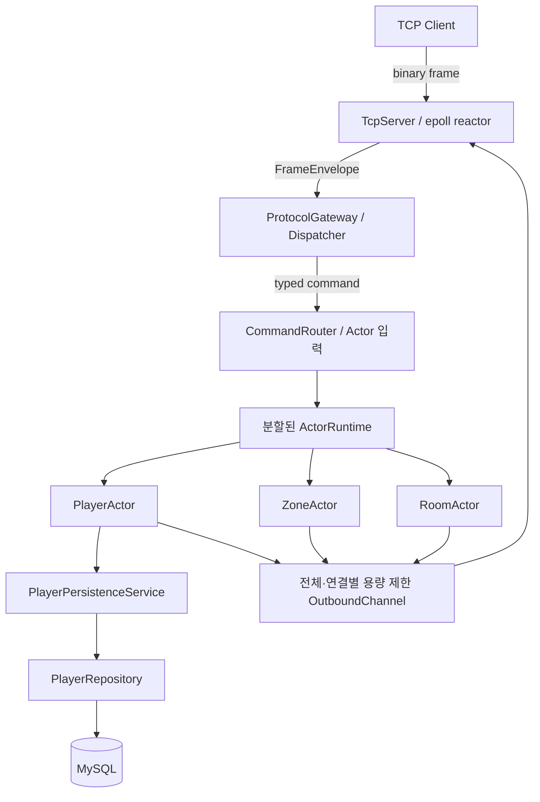

# SnF - C++ 비동기 MORPG 서버

> epoll 기반 네트워크, Actor 실행 모델과 MySQL 영속화 설계 및 구현

---

## 1. 프로젝트 개요

SnF는 Linux에서 실행되는 C++20 기반 MORPG 서버입니다.

- 논블로킹 TCP와 `epoll` 기반 연결 처리
- Actor별 FIFO 대기열을 통한 Player·Zone·Room 상태의 순차 처리
- DB 응답을 기다릴 때 PlayerActor만 중단하고 Worker는 다른 Actor를 계속 처리
- 최대 4인 Battle Room 입장 시 Player 상태를 전투용 스냅샷으로 전달
- 전투 종료 결과를 PlayerActor에 반영해 MySQL에 저장하고 참가자를 Zone으로 복귀

---

## 2. 전체 아키텍처

SnF는 네트워크 입출력, 게임 상태 변경, 데이터베이스 작업을 서로 다른 실행 경계로 나눕니다.
요청은 네트워크 Reactor에서 해석한 뒤 대상 Actor로 전달하고, 처리 결과는 클라이언트 응답이나
Player 상태 저장으로 이어집니다.



각 실행 경계가 소유하는 상태와 역할은 다음과 같습니다.

| 구성 요소 | 소유하는 상태 | 역할 |
| --- | --- | --- |
| TcpServer / epoll Reactor | 연결(Session), 연결 세대 번호 | TCP 입출력과 프레임 처리 |
| ActorRuntime Worker | Player·Zone·Room 상태, 명령 대기열, 코루틴 실행 상태 | 명령 순서화와 게임 로직 실행 |
| PlayerPersistenceService | 저장 대기·진행 중인 Player 스냅샷 | 최신 스냅샷 병합과 Player별 저장 순서 보장 |
| MySQL Repository Worker | MySQL 연결과 현재 저장 작업 | 동기식 MySQL 읽기·저장 실행 |

---

## 3. 네트워크

### 3.1 단일 epoll Reactor로 연결 상태 소유

하나의 Reactor가 모든 Session을 소유하고, `epoll`이 알려준 준비 상태에 따라 논블로킹
`accept`·`recv`·`send`를 직접 수행합니다. 연결 상태를 한 스레드에서 연속적으로 관리하며, 완료 통지
기반 I/O로 전환할 명확한 요구가 없었기 때문에 현재 범위에서는 이 구조를 유지했습니다.

#### 구현 구조

```text
epoll_wait
├── listener 수신 가능      → accept4(SOCK_NONBLOCK | SOCK_CLOEXEC)
├── client 수신 가능        → recv 반복 → FrameDecoder
├── client 송신 가능        → 미전송 위치부터 send
├── 송신 eventfd            → Actor가 생성한 송신 작업 소비
├── 종료 eventfd            → 내부 종료 요청 처리
└── SIGINT/SIGTERM signalfd → 종료 상태로 전이
```

`eventfd` 자체에 상태를 두지는 않습니다. Reactor가 송신 대기열이나 종료 조건을 다시 확인하게 하는
깨움 신호로 사용합니다.

> 코드: [`src/server/tcp_server.cpp`](src/server/tcp_server.cpp)

#### 한계

Reactor는 네트워크 I/O 전용 스레드 하나를 사용합니다. 부하가 낮을 때는 `epoll_wait()`에서
대기하므로 CPU 사용량은 적지만, 해당 스레드를 Actor 작업에 활용할 수는 없습니다. 반대로 모든
소켓 I/O가 한 스레드에 모이므로 네트워크 부하가 커지면 Reactor가 처리량의 상한이 될 수 있습니다.

### 3.2 송신 용량 제한과 느린 클라이언트 격리

Room은 전투 변경사항을 참가자에게 주기적으로 전송합니다. 특정 클라이언트가 데이터를 읽지 않으면
해당 연결의 미전송 데이터가 계속 쌓입니다. 송신 대기열에 상한이 없으면 메모리 사용량이 계속
늘어나고, 전체 용량만 제한하면 느린 연결 하나가 송신 대기열을 독점할 수 있습니다.

> OutboundChannel은 송신 작업 개수를 제한하고, Session은 실제 미전송 바이트를 제한합니다.

공유 `OutboundChannel`은 대기 중인 송신 작업과 예약한 공간을 합쳐 최대 4,096개로 제한하며, 한
연결은 최대 64개까지만 점유할 수 있습니다. Reactor가 송신 작업을 가져간 뒤에는 Session이 연결별
미전송 데이터를 관리하며, 기본 상한은 1 MiB입니다.

#### 구현 구조

```text
Actor 결과
→ OutboundChannel 예약 (전체 4,096개, 연결별 64개)
→ Reactor가 송신 작업 소비
→ Session 미전송 데이터 (연결별 최대 1 MiB)
→ `send()`
```

Actor가 결과를 송신 작업으로 등록하기 전에 필요한 슬롯을 예약합니다. 전체 사용량과 해당 연결의
사용량에는 대기열에 들어간 작업뿐 아니라 아직 등록하지 않은 예약도 포함합니다. 따라서 여러 Actor가
동시에 공간을 확인한 뒤 상한을 초과해 등록하는 일을 막습니다.

```cpp
bool OutboundChannel::fits(
    const ConnectionUsage& usage,
    const std::size_t slots) const
{
    return _items.size() + _reserved_slots + slots <= _capacity &&
           usage.queued + usage.reserved + slots <= _max_slots_per_connection;
}
```

> 코드: [`src/server/outbound_channel.cpp`](src/server/outbound_channel.cpp)

용량이 있으면 예약과 응답 등록을 동기 경로에서 끝냅니다. 포화된 경우에만 예약 대기 코루틴을 만들고
해당 Actor를 중단합니다. Worker 스레드는 기다리지 않고 다른 Actor를 계속 처리하며, Reactor가 송신
작업을 소비해 공간이 생기면 예약 결과를 담당 Worker로 돌려보냅니다.

```cpp
if (auto reservation = _outbound.tryReserve(state.connection, required_slots))
{
    return applyResponses(state, *reservation, stop_token);
}

state.reservation_task =
    awaitOutboundReservation(_outbound, context, state.connection, required_slots);

// 이후 같은 Actor의 실행 차례에서 진행
if (state.reservation_task.resume() == snf::runtime::ActorTaskStatus::Suspended)
{
    return snf::runtime::ActorDispatchResult::Suspended;
}
```

> 코드: [`src/server/player_actor_binding.cpp`](src/server/player_actor_binding.cpp)

Reactor가 송신 작업을 가져간 뒤에는 인코딩된 프레임의 실제 바이트 수를 Session 상한에 반영합니다.
상한을 넘으면 프레임을 조용히 버리지 않고 해당 연결만 종료합니다.

```cpp
// Session::enqueueFrame
auto encoded_frame = protocol::encode_frame(frame);
if (_pending_send_byte_count > _max_pending_send_bytes ||
    encoded_frame.size() > _max_pending_send_bytes - _pending_send_byte_count)
{
    return false;
}

// TcpServer::handleOutboundAction
auto* session = findCurrentSession(network_action.connection);
if (session == nullptr)
{
    return;
}

if (!session->enqueueFrame(network_action.frame))
{
    removeSession(
        network_action.connection.descriptor,
        ConnectionCloseCause::Overflow);
}
```

> 코드: [`src/net/session.cpp`](src/net/session.cpp),
> [`src/server/tcp_server.cpp`](src/server/tcp_server.cpp)

`findCurrentSession`은 파일 디스크립터뿐 아니라 연결마다 증가하는 generation까지 확인합니다. 따라서
이전 연결에서 늦게 도착한 송신이나 종료 결과가 같은 디스크립터를 재사용한 새 연결에 적용되지 않습니다.

#### 검증

4인 Room에서 한 클라이언트만 수신을 중단한 통합 테스트에서는 해당 연결 하나만 종료됐습니다.
나머지 3명은 `BattleDigest`의 순서 번호를 건너뛰지 않았고, `ParticipantLeft` 이후에도 전투를
클리어했습니다.

> 테스트: [`tests/tcp_server_integration_test.cpp`](tests/tcp_server_integration_test.cpp)

#### 한계

느린 연결의 데이터를 무기한 보관하지 않고 연결 종료로 포화를 해소합니다. 또한 `OutboundChannel`은
모든 Actor Worker가 공유하므로 송신 작업이 크게 늘어나면 하나의 경합 지점이 될 수 있습니다.

---

## 4. Actor 단위 비동기 실행과 코루틴 수명 보장

> 외부 작업을 기다릴 때 Worker가 아니라 해당 Actor만 중단합니다. 외부 스레드는 코루틴을 직접
> 재개하지 않고 완료 결과만 게시하며, 코루틴 프레임과 Actor 상태의 생성·재개·파괴는 담당 Worker가
> 수행합니다.

Actor가 중단된 동안에는 같은 Actor의 다음 명령을 실행하지 않습니다. 뒤에 도착한 명령은 mailbox에서
기다리고, Worker는 실행 가능한 다른 Actor를 처리합니다.

| 실행 계약 | 보장 |
| --- | --- |
| Actor 상태·mailbox·코루틴은 담당 Worker만 접근 | 상태 변경에 Actor별 mutex가 필요하지 않음 |
| 같은 Actor는 한 명령만 실행 | 중단 중에도 뒤의 명령이 현재 명령을 앞지르지 않음 |
| 외부 스레드는 완료 결과만 게시 | 다른 스레드에서 코루틴을 재개하거나 파괴하지 않음 |
| Actor incarnation과 작업 ID가 일치할 때만 재개 | 비활성화·재활성화 뒤 도착한 이전 결과를 폐기 |

### 4.1 상태 소유권과 순차 실행

```text
worker = hash(ActorKey{kind, entity}) % worker_count
```

Player·Zone·Room Actor는 `ActorKey`의 해시로 정해진 Worker에 배치됩니다. 활성화된 동안 상태,
FIFO mailbox, 실행 상태와 코루틴은 항상 같은 Worker가 소유합니다. `ActorBinding`이 Runtime 명령을
일반 C++ 게임 객체의 함수 호출로 변환하므로, 게임 로직은 스레드·소켓·DB를 모르는 동기 함수로
유지합니다.

```text
명령 게시
→ 담당 Worker 입력 대기열
→ Actor FIFO mailbox
→ 실행 준비 대기열
→ 한 차례에 최대 16개 처리
→ 남은 명령이 있으면 실행 준비 대기열 끝으로 이동
```

같은 Actor를 실행 준비 대기열에 중복 등록하지 않습니다. 또한 한 Actor가 한 차례에 처리할 명령을
최대 16개로 제한해, 명령이 몰린 Actor가 같은 Worker의 다른 Actor를 계속 밀어내지 않게 합니다.

#### 한계

실행 중인 Actor를 다른 Worker로 이동하거나 Worker 사이의 Actor 수를 재조정하지 않습니다. 하나의
Actor는 순차 실행되므로 단일 Actor의 처리량은 담당 Worker의 실행 속도를 넘을 수 없습니다. 또한
여러 Actor의 상태를 하나의 트랜잭션으로 변경하지 않으며, 입장과 복귀는 별도의 진행 상태와 보상
절차로 처리합니다.

### 4.2 외부 작업을 기다리는 Actor만 중단

Actor Worker가 MySQL 호출과 `OutboundChannel` 슬롯 대기를 동기식으로 처리하면 Worker 전체가
멈춥니다. 두 작업은 `PlayerActorBinding`에서 비동기로 처리하므로 요청한 PlayerActor만 중단됩니다.

Player를 읽을 때 Repository에는 결과 콜백을 전달합니다. 조회가 끝나면 Repository가 콜백을 호출하고,
콜백은 결과를 담당 Worker 대기열에 등록할 뿐 코루틴을 직접 재개하지 않습니다.

```cpp
auto result = co_await snf::runtime::awaitAsyncOperation<
    snf::server::PlayerLoadResult>(
    context,
    [&repository, player](
        snf::runtime::AsyncOperationProducer<snf::server::PlayerLoadResult> producer)
    {
        repository.asyncLoad(
            player,
            [producer = std::move(producer)](
                snf::server::PlayerLoadResult result) mutable noexcept
            {
                producer.complete(std::move(result));
            });
    });
```

> 코드: [`src/server/player_actor_binding.cpp`](src/server/player_actor_binding.cpp)

```text
PlayerActor / 담당 Worker
→ Repository 작업 시작
→ PlayerActor만 Suspended
→ Worker는 다른 Actor 처리

MySQL Repository Worker
→ 결과 콜백 호출
→ 담당 Worker의 완료 결과 대기열에 등록

담당 Worker
→ 완료 결과 소비
→ PlayerActor의 코루틴 재개
```

Repository가 `asyncLoad()` 반환 전에 완료 콜백을 호출하더라도, 콜백은 결과를 담당 Worker의
대기열에 등록할 뿐입니다. 코루틴은 Worker가 결과를 꺼낼 때 재개되므로 콜백의 실행 시점이나
스레드와 관계없이 같은 경로로 처리됩니다.

### 4.3 중단된 Actor를 한 번만 재개

PlayerActor가 DB 조회 결과를 기다리는 동안 완료와 취소가 동시에 발생할 수 있습니다. Actor가 제거된
뒤 같은 `ActorKey`로 다시 생성될 수도 있습니다. 이때 이전 DB 조회 결과가 현재 Actor를 재개하거나,
완료와 취소가 같은 코루틴을 두 번 재개해서는 안 됩니다.

```text
PlayerActor가 DB 결과를 기다리며 Suspended
├── DB 완료가 먼저 도착
│   → 현재 Actor가 기다리던 DB 조회의 결과인지 확인
│   → 담당 Worker에서 코루틴 재개
│
├── 취소가 먼저 발생
│   → 취소 결과로 재개
│   → 나중에 도착한 DB 완료는 폐기
│
└── Actor가 제거된 뒤 같은 ActorKey로 다시 생성
    → incarnation이 다르므로 이전 완료를 폐기
```

Runtime은 Actor가 `Suspended` 상태이고, `incarnation`과 작업 ID가 모두 일치할 때만 완료 결과를
적용합니다. `incarnation`은 같은 `ActorKey`로 다시 생성된 Actor를 구분하고, 작업 ID는 PlayerActor가
현재 기다리는 DB 조회를 이전 조회와 구분합니다.

```cpp
if (entry.execution == ActorExecutionState::Suspended &&
    entry.incarnation == continuation.incarnation &&
    entry.expected_task == continuation.task)
{
    entry.active_operation.reset();
    entry.expected_task.reset();
    entry.pending_resume = true;
    entry.execution = ActorExecutionState::Ready;
    worker.ready_actors.push_back(actor_iterator->first);
}
```

> 코드: [`src/runtime/actor_runtime.cpp`](src/runtime/actor_runtime.cpp),
> [`include/snf/runtime/async_operation.hpp`](include/snf/runtime/async_operation.hpp)

완료와 취소 중 먼저 확정된 결과만 사용하므로 코루틴은 한 번만 재개됩니다. 같은 DB 조회의 완료
콜백이 두 번 호출되면 두 번째 결과는 폐기하고 지표에 기록합니다.

#### 검증

- 즉시 완료, 완료·취소 경합, 중복 완료와 재활성화 뒤 도착한 이전 완료를 재현합니다.
- 코루틴 재개와 파괴가 완료 콜백 스레드가 아닌 담당 Worker에서 수행되는지 확인합니다.

> 테스트: [`tests/actor_coroutine_test.cpp`](tests/actor_coroutine_test.cpp),
> [`tests/actor_runtime_test.cpp`](tests/actor_runtime_test.cpp)

#### 한계

I/O 단계가 많은 `ActorBinding`은 읽기·저장·송신 대기 상태를 직접 관리하므로 도메인 객체보다
구현이 복잡해집니다.

---

## 5. 전투 시작: Player 상태 스냅샷과 Room 입장

> 전투에 사용할 Player 상태는 `BattleStart` 프레임이 아니라 각 Player가 Room에 입장할 때 정합니다.
> PlayerActor가 자신이 소유한 상태를 읽어 전투용 값으로 만들고, RoomActor는 전달받은
> 복사본만으로 전투를 처리합니다.

### 5.1 스냅샷은 상태 소유자인 PlayerActor에서 생성

클라이언트의 Room 입장 요청에는 Room ID만 있습니다. 공격력과 체력은 클라이언트가 보내지 않으며,
PlayerActor가 자신이 소유한 누적 경험치를 읽어 `CombatStats`를 계산합니다.

```cpp
// Player::handleCommand(const JoinRoomRequest&)
return PlayerResult{
    .room_join =
        RoomJoinRequest{
            .room = command.room,
            .stats = combatStats(
                streetLevel(_state._progression.street_experience)),
        },
};

// Room::handleCommand(const JoinRoom&)
_participants.insert(
    position,
    Participant{
        .player = command.player,
        .stats = command.stats,
        .current_health = command.stats.health,
        .cooldowns = {},
    });
```

`RoomJoinRequest`는 Player 객체나 `PlayerRecord` 전체가 아니라 전투에 필요한 값만 담습니다. 따라서
RoomActor가 PlayerActor의 메모리를 참조하거나 락을 걸 필요가 없고, 입장 뒤 Player의 성장 상태가
변하더라도 진행 중인 전투 능력치는 자동으로 바뀌지 않습니다.

| 상태 | 소유자와 수명 |
| --- | --- |
| 누적 경험치 | PlayerActor가 소유하고 DB에 저장 |
| `CombatStats` | 입장 순간 계산해 값으로 전달 |
| 현재 HP·쿨다운·좌표 | RoomActor가 전투가 끝날 때까지 소유 |

> 코드: [`src/game/player.cpp`](src/game/player.cpp),
> [`src/server/player_actor_binding.cpp`](src/server/player_actor_binding.cpp),
> [`src/game/room.cpp`](src/game/room.cpp)

### 5.2 Room 입장은 단계적으로 확정

Player·Zone·Room은 서로 다른 Actor이므로 하나의 메모리 트랜잭션으로 동시에 변경할 수 없습니다.
Reactor가 소유하는 `RoomEntryService`는 진행 단계를 기록하고 각 Actor의 처리 결과를 확인하며
다음 순서로 입장을 완성합니다.

```text
Stable(zone)
→ Entering(entry_id) 기록
→ PlayerActor: CombatStats 스냅샷 생성
→ RoomActor: 스냅샷을 참가자 상태로 복사
→ ZoneActor: 원래 Zone에서 Player 제거
→ InRoom 공개와 RoomJoined 응답
```

먼저 RoomActor가 정원과 전투 단계를 확인하고 Player를 참가자 목록에 추가합니다. Room이 입장을
거절하면 Player는 원래 Zone에 남아 있습니다. 참가자 추가 뒤 Zone 제거가 실패하면 `LeaveRoom`을
보내 참가자 등록을 되돌립니다. 두 단계가 모두 끝난 뒤에만 `InRoom`을 안정 상태로 공개합니다.

입장 상태 전환에 관련된 분기만 발췌하면 다음과 같습니다.

```cpp
// Room 참가자 등록 성공 후에만 원래 Zone 제거 단계로 진행
if (completion.room_status != RoomCommandStatus::Applied)
{
    static_cast<void>(_routes.rollbackRoomEntryBeforeLeave(
        active.connection, active.entry_id));
    return;
}
static_cast<void>(_routes.noteRoomJoined(
    active.connection, active.entry_id));

// Zone 제거 성공 후에만 InRoom으로 전환
if (completion.zone_status != ZoneCommandStatus::Applied ||
    !completion.position)
{
    compensateFailedSourceLeave(active);
    return;
}

const auto in_room = _routes.completeRoomEntry(
    active.connection, active.entry_id, *completion.position);
if (!in_room)
{
    compensateFailedSourceLeave(active);
    return;
}
```

`completeRoomEntry()`는 진행 중인 입장 정보를 제거하고 연결을 `_in_rooms`에 등록합니다.

```cpp
_room_entries.erase(iterator);
_in_rooms.insert_or_assign(connection, in_room);
```

| 실패 위치 | 처리 |
| --- | --- |
| Player·Room 메시지 전달 실패 | 원래 Zone을 떠나기 전에 입장 진행 상태를 되돌림 |
| Room 정원 초과·잘못된 전투 단계 | Room의 거절 결과로 입장 종료, Zone 상태 유지 |
| Room 수락 후 Zone 제거 실패 | Room에 `LeaveRoom`을 보내 참가자 등록을 되돌림 |
| 이전 전환의 늦은 완료 | `entry_id`와 진행 단계가 다르면 폐기 |

각 Actor의 소유권을 유지하면서 작업을 단계별로 진행하고, 중간에 실패하면 이미 적용한 작업을
되돌립니다.

> 코드: [`src/server/room_entry_service.cpp`](src/server/room_entry_service.cpp),
> [`src/server/route_coordinator.cpp`](src/server/route_coordinator.cpp)

### 5.3 RoomActor가 전달받은 상태로 전투를 처리

입장이 끝나면 위치·HP·쿨다운·적 상태와 승패는 RoomActor 안에서만 변경됩니다. 이동·스킬·tick·제한시간
타이머도 같은 FIFO mailbox를 통과하므로 하나의 Room 상태를 동시에 수정하지 않습니다. 전투 중에는
PlayerActor를 다시 읽지 않으므로, 입장 뒤 성장 상태가 바뀌어도 진행 중인 전투에는 반영되지 않습니다.

`BattleStart` 처리 전에 제한시간 타이머 슬롯을 확보하지 못하면 `Running`으로 전환하지 않고
`RuntimeOverloaded`로 거절합니다. 종료 시점을 예약할 수 있는 전투만 시작합니다.

> 테스트: [`tests/player_test.cpp`](tests/player_test.cpp),
> [`tests/route_coordinator_test.cpp`](tests/route_coordinator_test.cpp),
> [`tests/protocol_gateway_test.cpp`](tests/protocol_gateway_test.cpp),
> [`tests/room_actor_binding_test.cpp`](tests/room_actor_binding_test.cpp)

---

## 6. 전투 종료: 결과 전달과 Player 저장

> RoomActor는 전투가 끝나도 Player 상태나 DB를 직접 수정하지 않습니다. 결과를 값 메시지로
> PlayerActor에 전달하고, PlayerActor가 자신의 현재 상태에 반영한 뒤 저장 스냅샷을 만듭니다.

### 6.1 종료 결과를 보상과 복귀 흐름으로 분리

Room이 종료 상태가 되면 `RoomResult`를 바탕으로 보상 처리와 Zone 복귀를 각각 진행합니다. 클리어 결과에만
`StreetExperienceGrant`가 들어가며, `audience`는 성공·실패와 관계없이 참가자를 Zone으로 돌려보내는
데 사용합니다.

```text
RoomActor: Cleared / Failed
├── grants (Cleared만 존재)
│   → StreetExperienceGrant
│   → PlayerActor
│   → 성장 상태 반영과 PlayerRecord 스냅샷 생성
│   → PlayerPersistenceService → MySQL
│
└── audience (Cleared와 Failed 모두 존재)
    → RoomReturnRequest
    → Reactor의 RoomEntryService
    → ZoneActor 재등록 → Stable(zone)
```

```cpp
void Room::rewardClear(RoomResult& result) const
{
    for (const Participant& participant : _participants)
    {
        result.grants.push_back(StreetExperienceGrant{
            .player = participant.player,
            .experience = _config.clear_experience,
        });
    }
}

// RoomActorBinding
for (const StreetExperienceGrant& grant : result.grants)
{
    const auto posted = context.tryTell(
        snf::runtime::ActorKey{
            .kind = snf::runtime::ActorKind::Player,
            .entity = grant.player.value,
        },
        snf::runtime::TellPayload::of(grant));

    if (posted != snf::runtime::PostResult::Accepted)
    {
        _grant_tell_rejections.fetch_add(1, std::memory_order_relaxed);
    }
}
```

RoomActor는 PlayerActor의 처리 결과나 DB 저장 완료를 기다리지 않습니다. Zone 복귀는 `audience`를
기준으로 별도 진행하므로 실패한 전투의 참가자도 모두 복귀하며, 보상 저장과 독립적으로 진행됩니다.

> 코드: [`src/game/room.cpp`](src/game/room.cpp),
> [`src/server/room_actor_binding.cpp`](src/server/room_actor_binding.cpp),
> [`src/server/game_server.cpp`](src/server/game_server.cpp)

### 6.2 비활성 Player도 현재 상태를 읽은 뒤 보상 적용

전투 도중 로그아웃해 PlayerActor가 비활성화됐을 수 있으므로 보상 메시지는 `ActivateIfMissing`으로
전달합니다. 새로 활성화된 Actor는 DB의 `PlayerRecord`를 아직 읽지 않았으므로, 보상을 기본값에
적용해 기존 재화와 경험치를 덮어쓰지 않도록 먼저 레코드를 비동기로 읽습니다.

```cpp
// PlayerActorBinding::makeTell
return makeSubmission(
    target,
    ActorActivation::ActivateIfMissing,
    ActorAccounting::Command,
    StreetExperienceGrantPayload{.grant = *grant});

// PlayerActorBinding::dispatch
if (!player_state.loaded)
{
    player_state.pending_grant = grant->grant;
    player_state.sessionless = true;
    player_state.stage = PlayerActorState::Stage::Loading;
    player_state.load_task = awaitPlayerLoad(
        *_repository, context, *player_state.identity.playerId());
    return advance(player_state, context, stop_token);
}

player_state.player.grantStreetExperience(grant->grant.experience);
player_state.reward_snapshot_pending = true;
```

보상 적용 뒤에는 Player가 변경된 구성요소를 포함한 `PlayerRecord`를 생성합니다. 저장 대기열 등록이
거절되거나 예외가 발생하면 스냅샷 생성 과정에서 해제한 `dirty` 표시를 복원해 변경사항이 유실되지
않도록 합니다.

```cpp
auto snapshot = state.player.takeDirtySnapshot(&cleared_components);
if (!_persistence_service->tryEnqueue(std::move(*snapshot)))
{
    state.player.restoreDirtyComponents(cleared_components);
    return false;
}
```

즉 RoomActor가 오래된 Player 전체 상태를 저장하는 것이 아니라, **결과만 소유자에게 보내고
PlayerActor가 자신의 최신 상태와 결합해 저장 스냅샷을 만드는 구조**입니다.

> 코드: [`src/server/player_actor_binding.cpp`](src/server/player_actor_binding.cpp),
> [`src/game/player.cpp`](src/game/player.cpp)

### 6.3 Player별 저장 순서와 MySQL Worker 분리

현재 사용하는 MySQL 클라이언트 함수는 DB 작업이 끝난 뒤에 반환됩니다. 따라서 SQL은 Actor Worker가
아니라 MySQL 전용 Worker에서 실행합니다. `PlayerPersistenceService`가 Player별 저장 순서를 정하고,
Actor 쪽에서는 `asyncLoad`와 `asyncSave`만 사용합니다.

```text
PlayerActor
→ 용량 제한 스냅샷 대기열
→ PlayerPersistenceService
   ├── pending[player]   : 아직 시작하지 않은 최신 스냅샷
   └── in_flight[player] : 현재 실행 중인 저장 0개 또는 1개
→ MySqlPlayerRepository 작업 대기열
→ MySQL Worker
→ MySQL
```

`PlayerPersistenceService`는 같은 Player의 대기 중인 값을 `insert_or_assign`으로 최신 스냅샷으로
교체하고, 저장 중인 Player는 다음 저장 대상으로 선택하지 않습니다. 따라서 같은 Player의 저장은
직렬화되지만 서로 다른 Player는 Repository Worker에서 병렬로 저장할 수 있습니다.

- 실행 중 스냅샷 저장이 실패하면 해당 스냅샷을 다시 대기 상태로 돌립니다.
- 새 스냅샷이 들어오면 실패한 이전 값보다 최신 값으로 교체할 수 있습니다.
- 연결·서버 종료 시의 최종 스냅샷은 진행 중인 저장을 추월하지 않고, 이전 대기 값은 대체합니다.
- Repository 작업 대기열이 가득 차면 블로킹하지 않고 완료 콜백에 `Unavailable`을 전달합니다.

테스트에서는 같은 `PlayerRepository` 인터페이스를 구현한 메모리 저장소로 완료 순서와 실패를
제어하고, 별도 테스트 DB가 설정된 경우 MySQL 구현을 통합 검증합니다.

> 코드: [`src/server/player_persistence_service.cpp`](src/server/player_persistence_service.cpp),
> [`src/server/mysql_player_repository.cpp`](src/server/mysql_player_repository.cpp)

### 6.4 현재 보장 범위

| 경계 | 현재 동작 |
| --- | --- |
| RoomActor → PlayerActor | 재시도 없이 한 번 전달하며, `mailbox` 거절은 카운터로 기록 |
| 비활성 Player 읽기 | DB 읽기 성공 후 보상을 적용하며, 읽기 실패는 기록하고 보상을 폐기 |
| PlayerActor → PersistenceService | 거절 시 `dirty` 상태를 복원하고 1초 간격으로 최대 5회 재시도 |
| PersistenceService → MySQL | Player별 저장 순서 유지, 실행 중 저장 실패 시 스냅샷 재등록 |
| Zone 복귀 | 전투 결과 발생 뒤 시작하며 보상 적용·DB 저장 완료를 기다리지 않음 |

따라서 서버가 실행 중인 동안에는 상태 소유권과 Player별 저장 순서를 보장하지만, 다음은 보장하지
않습니다.

- 프로세스 비정상 종료 직전 변경의 영속성
- 보상 메시지가 한 번 이상 전달되는 것
- 중복 보상 메시지의 멱등 처리 또는 정확히 한 번만 적용되는 것

내구성을 더 높이려면 Room 결과와 보상 ID를 DB에 먼저 기록하고, PlayerActor가 이미 처리한 ID를
무시하도록 해야 합니다. 보상 반영과 처리 완료 상태도 하나의 DB 트랜잭션으로 저장해야 합니다. 현재
구현에는 이 복잡도를 추가하지 않았으며, 각 실패를 카운터와 테스트로 확인할 수 있게 했습니다.

> 테스트: [`tests/room_actor_binding_test.cpp`](tests/room_actor_binding_test.cpp),
> [`tests/player_tell_test.cpp`](tests/player_tell_test.cpp),
> [`tests/player_persistence_service_test.cpp`](tests/player_persistence_service_test.cpp),
> [`tests/mysql_player_repository_integration_test.cpp`](tests/mysql_player_repository_integration_test.cpp)

---

## 7. 검증

| 설계 주장 | 대표 검증 |
| --- | --- |
| TCP 부분 입출력 | 분할·병합 수신, 부분 송신 위치, `EINTR`·`EAGAIN`, 수신 중 연결 종료 |
| 연결 generation | 이전 연결의 늦은 송신·비활성화가 재사용된 Session을 변경하지 않음 |
| Actor FIFO·단일 실행 | 같은 Actor 순차 실행, 다른 Worker의 병렬 실행 |
| 용량 제한 | 입력·외부 작업·타이머·송신 대기열 포화 |
| 코루틴 수명 | 즉시 완료, 완료·취소 경합, 늦은 완료, 담당 Worker에서 폐기 |
| 전투 시작 경계 | Player 상태에서 능력치 계산, Room의 값 복사, 단계별 입장과 거절 시 롤백 |
| 전투 종료 경계 | 참가자별 보상 전달, 비활성 Player 선행 읽기, 보상과 Zone 복귀 분리 |
| Player 저장 | dirty 복원, 최신 값 병합, Player별 저장 직렬화, 재시도 |
| MySQL | Repository 재생성과 GameServer 재시작 후 Player 복원 |
| 느린 클라이언트 | 해당 연결만 종료, 나머지 3명의 digest 연속성과 `ParticipantLeft` 이후 클리어 |

게임 계층은 Runtime과 분리해 단위 테스트를 실행합니다. Runtime 경합과 대기열 포화는 작은 용량과
테스트용 제어 지점으로 재현하고, TCP 재접속과 느린 송신은 실제 소켓을 사용하는 통합 테스트로
검증합니다. MySQL 통합 테스트는 별도 테스트 DB가 설정된 경우 실행됩니다.

---

## 8. 실행

### 8.1 최초 환경 준비 및 빌드

최초 한 번만 Docker 개발 이미지를 만들고 서버와 Python 클라이언트를 준비합니다.

```bash
# Docker 개발 이미지 빌드
docker build -t snf-server-dev .

# Docker에서 C++ 서버 빌드 (ASan·UBSan)
docker run --rm -v "$PWD:/workspace" -w /workspace snf-server-dev bash -c \
  "cmake --preset asan-ubsan && cmake --build --preset asan-ubsan"

# Python 클라이언트 가상환경 생성 및 pygame 설치
cd game-client
python3 -m venv .venv-play
.venv-play/bin/pip install pygame
cd ..
```

### 8.2 평소 실행

준비가 끝난 뒤에는 서버와 클라이언트를 각각 실행합니다.

1. Docker 서버 실행 (백그라운드)

   ```bash
   docker run -d --name snf-server --rm -p 7777:7777 -v "$PWD:/workspace" -w /workspace snf-server-dev ./build/asan-ubsan/snf_server
   ```

2. 클라이언트 실행 (Zone 필드 + AI 봇 3명)

   ```bash
   cd game-client && .venv-play/bin/python snf_play.py --player 1 --zone 1 --room 1 --zone-first --bots 3
   ```
