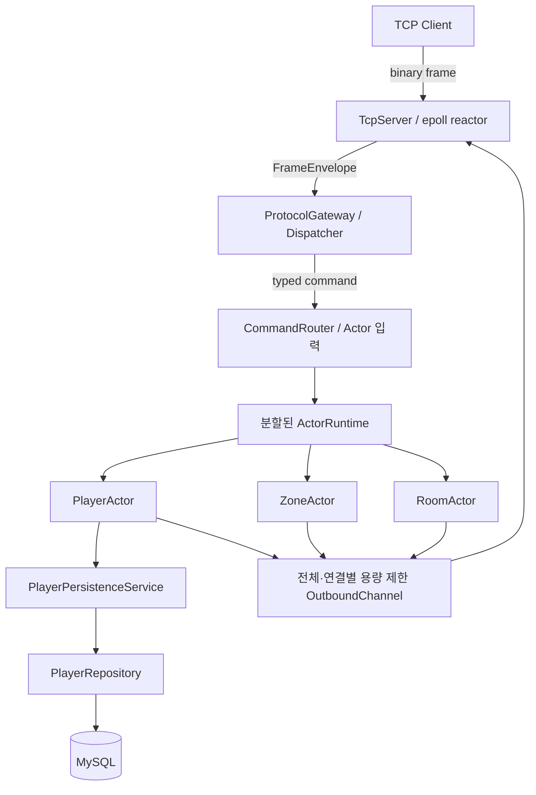

# SnF - C++ 비동기 MORPG 서버

> epoll 기반 네트워크, Actor 실행 모델과 MySQL 영속화 설계 및 구현

---

## 1. 프로젝트 개요

SnF는 Linux에서 실행되는 C++20 기반 MORPG 서버입니다. 논블로킹 TCP와 epoll로 연결을 처리하고, 게임 상태 변경은 Actor별 FIFO 명령 대기열을 통해 순차적으로 처리합니다. DB 읽기·저장과 송신 공간 확보를 기다릴 때는 코루틴으로 해당 Actor만 중단하며, Worker 스레드는 대기하지 않고 다른 Actor를 계속 처리합니다.

클라이언트는 인증 후 Zone에 입장해 이동하고, 최대 4명이 Battle Room에 입장해 전투한 뒤 보상을 획득하고 Zone으로 복귀합니다. Room은 전투 중 100ms 단발성 타이머를 반복 예약해 이동·추격·공격 등을 처리하고, 전투 제한시간과 승패를 관리합니다.

---

## 2. 전체 아키텍처

SnF는 네트워크 입출력, 게임 상태 변경, 데이터베이스 작업을 서로 다른 실행 경계로 나눕니다.
요청은 네트워크 Reactor에서 해석한 뒤 대상 Actor로 전달하고, 처리 결과는 클라이언트 응답이나
Player 상태 저장으로 이어집니다.



각 실행 경계가 소유하는 상태와 역할은 다음과 같습니다.

| 구성 요소 | 소유하는 상태 | 역할 |
| --- | --- | --- |
| TcpServer / epoll Reactor | 연결(Session), 연결 세대 번호 | TCP 입출력과 프레임 처리 |
| ActorRuntime Worker | Player·Zone·Room 상태, 명령 대기열, 코루틴 실행 상태 | 명령 순서화와 게임 로직 실행 |
| PlayerPersistenceService | 저장 대기·진행 중인 Player 스냅샷 | 최신 스냅샷 병합과 Player별 저장 순서 보장 |
| MySQL Repository Worker | MySQL 연결과 현재 저장 작업 | 동기식 MySQL 읽기·저장 실행 |

---

## 3. 네트워크

### 3.1 단일 epoll Reactor로 연결 상태 소유

하나의 Reactor가 모든 Session을 소유하고, `epoll`이 알려준 준비 상태에 따라 논블로킹
`accept`·`recv`·`send`를 직접 수행합니다. 연결 상태를 한 스레드에서 연속적으로 관리하며, 완료 통지
기반 I/O로 전환할 명확한 요구가 없었기 때문에 현재 범위에서는 이 구조를 유지했습니다.

#### 구현 구조

```text
epoll_wait
├── listener 수신 가능      → accept4(SOCK_NONBLOCK | SOCK_CLOEXEC)
├── client 수신 가능        → recv 반복 → FrameDecoder
├── client 송신 가능        → 미전송 위치부터 send
├── 송신 eventfd            → Actor가 생성한 송신 작업 소비
├── 종료 eventfd            → 내부 종료 요청 처리
└── SIGINT/SIGTERM signalfd → 종료 상태로 전이
```

`eventfd` 자체에 상태를 두지는 않습니다. Reactor가 송신 대기열이나 종료 조건을 다시 확인하게 하는
깨움 신호로 사용합니다.

> 코드: [`src/server/tcp_server.cpp`](src/server/tcp_server.cpp)

#### 한계

Reactor는 네트워크 I/O 전용 스레드 하나를 사용합니다. 부하가 낮을 때는 `epoll_wait()`에서
대기하므로 CPU 사용량은 적지만, 해당 스레드를 Actor 작업에 활용할 수는 없습니다. 반대로 모든
소켓 I/O가 한 스레드에 모이므로 네트워크 부하가 커지면 Reactor가 처리량의 상한이 될 수 있습니다.

### 3.2 부분 입출력과 연결 세대

```text
[body_length:u32][type:u16][request_id:u32][payload]
```

TCP 수신 단위와 요청 프레임의 경계가 일치하지 않으므로 본문 길이를 헤더에 기록하고 최대 64 KiB로
제한했습니다. `FrameDecoder`는 누적된 입력에서 완성된 프레임만 순서대로 꺼냅니다. `send()`가
일부만 전송하면 Session이 전송 위치를 저장하고 다음 `EPOLLOUT`에서 남은 데이터만 보냅니다.

연결 종료 후 같은 파일 디스크립터가 재사용되는 경우에는 `ConnectionId{descriptor, generation}`으로
이전 연결과 새 연결을 구분합니다. 송신·Session 조회·명령 전달과 `epoll` 이벤트 모두 두 값이
일치할 때만 현재 연결에 적용합니다.

> 코드: [`src/net/session.cpp`](src/net/session.cpp),
> [`src/protocol/frame_codec.cpp`](src/protocol/frame_codec.cpp)

### 3.3 송신 용량 제한과 느린 클라이언트 격리

Room은 전투 변경사항을 참가자에게 주기적으로 전송합니다. 특정 클라이언트가 데이터를 읽지 않으면
해당 연결의 미전송 데이터가 계속 쌓입니다. 송신 대기열에 상한이 없으면 메모리 사용량이 계속
늘어나고, 전체 용량만 제한하면 느린 연결 하나가 송신 대기열을 독점할 수 있습니다.

> OutboundChannel은 송신 작업 개수를 제한하고, Session은 실제 미전송 바이트를 제한합니다.

공유 `OutboundChannel`은 대기 중인 송신 작업과 예약한 공간을 합쳐 최대 4,096개로 제한하며, 한
연결은 최대 64개까지만 점유할 수 있습니다. Reactor가 송신 작업을 가져간 뒤에는 Session이 연결별
미전송 데이터를 관리하며, 기본 상한은 1 MiB입니다.

Actor가 결과를 송신 작업으로 등록하기 전에 필요한 개수를 예약합니다. 대기가 가능한 요청·응답
경로에서는 용량이 날 때까지 해당 Actor만 중단하고 Worker는 다른 Actor를 처리합니다. 송신 작업을
등록할 수 없거나 Session의 바이트 상한을 넘으면 응답을 조용히 버리지 않고 해당 연결을 종료합니다.

#### 구현 구조

```text
Actor 결과
→ OutboundChannel 예약 (전체 4,096개, 연결별 64개)
→ Reactor가 송신 작업 소비
→ Session 미전송 데이터 (연결별 최대 1 MiB)
→ `send()`
```

4인 Room에서 한 클라이언트만 수신을 중단한 통합 테스트에서는 해당 연결 하나만 종료됐습니다.
나머지 3명은 `BattleDigest`의 순서 번호를 건너뛰지 않았고, `ParticipantLeft` 이후에도 전투를
클리어했습니다.

#### 한계

느린 연결의 데이터를 무기한 보관하지 않고 연결 종료로 포화를 해소합니다. 또한 `OutboundChannel`은
모든 Actor Worker가 공유하므로 송신 작업이 크게 늘어나면 하나의 경합 지점이 될 수 있습니다.

---

## 4. Actor와 비동기 실행

ActorRuntime은 `ActorKey`로 담당 Worker를 정하고, 각 Worker는 자신에게 배치된 Actor의 대기열,
실행 상태와 코루틴 수명을 독점해서 관리합니다.

```text
ActorRuntime
└── Worker 0..N
    ├── 용량 제한 ingress
    ├── 완료 결과 대기열
    ├── 실행 준비 Actor 대기열
    ├── 단발 타이머
    ├── 작업 예약과 실행 지표
    └── ActorEntry table
        └── ActorEntry
            ├── ActorBinding
            ├── FIFO mailbox
            ├── execution
            │   └── Idle / Ready / Running / Suspended
            ├── incarnation
            ├── ActorContext
            ├── 현재 명령과 외부 작업
            └── ActorState
                ├── PlayerActorState
                │   ├── Player
                │   ├── 연결·요청·생명주기 정보
                │   └── 읽기·송신 예약·저장 코루틴 상태
                ├── ZoneActorState
                │   └── Zone
                └── RoomActorState
                    └── Room
```

| 구성 요소 | 역할 |
| --- | --- |
| `ActorRuntime` | Binding을 등록하고 `ActorKey`에 따라 명령을 담당 Worker로 보냅니다. |
| Worker | 입력·완료·타이머·실행 준비 대기열과 자신에게 배치된 모든 `ActorEntry`를 소유합니다. |
| `ActorEntry` | Actor 활성화 하나의 mailbox, 실행 상태, 세대와 진행 중인 작업을 관리합니다. |
| `ActorBinding` | Runtime 명령을 게임 객체 호출로 변환하고 결과를 송신·저장·타이머로 연결합니다. |
| `ActorState` | Binding이 사용하는 타입별 상태이며 게임 객체와 필요한 비동기 진행 정보를 가집니다. |
| `ActorContext` | Actor 메시지 전달, 외부 작업 시작과 타이머 예약처럼 담당 Worker의 기능만 제공합니다. |

`PlayerActorState`는 게임의 `Player` 자체가 아니라 연결·요청과 코루틴 진행 상태까지 포함한 Runtime
상태입니다. `ActorState`의 가상 소멸자를 통해 Runtime이 타입별 상태를 제거하며,
`PlayerActorState`가 파괴될 때 비활성화 완료 콜백도 실행합니다.

### 4.1 mutex 대신 Actor를 선택한 이유

#### 문제

여러 Worker가 같은 Player·Zone·Room 상태를 동시에 변경하면 명령 순서와 동기화 범위를 정해야
합니다. 모든 상태를 mutex로 보호하면 상태마다 잠금 범위와 획득 순서를 관리해야 하고, DB나 송신
공간을 기다리는 작업이 잠금 구간에 섞일 수 있습니다.

#### 결정과 이유

> Actor는 자신에게 도착한 명령을 FIFO 순서로 하나씩 처리하는 실행 단위입니다.

Player·Zone·Room을 Actor로 실행합니다. 같은 Actor의 명령은 동시에 실행되지 않으며, 서로 다른
Actor는 독립적으로 진행합니다. 도메인 객체가 Actor 기반 클래스를 상속하지는 않습니다.
`ActorBinding`이 일반 C++ 객체를 Runtime과 연결하므로 게임 로직은 스레드·소켓·DB를 모르는 동기
함수로 유지합니다.

#### 한계

여러 Actor의 상태를 하나의 트랜잭션으로 변경하지는 못합니다. Player·Zone·Room을 함께 변경하는
입장과 복귀는 별도의 진행 상태와 보상 절차로 처리합니다.

### 4.2 Actor별 순서와 Worker 배치

```text
worker = hash(ActorKey{kind, entity}) % worker_count
```

Actor는 `ActorKey`의 해시로 정해진 Worker에 배치됩니다. 활성화된 동안 상태, 명령 대기열과
코루틴은 항상 같은 Worker가 소유하며, 명령·타이머·외부 작업의 완료 결과도 해당 Worker로
돌아옵니다. 따라서 Actor 상태를 다른 Worker가 직접 변경하지 않습니다.

```text
명령 게시
→ 담당 Worker 입력 대기열
→ Actor FIFO 명령 대기열
→ 실행 준비 대기열
→ 한 차례에 최대 16개 처리
→ 남은 명령이 있으면 다시 실행 준비 대기열에 등록
```

실행 준비 대기열에는 Actor마다 토큰을 하나만 둡니다. 한 Actor가 한 차례에 처리할 명령 수도
16개로 제한해, 명령이 몰린 Actor가 같은 Worker의 다른 Actor를 계속 밀어내지 않게 합니다.

#### 한계

실행 중인 Actor를 다른 Worker로 이동하거나 Worker 사이의 Actor 수를 재조정하지 않습니다. 또한
하나의 Actor는 한 Worker에서 순차 실행되므로 단일 Actor의 처리량은 해당 Worker의 실행 속도를
넘을 수 없습니다.

### 4.3 외부 작업을 기다리는 동안 해당 Actor만 중단

#### 문제

Actor Worker에서 MySQL 응답이나 송신 공간을 동기적으로 기다리면 같은 Worker가 담당하는 다른
Actor도 함께 멈춥니다.

#### 결정과 이유

Player·Zone·Room의 핸들러는 동기 함수로 유지하고, 외부 작업을 아는 `ActorBinding`에 코루틴을
둡니다. 외부 작업을 기다리는 Actor는 실행 준비 대기열에서 빠지지만, Worker는 다른 Actor를 계속
처리합니다. 완료 결과가 도착해도 외부 스레드가 코루틴을 직접 재개하지 않고 담당 Worker에
결과를 게시합니다.

```text
Actor Worker
→ 외부 작업 시작
→ Actor 중단
→ 다른 Actor 처리

Repository / OutboundChannel
→ 완료 결과 게시

담당 Actor Worker
→ Actor와 작업 식별자 확인
→ 코루틴 재개
```

외부 작업을 시작하기 전에 완료 결과를 받을 공간도 함께 예약합니다. 완료와 취소가 경쟁하면 둘 중
하나만 최종 결과가 되며, Actor가 비활성화된 뒤 늦게 도착한 결과는 식별자가 맞지 않아 폐기됩니다.

#### 한계

I/O 단계가 많은 `ActorBinding`은 읽기·저장·송신 대기 상태를 직접 관리하므로 도메인 객체보다
구현이 복잡해집니다.

---

## 5. Battle Room

Room은 참가자와 적의 좌표·HP·이동 의도·공격 상태를 하나의 Actor에서 관리합니다. 클라이언트는
이동과 스킬 사용을 요청하고, 위치·쿨다운·공격 범위·피해량·승패는 서버가 판정합니다.

### 5.1 서버 권위 전투 처리

```text
UseSkill 프레임
→ RoomActor FIFO 명령 대기열
→ 현재 좌표·쿨다운·공격 범위 판정
→ 피해·사망·전투 종료 상태 반영
→ 전투 변경사항을 BattleDigest로 참가자에게 전송
```

Room 명령과 타이머는 같은 FIFO 명령 대기열을 통과합니다. 따라서 스킬 사용, 참가자 이동, 적 행동과
전투 종료가 하나의 실행 순서에서 처리됩니다. 같은 Room 상태에서 하나의 명령이 만드는 대상 선택과
피해·사망 이벤트 순서는 ID를 기준으로 결정합니다.

### 5.2 Tick과 전투 상태

Room은 기본 100ms 간격의 단발성 타이머를 실행한 뒤 다음 tick을 다시 예약합니다. 전투 제한시간은
tick과 별도의 타이머로 예약하지만, 두 타이머 모두 RoomActor의 명령 대기열에서 처리됩니다.

```text
Waiting
  → Running
      ├── Cleared : 보스 HP 0
      └── Failed  : 제한시간 초과 또는 참가자 전원 사망
```

전투 제한시간 타이머를 예약할 수 없으면 종료 결과를 보장할 수 없으므로 `BattleStart`를
`RuntimeOverloaded`로 거절합니다. 시작된 전투는 종료 상태를 한 번만 만들고, 남은 타이머와 명령이
정리된 뒤 RoomActor를 비활성화합니다.

#### 한계

tick은 이전 처리가 끝난 뒤 100ms를 더하는 방식이므로 Worker가 바쁘면 실행 시점이 늦어질 수
있습니다. 정확한 고정 주기를 보장하지 않으며 타이머 지연과 tick 실행 시간을 지표로 기록합니다.

### 5.3 클리어 보상과 Zone 복귀

```text
보스 HP 0
→ Room을 Cleared로 전환
→ BattleDigest와 BattleCleared 전송
→ PlayerActor에 경험치 지급 메시지 전달
→ Player 상태 반영과 스냅샷 저장 요청
→ 참가자를 Zone으로 복귀
```

RoomActor는 PlayerActor에 보상 메시지를 보내지만 응답을 기다리지는 않습니다. Actor끼리 서로의
응답을 기다리면 순환 대기가 생길 수 있기 때문입니다. 메시지 전달이 거절되면 Room을 멈추지 않고
카운터로 기록합니다. PlayerActor가 메시지를 수락하면 경험치를 반영하고 저장 대기열 수락까지
책임집니다.

Room 입장과 복귀는 Player·Zone·Room 상태를 한 번에 변경하지 않습니다.

```text
Stable(zone)
→ Entering 기록과 완료 공간 예약
→ PlayerActor에서 전투 스냅샷 생성
→ Room 좌석 적용
→ 원래 Zone에서 제거
→ InRoom 공개
→ 전투
→ Returning 기록과 복귀 epoch 발급
→ 원래 Zone에 재등록
→ Stable(zone) 공개
```

Room의 정원과 전투 단계는 Room만 판정할 수 있으므로, Room 좌석이 적용된 뒤 원래 Zone에서
제거합니다. 입장·복귀 식별자, 진행 단계와 epoch가 현재 전환에 맞지 않는 늦은 완료는 폐기합니다.
Zone 제거가 실패하면 Room 좌석을 되돌리고, 복귀에 실패하면 연결을 종료해 잘못된 경로를 공개하지
않습니다.

---

## 6. MySQL과 Player 저장

### 6.1 동기식 MySQL을 Actor Worker 밖에서 실행

MySQL C API는 호출한 스레드를 대기시킵니다. Actor Worker에서 직접 읽고 저장하면 해당 Worker가
담당하는 다른 Actor까지 DB 응답 동안 멈춥니다.

```text
PlayerActor
→ PlayerPersistenceService
→ PlayerRepository 작업 대기열
→ MySQL 전용 Worker
→ MySQL
```

MySQL 작업은 용량이 제한된 작업 대기열과 전용 Worker 스레드에서 실행합니다. Actor 쪽에서는
`asyncLoad`와 `asyncSave`만 사용하며 MySQL 연결이나 SQL을 직접 다루지 않습니다. 대기열이
가득 차면 작업을 시작하지 않고 `Unavailable` 결과를 돌려줍니다. 테스트에서는 같은
`PlayerRepository` 인터페이스를 구현한 메모리 저장소를 사용합니다.

### 6.2 Player 스냅샷 병합과 저장 순서

실행 중인 Player 상태는 PlayerActor가 소유하고, DB에는 로그인과 재접속에 사용할 전체 스냅샷을
저장합니다. 위치·재화·경험치가 변경되면 dirty 상태를 표시하고 `PlayerRecord`를
`PlayerPersistenceService`에 제출합니다.

Service는 다음 순서를 보장합니다.

- 같은 Player의 대기 중인 스냅샷은 가장 최근 값으로 교체합니다.
- 같은 Player의 저장을 동시에 두 개 실행하지 않습니다.
- 서로 다른 Player의 저장은 Repository Worker에서 병렬로 실행할 수 있습니다.
- 실패한 저장은 스냅샷을 유지한 채 다시 시도합니다.
- 연결 종료와 서버 종료 시 마지막 스냅샷이 이전 저장을 추월하지 않도록 순서대로 처리합니다.

### 6.3 저장 보장 범위

NPC 구매와 전투 보상은 MySQL 저장 완료 전에 성공 결과를 보냅니다. 따라서 저장 대기 중에
프로세스가 비정상 종료되면 최근 변경이 유실될 수 있습니다.

**서버 실행 중 보장하는 것**

- PlayerActor가 실행 중인 Player 상태를 소유합니다.
- 같은 Player의 저장 순서를 보장하고, 대기 중인 스냅샷은 최신 값으로 병합합니다.
- 저장 실패 시 스냅샷을 유지하고 다시 시도합니다.
- 전투 보상 스냅샷이 대기열에서 거절되면 dirty 상태를 복원하고 1초 간격으로 최대 5회 다시 시도합니다.

**보장하지 않는 것**

- 프로세스 비정상 종료 직전 변경의 영속성
- 보상이 정확히 한 번만 적용되는 것

보상 메시지 전달 거절, 최초 Player 읽기 실패와 재시도 소진은 카운터로 기록합니다.

---

## 7. 검증

### 7.1 테스트 전략

| 설계 주장 | 대표 검증 |
| --- | --- |
| TCP 부분 입출력 | 분할·병합 수신, 부분 송신 위치, `EINTR`·`EAGAIN`, 수신 중 연결 종료 |
| 연결 generation | 이전 연결의 늦은 송신·비활성화가 재사용된 Session을 변경하지 않음 |
| Actor FIFO·단일 실행 | 같은 Actor 순차 실행, 다른 Worker의 병렬 실행 |
| 용량 제한 | 입력·외부 작업·타이머·송신 대기열 포화 |
| 코루틴 수명 | 즉시 완료, 완료·취소 경합, 늦은 완료, 담당 Worker에서 폐기 |
| Player 저장 | dirty 복원, 최신 값 병합, Player별 저장 직렬화, 재시도 |
| MySQL | Repository 재생성과 GameServer 재시작 후 Player 복원 |
| 느린 클라이언트 | 해당 연결만 종료, 나머지 3명의 digest 연속성과 `ParticipantLeft` 이후 클리어 |
| 서버 종료 | Actor·코루틴·스냅샷·송신·Session 정리 순서 |

게임 계층은 Runtime과 분리해 단위 테스트를 실행합니다. Runtime 경합과 대기열 포화는 작은 용량과
테스트용 제어 지점으로 재현하고, TCP 재접속과 느린 송신은 실제 소켓을 사용하는 통합 테스트로
검증합니다. Debug·ASan·UBSan·TSan 구성에서 실행했으며, MySQL 통합 테스트는 별도 테스트 DB를
사용했습니다.

### 7.2 부하 측정

Release `LoadScenario::Battle`로 한 Room의 직렬화 한계와 Worker 수에 따른 여러 Room 확장을
나누어 측정했습니다. 각 실행은 6초 동안 첫 병목을 찾는 용량 탐색이며 장기 벤치마크는 아닙니다.
한 Room에서는 부하 생성기가 약 3,930 response/s에서 먼저 한계에 도달해 Room의 붕괴점은 확인하지
못했습니다.

| Workers × Rooms | Clients | 결과 | Response/s | RTT p99 | Outbound HWM |
| --- | ---: | --- | ---: | ---: | ---: |
| 1 × 256 | 1,024 | 성공 | 10,112 | 26.563ms | 1,503 |
| 1 × 512 | 2,048 | 전투 처리 성공 / 동시 종료 시 Worker 외부 작업 예약 1,024개 도달 | 19,882.7 | 33.540ms | 2,441 |
| 2 × 500 | 2,000 | 성공 | 19,750 | 29.429ms | 2,422 |
| 4 × 700 | 2,800 | 성공 | 27,650 | 30.720ms | 3,232 |
| 4 × 750 | 3,000 | OutboundChannel 4,096개 도달 / 116개 연결 종료 | 28,989.7 | 33.065ms | 4,096 |

1 Worker에서 2,048개 연결의 전투 명령은 처리했지만, 동시 종료 시 Worker의 외부 작업 예약 상한
1,024개가 먼저 찼습니다. 4 Worker에서는 700개 Room까지 성공했고, 750개 Room에서 공유
`OutboundChannel`의 4,096개 상한에 도달했습니다. 관측 범위에서 tick 예산 초과와 타이머 예약
거절은 없었습니다.

측정 당시 전투 설정은 현재 기본값과 다르므로 절대 수치는 당시 구성에 한정합니다. 이 측정은
Room이나 Reactor의 최대 처리량보다, 종료 예약과 공유 송신 대기열이 먼저 용량 경계가 된다는 것을
확인한 결과입니다.

---

## 8. 서버 종료 순서

```text
새 연결과 명령 수락 중단
→ Session 종료 사실을 Actor에 전달
→ Actor·타이머·코루틴 정리
→ Player 스냅샷 저장 완료
→ 송신 대기열과 Session 미전송 데이터 처리
→ Reactor 종료
```

Actor는 송신 공간을 기다리며 중단될 수 있습니다. Reactor를 먼저 종료하면 송신 공간을 돌려줄
주체가 사라져 Actor Worker가 끝나지 않을 수 있으므로, Reactor는 Actor와 송신 대기열이 정리된 뒤
마지막에 종료합니다.

유예 시간이 끝나거나 Runtime이 실패하면 취소 경로로 전환합니다. 외부 스레드는 취소만 요청하고,
코루틴 재개·폐기와 명령 대기열 정리는 상태를 소유한 Worker가 수행합니다.

---

## 9. 핵심 코드 위치

| 관심사 | 코드 |
| --- | --- |
| epoll Reactor와 Session 수명 | [`src/server/tcp_server.cpp`](src/server/tcp_server.cpp) |
| Actor 실행·코루틴·타이머 | [`src/runtime/actor_runtime.cpp`](src/runtime/actor_runtime.cpp) |
| Player 비동기 연결 계층 | [`src/server/player_actor_binding.cpp`](src/server/player_actor_binding.cpp) |
| Room 전투 상태 기계 | [`src/game/room.cpp`](src/game/room.cpp) |
| 스냅샷 병합과 저장 순서 | [`src/server/player_persistence_service.cpp`](src/server/player_persistence_service.cpp) |
| MySQL 작업 대기열과 SQL | [`src/server/mysql_player_repository.cpp`](src/server/mysql_player_repository.cpp) |

---

## 10. 실행

### 10.1 최초 환경 준비 및 빌드

최초 한 번만 Docker 개발 이미지를 만들고 서버와 Python 클라이언트를 준비합니다.

```bash
# Docker 개발 이미지 빌드
docker build -t snf-server-dev .

# Docker에서 C++ 서버 빌드 (ASan·UBSan)
docker run --rm -v "$PWD:/workspace" -w /workspace snf-server-dev bash -c \
  "cmake --preset asan-ubsan && cmake --build --preset asan-ubsan"

# Python 클라이언트 가상환경 생성 및 pygame 설치
cd game-client
python3 -m venv .venv-play
.venv-play/bin/pip install pygame
cd ..
```

### 10.2 평소 실행

준비가 끝난 뒤에는 서버와 클라이언트를 각각 실행합니다.

1. Docker 서버 실행 (백그라운드)

   ```bash
   docker run -d --name snf-server --rm -p 7777:7777 -v "$PWD:/workspace" -w /workspace snf-server-dev ./build/asan-ubsan/snf_server
   ```

2. 클라이언트 실행 (Zone 필드 + AI 봇 3명)

   ```bash
   cd game-client && .venv-play/bin/python snf_play.py --player 1 --zone 1 --room 1 --zone-first --bots 3
   ```
