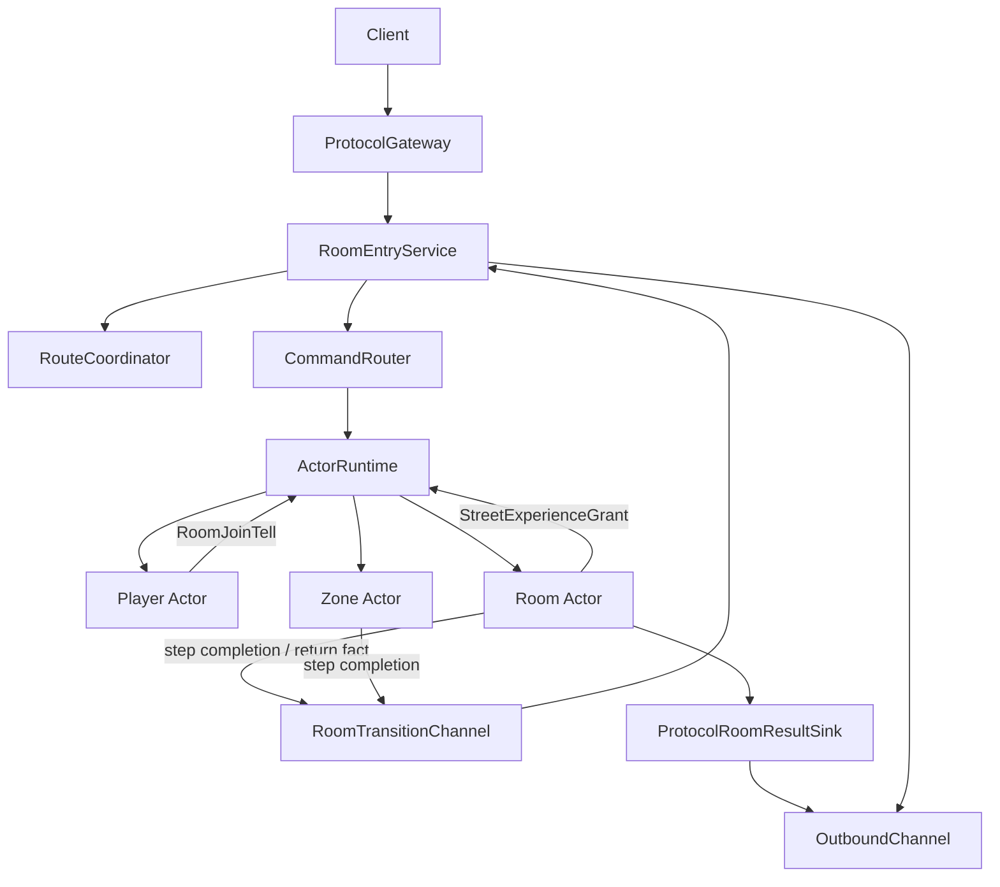
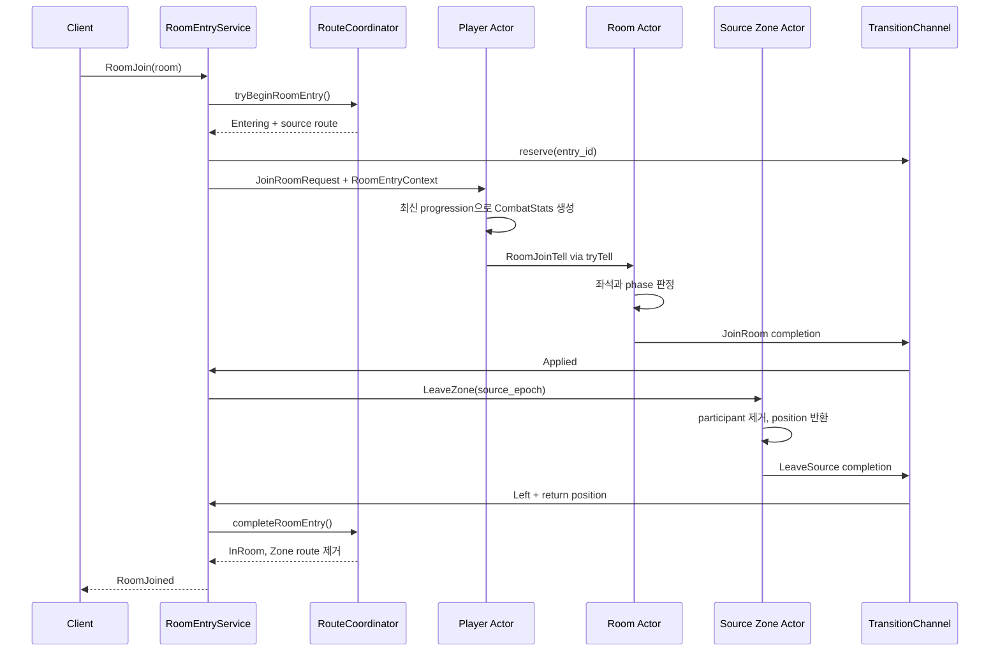
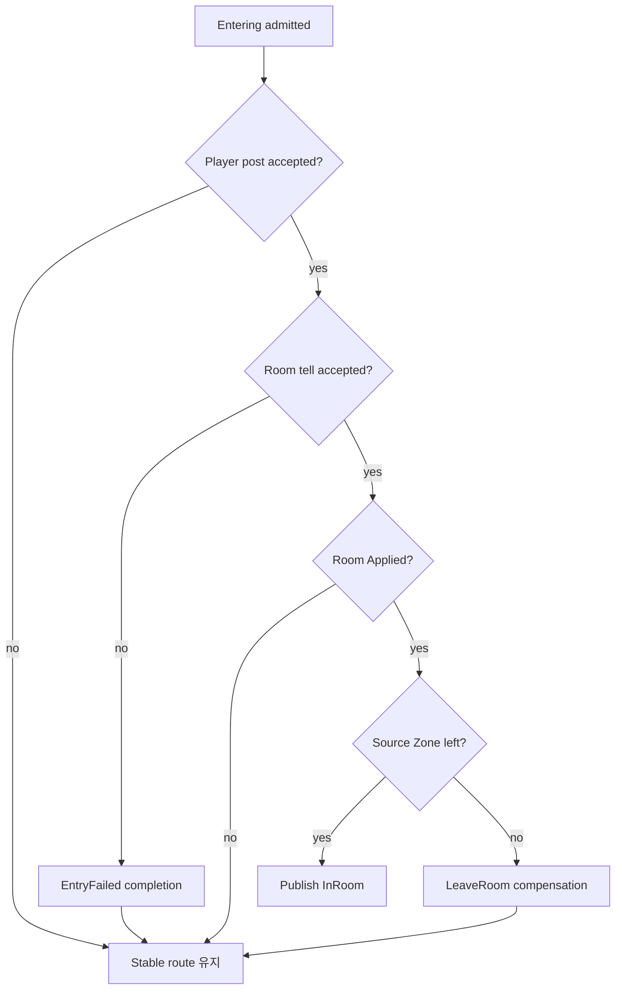
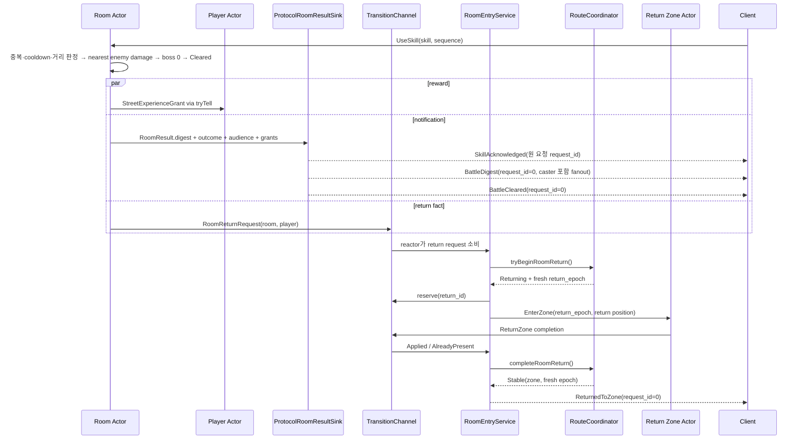
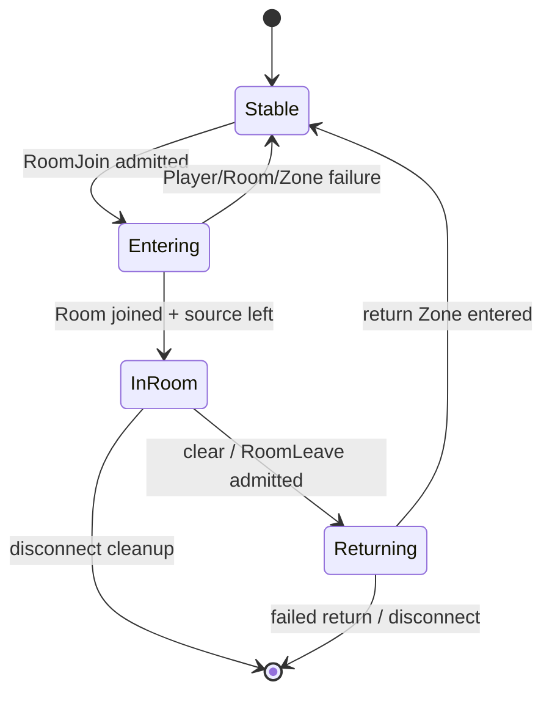

# Actor 상호작용 아키텍처

> 범위: 현재 구현된 Zone–Room–Player 상호작용과 이를 연결하는 Actor tell, bounded completion,
> reactor-owned saga의 역할
>
> 이 문서는 특정 실패 상태를 정의하는 계약서가 아니라, 서로 다른 상태 소유자를 어떤 전달 수단으로
> 연결했는지 설명하는 구현 사례다. Room 입장과 복귀의 단계별 보상 규칙은
> [Room 입장 Handoff 계약](./room-entry-handoff-contract.md)이 소유한다.

## 1. 핵심 결정

SnF는 Actor 사이의 모든 상호작용을 하나의 메시지 방식으로 통일하지 않는다. **다음 결정을 내려야 하는
상태의 소유자와 필요한 전달 보장 수준에 따라 경로를 선택한다.**

```text
gameplay state의 다음 결정        → Actor mailbox로 tell
connection/route authority 변경    → reactor-owned saga
Worker가 낸 saga 단계 결과         → 예약된 completion channel
Worker가 reactor에 알리는 새 사실  → bounded request channel
client에 보여줄 결과               → protocol result sink
```

이 원칙은 Room 입장과 전투 종료에서 한 번에 드러난다.

- Player는 자신의 progression으로 전투 스탯을 만든다.
- Room은 좌석, 전투 phase와 보상 대상을 판정한다.
- Zone은 참가자와 위치를 수정한다.
- reactor는 connection이 현재 어느 공간으로 route되는지 소유한다.
- Actor Runtime은 mailbox 위치와 실행 순서만 책임진다.

어느 컴포넌트도 다른 소유자의 mutable state를 직접 읽지 않는다.

## 2. 상태 소유권



| 소유자 | 소유하는 mutable state | 소유하지 않는 것 |
| --- | --- | --- |
| Player | identity, progression, economy, 마지막 복귀 가능 Zone 위치 | Room 좌석과 phase, connection route |
| Room | participant와 입장 시 combat snapshot, phase, 보상 대상 | Player의 현재 progression, connection |
| Zone | participant, position, route epoch, tick state | Room 좌석, connection의 현재 공간 |
| `RouteCoordinator` | connection별 Stable/Entering/InRoom/Returning route와 Player별 epoch | gameplay participant 세부 상태 |
| `RoomEntryService` | 입장·복귀 saga 진행, 보상과 terminal 응답 | Player/Room/Zone 내부 상태 |
| `ActorRuntime` | ActorKey routing, mailbox, 실행 상태와 lifecycle | 도메인 command/result 의미 |
| protocol sink | PlayerId→connection 해석과 frame 전송 | gameplay 판정과 route 전이 |

Room이 Player의 최신 progression을 읽거나 reactor가 Room 좌석을 세면 소유권이 중복된다. 대신 소유자가
자기 상태로 결정을 내리고 immutable value를 다음 소유자에게 전달한다.

## 3. 상호작용 수단 선택

### 3.1 Actor command

reactor에서 gameplay 결정을 시작할 때는 typed command를 대상 Actor mailbox에 게시한다. Room 입장은
Player의 현재 경험치에서 combat snapshot을 만들어야 하므로 client의 `RoomJoin`은 Room이 아니라
Player에게 먼저 간다.

```text
RoomJoin frame
→ JoinRoomRequest{room}
→ Player mailbox
→ Player가 최신 progression으로 CombatStats 생성
```

client가 전투 수치를 보내게 하지 않고, reactor-side cache도 두지 않는다. client 값은 신뢰할 수 없고,
load 시점에 만든 cache는 보상을 받은 뒤 오래된 값이 되기 때문이다.

### 3.2 Actor tell

한 Actor의 결과가 다른 Actor의 gameplay 결정을 시작할 때는 `ActorContext::tryTell()`을 사용한다.

```text
Player → Room  : 입장할 Player와 combat snapshot
Room   → Player: 전투 보상 경험치
```

tell은 응답을 기다릴 수 없는 1:1 비동기 전송이다. 대상 Binding이 payload를 자기 command로 복원하며,
기존 `tryPost` 경로를 사용하므로 외부 command와 같은 shard, ingress, mailbox와 backpressure를 갖는다.

### 3.3 예약된 transition completion

Room 또는 Zone command의 결과로 reactor-owned route 상태를 바꿔야 할 때 Actor가 route를 직접 수정하지
않는다. Worker는 `RoomTransitionCompletion` value만 예약된 channel에 게시하고, reactor의
`RoomEntryService`가 이를 소비해 saga를 전진시킨다.

```text
Room/Zone Worker
→ RoomTransitionCompletion
→ RoomTransitionChannel
→ reactor wake-up
→ RoomEntryService
→ RouteCoordinator 상태 전이
```

Room 입장 또는 복귀 admission은 saga 전체 수명에 사용할 ticket 하나를 먼저 예약한다. 한 시점에는 단계
하나만 진행되므로 같은 ticket이 각 단계의 completion slot을 재사용한다. 따라서 admission이 끝난 뒤
completion queue 포화로 saga 결과를 잃는 경로가 없다.

### 3.4 Return request

Room clear는 기존 entry saga의 단계가 아니라 새 복귀를 시작하게 하는 사실이다. 그래서 ticket을 가진
completion이 아니라 별도 bounded `RoomReturnRequest{room, player}`를 Worker에서 reactor로 게시한다.

reactor가 request를 소비한 뒤에야 route state를 `Returning`으로 바꾸고 새 return ticket을 예약한다.
이 request를 잃으면 Player가 어느 Zone에도 없는 채 남으므로 게시 실패는 best-effort가 아니라 Logic
Runtime failure로 승격된다.

### 3.5 Protocol result sink

게임 결과와 client 알림은 같은 것이 아니다. Room은 참가자를 `PlayerId`로만 알고, live connection을
알지 않는다. 일반 Room command와 clear는 `ProtocolRoomResultSink`가 session directory에서 connection을
찾아 `BattleStarted`, `BattleCleared` 같은 frame으로 변환한다.

handoff 중인 `RoomJoined`는 예외다. Room이 join을 승인한 시점에는 아직 source Zone leave가 남아 있으므로
Room result를 바로 client에 보내지 않는다. reserved completion으로 `RoomEntryService`에 돌려보내고,
서비스가 Zone leave와 route publish까지 마친 뒤 terminal `RoomJoined`를 보낸다.

이 경로는 Actor routing이나 route saga와 분리된다. client 알림이 실패해도 gameplay result를 다시
판정하지 않으며, outbound admission 정책에 따라 connection을 정리한다.

## 4. 전달 의미 비교

| 흐름 | 전달 수단 | 포화 또는 실패 시 의미 |
| --- | --- | --- |
| reactor → Player/Zone/Room command | bounded Actor post | 시작하지 않고 typed 거부 또는 client terminal 처리 |
| Player → Room 입장 | `tryTell(RoomJoinTell)` | saga가 기다리는 중이면 `EntryFailed` completion으로 변환 |
| Room → Player 보상 | `tryTell(StreetExperienceGrant)` | 현재는 best-effort; 대상 mailbox가 가득 차면 보상 유실 가능 |
| Room/Zone → reactor 단계 결과 | 예약된 transition completion | publish 실패를 Logic Runtime failure로 처리 |
| Room clear → reactor 복귀 요청 | bounded return request | publish 실패를 Logic Runtime failure로 처리 |
| Room result → client | outbound reservation | 게임 상태와 분리해 admission failure 처리 |

같은 `tryTell()`도 도메인 의미에 따라 실패 처리가 다르다.

- 일반 보상 tell은 sender를 막지 않고 결과를 기다리지 않는다.
- Room 입장 tell은 reactor saga가 terminal 결과를 기다린다. 조용히 drop되면 hidden route가 영원히
  남으므로 Player Binding이 거부를 `EntryFailed` completion으로 바꾼다.

Runtime primitive가 delivery guarantee를 전부 결정하는 것이 아니다. 호출자가 그 메시지를 왜 보내는지에
따라 상위 계층이 실패 의미를 완성한다.

## 5. 도메인 결과와 server context 분리

도메인 상태 기계는 mailbox, connection, request ID나 saga ticket을 알지 않는다.

```cpp
struct PlayerResult
{
    std::vector<SendResponse> responses;
    std::optional<RoomJoinRequest> room_join;
};

struct RoomResult
{
    RoomCommandStatus status;
    RoomPhase phase;
    std::optional<std::chrono::milliseconds> deadline_after;
    std::optional<std::chrono::milliseconds> tick_after;
    std::uint64_t boss_health;
    bool boss_spawned;
    std::optional<BattleDigest> digest;
    std::optional<BattleOutcome> outcome;
    std::optional<BattleFailureReason> failure_reason;
    std::vector<PlayerId> audience;
    std::vector<StreetExperienceGrant> grants;
};
```

Player는 “이 Room에 이 스탯으로 들어가고 싶다”고 말하고, Room은 “다음 tick과 deadline은 언제고,
어떤 전투 이벤트가 어떤 순서로 일어났으며, 누가 그것을 봐야 하고, 누구에게 얼마를 지급한다”고
말한다. 어느 문장에도 connection은 없다. Binding과 sink가 이를 Runtime·network 동작으로 번역한다.

```text
PlayerResult.room_join       → RoomJoinTell → tryTell(Room)
RoomResult.deadline_after    → trySchedule(BattleDeadline)
RoomResult.tick_after        → trySchedule(RoomSimulationTick, ExistingOnly)
RoomResult.digest            → BattleDigest(request_id=0) fanout
RoomResult.grants            → tryTell(Player)
RoomResult.outcome+audience  → terminal 알림과 Zone 복귀 요청
```

`audience`가 `grants`와 별개인 이유는 실패다. 실패는 아무에게도 지급하지 않으므로 보상 목록이 비고,
그래도 참가자 전원에게 결과를 알리고 전원을 원래 Zone으로 되돌려야 한다. 두 목록을 하나로 합치면
`Failed` 경로에서 사람들이 Room에 갇힌다.

반대로 `RoomEntryContext`는 game command 안이 아니라 server command envelope 옆에 붙는다.

```text
game value
  JoinRoomRequest{room, stats}

server context
  entry_id, return_id, ticket, connection, player, step
```

Player Binding은 dispatch 시 context를 보관했다가 `RoomJoinTell`에 다시 붙이고, Room/Zone Binding은
result와 context를 결합해 completion을 만든다. 덕분에 game target은 network, Runtime과 saga 타입을
링크하지 않으면서도 하나의 요청이 여러 Actor와 thread를 건너 상관관계를 유지한다.

## 6. 정상 Room 입장



### 6.1 Player를 먼저 거치는 이유

Room이 사용할 combat snapshot은 Player의 progression에서 파생된다. 이를 Player가 만들면 다음 성질을
얻는다.

- client가 공격력이나 체력을 조작할 수 없다.
- 보상으로 progression이 변한 다음 입장도 최신 값으로 계산된다.
- Room은 Player persistence나 progression 구조를 알지 않는다.
- snapshot은 입장 시점에 고정되므로 전투 중 Player 데이터가 변해도 Room 판정은 결정적이다.

### 6.2 Room을 Zone leave보다 먼저 묻는 이유

`RoomFull`, `WrongPhase`, `AlreadyJoined`는 Room만 판정할 수 있다. Zone을 먼저 떠난 뒤 Room이 거절하면
매번 더 큰 epoch으로 source Zone을 복원해야 한다. Room을 먼저 물으면 Room 거절은 Zone을 전혀
건드리지 않는다.

대신 Room join 적용과 Zone leave completion 사이에 Player가 두 공간에 기록된 짧은 구간이 생긴다.
이때 public route는 `Entering`으로 숨겨지고 client gameplay command는 `TransitionInProgress`로 끝난다.
`StartBattle`도 `InRoom` route를 요구하므로 중간 상태가 gameplay로 노출되지 않는다. 겹침의 시간은 전투
전체가 아니라 두 mailbox 왕복으로 제한된다.

## 7. 입장 실패와 보상



실패 위치에 따라 필요한 보상이 달라진다.

- Player post, Room tell 또는 Room 판정 실패: source Zone을 아직 건드리지 않았으므로 route만 rollback한다.
- Room 적용 뒤 Zone leave 실패: Room 좌석을 이미 얻었으므로 `LeaveRoom`을 게시해 보상한다.
- completion의 ID, ticket 또는 step이 현재 saga와 다르면 stale result로 세고 적용하지 않는다.
- reply outbound가 포화되면 connection을 정리한다. 이미 `InRoom`이면 disconnect 경로가 Room 좌석을
  해제한다.

`RoomEntryId`는 입장 saga, `RoomReturnId`는 복귀 saga, `RoomTransitionTicket`은 예약된 channel slot,
`RoomEntryStep`은 completion이 어느 단계를 끝냈는지 식별한다. `completionFrom(context)`가 identity를
통째로 복사해 publisher마다 필드를 다시 조립하다 correlation 값을 빠뜨리는 오류를 막는다.

## 8. 전투 종료, 보상과 Zone 복귀



보스가 deadline까지 살아남거나 마지막 참가자가 죽으면 같은 그림에서 첫 두 줄만 바뀐다. Room의 자기
timer, deadline에 도달한 tick/늦은 command는 `Deadline` helper를 호출하고 전원 사망은
`PartyDefeated` helper를 호출한다. Room은 한 번만 `Failed`가 되며 pending `BattleDigest`, reason을 담은
보상 없는 `BattleFailed`와 복귀 요청이 순서대로 나간다.

### 8.1 Room tick과 관찰 경계

`StartBattle`은 Room의 시작 가능 여부를 확인한 뒤 deadline timer를 먼저 예약하고, 예약에 성공해야
Room 상태를 `Running`으로 바꾼다. 예약이 거절되면 `deadline_schedule_rejections`를 올리고
`RuntimeOverloaded`/`Waiting`으로 응답한다. Room과 Logic Runtime은 그대로 살아 있어 client가 시작을
재시도할 수 있다. 시작 뒤에는 100ms `ExistingOnly` one-shot tick을 예약하고, 각 tick 결과의
`tick_after`가 다음 timer 하나를 만든다. terminal result는 `PassivateIfIdle`을 반환하므로 Runtime이
남은 tick/deadline timer를 activation과 함께 제거한다. tick 예약 실패는 metric만 올린 뒤 이미
예약된 deadline을 종결 backstop으로 사용한다.

Room은 Zone과 별개인 비영속 Arena 좌표와 현재 HP를 소유한다. `SetMoveIntent`는 의도와 독립 movement
sequence만 즉시 바꾸고, tick이 참가자를 PlayerId 순서로 이동시킨다. 이어 tick 시작 때 존재한 적을
EnemyId 순서로 처리하며 각 적마다 가장 가까운 생존 참가자 선택 → 직선 추격 → 선택적 공격 → 선택적
사망을 끝낸다. 동률은 작은 ID이고, 뒤의 적은 앞의 적에게 죽은 참가자를 제외하고 다시 선택한다.

`UseSkill`은 tick까지 기다리지 않고 현재 좌표에서 가장 가까운 사거리 내 적에게 즉시 적용한다. 발생한
`EnemyDamaged`, `EnemyDied`, `SkillWhiffed`는 Room의 ordered buffer에 쌓이고 다음 tick이
`BattleDigest`로 비운다. threshold를 넘으면 command의 인과 그룹을 전부 추가한 다음 조기 flush하므로
Damage+Died와 EnemySpawned+EnemyPositioned가 갈라지지 않는다. 참가자 이동, 적 이동·공격, wave와 boss
spawn도 같은 이벤트 스트림에 들어간다.

Room tick metric의 범위는 다음과 같다.

- `tick_execution`: 순수 Room handle
- `tick_publish`: protocol payload 생성과 `OutboundChannel` enqueue. reactor의 frame encoding과 실제 TCP
  송신은 포함하지 않는다
- `tick_turn`: Room handle 시작부터 timer 예약과 ResultSink publish 완료까지이며 budget overrun 기준이다

Protocol sink는 성공적으로 enqueue한 `battle_digest_frames`와 frame header를 포함한
`battle_digest_fanout_bytes`를 별도로 센다. 참가자 4명이 모두 움직이고 적 64마리가 모두 위치를 바꾸는
movement-only 상한은 921 bytes/client/tick이며 100ms tick이면 9.21KB/s/client다. 4인 fanout은 tick당
3,684 bytes다. 기본 1MiB pending-byte 상한보다 connection당 64 outbound slot이 지속 정체 약 6.4초에서
먼저 작동할 수 있다. 이 수치는 reactor encoding/TCP 송신 비용이 아니라 Worker-side fanout 크기다.

### 8.2 보상

Room은 clear 시점에 남아 있는 participant를 기준으로 `StreetExperienceGrant`를 만든다. Room Binding은
각 grant를 persistent Player Actor로 tell한다. 대상이 offline이어도 `ActivateIfMissing`으로 Player를
활성화하고, Player Binding은 저장된 record를 먼저 load한 뒤 경험치를 적용하고 snapshot을 제출한다.

다만 tell admission 자체는 현재 best-effort다. Player Worker의 mailbox capacity가 가득 차면 Room은
기다리거나 재시도하지 않고 grant를 drop한다. client의 `BattleCleared` 알림과 reward tell도 서로 다른
경로이므로 알림이 도착했다고 persistence까지 보장되는 것은 아니다. 보상을 반드시 보존해야 한다면
현재 구조만으로는 부족하다. 반면 Room join은 `on_room_join_undelivered`가 거절을 terminal completion으로
바꾸므로 두 tell 경로의 유실 정책도 현재 서로 다르다.

구현 순서 4는 durable grant 테이블 대신 프로세스 내부의 책임 전달로 이 차이를 좁힌다.

```text
Room clear terminal turn
  → best-effort grant tell
      → admitted + first load succeeded: PlayerActor가 책임 인수, 메모리 반영 후 큐 수락까지 상주
      → refused: 계측된 허용 유실. Room은 재전달 timer를 갖지 않는다
      → first load failed: 계측된 허용 유실. grant를 적용하지 않는다
  → 큐 수락 이후 PlayerPersistenceService가 프로세스 생존 범위에서 저장을 재시도
```

tell이 수락되고 offline Player의 최초 record load가 성공한 순간 보상의 책임은 PlayerActor로
넘어간다. PlayerActor는 스냅샷이 저장 큐에 수락될 때까지만 상주하고 저장 성공은 기다리지 않는다.
큐에 들어간 스냅샷은 서비스가 자체 타이머로 재시도하므로 actor 수명과 무관하며, 저장 성공까지
붙잡으면 DB 장애 동안 clear한 방마다 actor가 누적된다. tell 거절, 최초 load 실패와 큐 거절은 각각
계측하고, 그 경로의 유실과 프로세스 장애로 인한 유실은 허용한다. 고가치 보상은 durable 원장과 멱등
키로 별도 처리한다.

### 8.3 복귀

Room Worker는 route를 직접 읽거나 수정하지 않고 “이 Player를 돌려보내야 한다”는 사실만 게시한다.
reactor는 live session을 확인하고 `RoomEntryService::startReturn()`에서 새 saga를 시작한다.

복귀할 Zone이 passivate됐어도 `EnterZone`은 `ActivateIfMissing`으로 다시 활성화한다. 복귀 epoch은
Player별 단조 증가 값으로 새로 발급해 전투 전에 mailbox나 network에 남아 있던 stale Zone command가
복귀 뒤 상태를 덮지 못하게 한다. Zone enter가 성공한 뒤에만 Stable route를 공개하고
`ReturnedToZone`을 보낸다.

## 9. Route 상태 기계



```text
Stable(zone, epoch, position)
Entering(room, source route, request_id)
InRoom(room, return zone, return position)
Returning(room, return zone, return_epoch)
```

`RouteCoordinator`가 이 상태의 authority다. `Entering`, `InRoom`, `Returning`에서는 일반 Zone route를
숨긴다. 그래서 transition 도중 도착한 Move/EnterZone/LeaveZone이 오래된 route로 게시되지 않는다.

- `Entering` 또는 `Returning`: `TransitionInProgress`
- `InRoom`: `InRoom`
- session과 route의 Player identity 불일치: client race가 아니라 routing bug

Room 재적은 persistence에 저장하지 않는다. `PlayerRecord::last_location`은 복귀할 Zone을 유지하며,
disconnect는 Room 좌석을 해제한다. 따라서 reconnect는 Room을 복원하지 않고 저장된 Zone으로 평소처럼
들어간다. mid-battle reconnect와 process를 넘는 Room 수명은 현재 범위 밖이다.

## 10. Backpressure와 lifecycle

모든 cross-thread 경로는 bounded다.

| 자원 | 상한 적용 시점 | 포화 시 처리 |
| --- | --- | --- |
| Actor ingress/mailbox | command/tell admission | `Full` 반환; caller가 의미 결정 |
| transition reservation | Room entry/return 시작 전 | saga 시작하지 않고 rollback 또는 connection 정리 |
| transition completion ring | ticket 예약 시 확보 | 승인 후 capacity 실패 없음 |
| return request ring | Room clear fact 게시 | 거부 시 Logic Runtime failure |
| outbound | frame 생성 전 reservation | admission failure와 connection 정리 |
| route transition maps | entry/return admission | 새 transition 거부 |

graceful shutdown은 새 Room entry admission을 먼저 닫고 이미 승인된 completion과 return request를
drain한다. cancel은 channel reservation과 queued value를 회수하고 `RoomEntryService`의 active entry와
return을 명시적으로 정리한다. 단순히 Actor mailbox가 비었다는 이유로 reactor route state까지
완료됐다고 판단하지 않는다.

## 11. 설계의 장점과 비용

### 장점

- Player, Room과 Zone이 자기 상태만 읽어 gameplay 판정을 내린다.
- Runtime type이 domain command/result에 침투하지 않는다.
- Actor끼리 동기 대기하지 않아 순환 suspend가 생기지 않는다.
- route 전이를 reactor 한 곳에서 직렬화해 connection authority가 갈리지 않는다.
- saga admission 전에 completion capacity를 예약해 승인된 전이가 중간 결과를 잃지 않는다.
- normal, mailbox 포화, disconnect와 shutdown을 같은 상태 기계에서 설명할 수 있다.

### 비용과 한계

- 하나의 Room 입장이 Player, Room, Zone과 reactor를 지나므로 단일 Actor command보다 왕복이 많다.
- Actor 동기 요청을 금지한 대신 correlation context와 별도 saga가 필요하다.
- Room 적용 후 Zone leave 전까지 짧은 이중 재적 구간을 route fence로 감춘다.
- route authority가 reactor에 집중되므로 transition 트래픽이 커지면 별도 병목 관측이 필요하다.
- reward tell은 현재 best-effort라 durable gameplay 보상 요구에는 부족하다. 구현 순서 4는 Room을
  붙잡는 retry driver 없이 durable pending row와 다음 Player activation fallback으로 이를 닫는다.
- Room이 process 수명을 넘지 않으므로 mid-battle reconnect나 process 간 migration을 지원하지 않는다.

이 비용은 Actor abstraction만으로 숨기지 않는다. interaction마다 latency, admission failure, transition
시간과 stale completion을 metric으로 남기고, 보장 수준이 달라지는 지점을 문서와 타입으로 드러낸다.

## 12. 검증 근거

| 검증 대상 | 대표 테스트 |
| --- | --- |
| Player→Room tell과 target identity 검증 | [`room_actor_binding_test.cpp`](../tests/room_actor_binding_test.cpp) |
| Room→offline Player 보상 전 record load | [`player_tell_test.cpp`](../tests/player_tell_test.cpp) |
| Room mailbox 거부를 `EntryFailed`로 변환 | [`player_tell_test.cpp`](../tests/player_tell_test.cpp) |
| completion reservation, 재사용과 동시 publish | [`room_transition_channel_test.cpp`](../tests/room_transition_channel_test.cpp) |
| entry, InRoom, return과 epoch 상태 전이 | [`route_coordinator_test.cpp`](../tests/route_coordinator_test.cpp) |
| 정상 입장, 실패 보상과 InRoom command fence | [`protocol_gateway_test.cpp`](../tests/protocol_gateway_test.cpp) |
| 실제 TCP 이동→추격/피해→boss clear 또는 PartyDefeated→Zone 왕복 | [`tcp_server_integration_test.cpp`](../tests/tcp_server_integration_test.cpp) |
| unsolicited fanout, 최대 digest wire bytes와 outbound 포화 | [`protocol_room_result_sink_test.cpp`](../tests/protocol_room_result_sink_test.cpp) |

통합 테스트는 두 Player가 Zone에 들어가 Room에 합류하고, 이동, 첫 wave 등장, minion 처치, tick에서
boss 등장과 clear까지의 unsolicited `BattleDigest`를 양쪽 실제 socket에서 확인한다. 이어 두 Player가
`BattleCleared`와 `ReturnedToZone`을 받고 새 epoch의 Move까지 적용되는지 검증한다. 별도 실제 socket
시나리오는 적 공격으로 `ParticipantDied → BattleFailed(PartyDefeated) → ReturnedToZone`이 이어지는지
검증해 deadline 실패와 전멸을 구분한다.

## 13. 구현이 발전한 순서

이 구조는 한 번에 완성한 추상화가 아니라 실제 Room 요구사항에서 단계적으로 나왔다.

| commit | 결정 |
| --- | --- |
| `67d93ac` | Actor는 서로 tell하되 기다리지 않는다는 계약 기록 |
| `32d9ab1` | cleared Room이 Player에게 경험치 grant |
| `2694988` | Runtime 목적지를 domain result에서 제거하고 Binding이 번역 |
| `95f7d08` | Player가 최신 progression으로 Room combat snapshot 생성 |
| `ca464d3` | Player→Room join을 tell로 전달 |
| `32539f5` | clear, disconnect와 보상에 공통으로 쓰는 Room leave 도입 |
| `cabea11` | Zone overlay를 실제 Zone↔Room handoff로 전환 |

요구사항이 생긴 뒤 필요한 보장만 추가했다. 모든 result를 공용 event variant로 만들거나, 아직 다중
구독자가 없는 상태에서 event bus를 도입하지 않았다.

## 14. 코드 탐색 순서

1. [`player.cpp`](../src/game/player.cpp) — progression에서 Room combat snapshot 생성
2. [`player_actor_binding.cpp`](../src/server/player_actor_binding.cpp) — Player result를 Room tell로 번역
3. [`room_actor_binding.cpp`](../src/server/room_actor_binding.cpp) — join tell 복원, timer와 reward tell
4. [`room_entry_service.cpp`](../src/server/room_entry_service.cpp) — reactor-owned entry/return saga
5. [`route_coordinator.cpp`](../src/server/route_coordinator.cpp) — public route 상태 기계와 epoch
6. [`room_transition_channel.cpp`](../src/server/room_transition_channel.cpp) — 예약 completion과 return request
7. [`protocol_room_result_sink.cpp`](../src/server/protocol_room_result_sink.cpp) — PlayerId를 connection 알림으로 변환
8. [`game_server.cpp`](../src/server/game_server.cpp) — Binding result, channel과 service 조립

## 15. 관련 문서

- [Actor Runtime 아키텍처](./actor-runtime-architecture.md): Worker, ActorEntry, Binding과 coroutine 구조
- [Actor 간 메시지와 게임 시간 결정](./actor-messaging-and-game-time.md): tell의 generic Runtime 계약
- [Room 입장 Handoff 계약](./room-entry-handoff-contract.md): 단계별 실패와 보상 규칙
- [Cross-Zone Handoff 계약](./cross-zone-handoff-contract.md): 같은 route authority를 사용하는 Zone 간 이동
- [Player 상태 소유권과 persistence 계약](./player-state-ownership-contract.md): Player와 DB의 authority
- [Runtime Lifecycle 계약](./runtime-lifecycle-contract.md): 서버 전체 drain과 shutdown 순서
