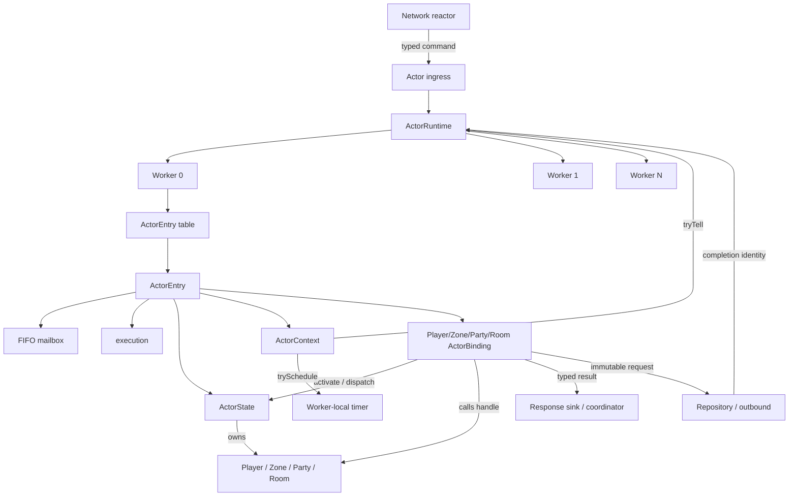
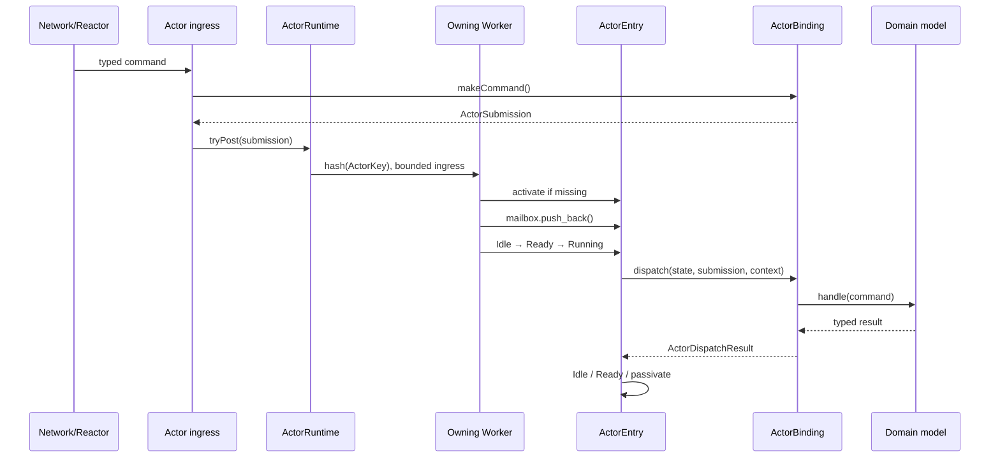
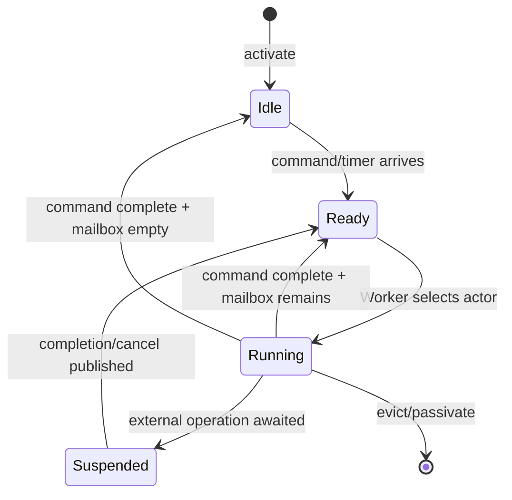
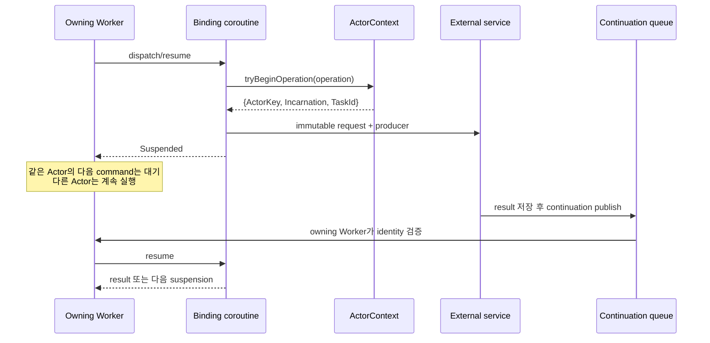

# Actor Runtime 아키텍처

> 범위: 현재 구현된 in-process Actor Runtime의 구성요소, 명령 실행, 비동기 작업과 생명주기
>
> 이 문서는 구현을 처음 읽는 사람을 위한 구조 설명이다. 세부 경합 조건과 종료 조건은 각 계약
> 문서가 소유하며, 아직 구현하지 않은 분산 Actor나 process 간 migration은 다루지 않는다.

## 1. 해결하려는 문제

온라인 게임 서버에서는 여러 연결과 Worker가 같은 Player, Zone, Party 또는 Room을 동시에
변경하려 할 수 있다. 모든 상태를 lock으로 보호하면 상태마다 lock 범위와 획득 순서를 정해야 하고,
느린 저장이나 outbound까지 임계 구역에 섞이기 쉽다.

SnF는 mutable gameplay state의 실행 단위를 Actor로 고정한다.

- 같은 Actor의 명령은 하나의 FIFO mailbox를 거쳐 순서대로 실행한다.
- 같은 Actor의 handler는 동시에 실행되지 않는다.
- 서로 다른 Actor는 같은 Worker 또는 다른 Worker에서 독립적으로 진행한다.
- 외부 작업을 기다릴 때는 Worker가 아니라 해당 Actor만 suspend한다.
- Runtime은 scheduling을 담당하고, 게임 규칙은 Runtime을 모르는 도메인 상태 기계가 담당한다.

여기서 **Actor는 도메인 클래스의 상속 계층이 아니다.** `Player`, `Zone`, `Party`, `Room`은
공통 Actor base를 상속하지 않는다. 논리적 identity, mailbox와 실행 순서가 이 객체를 Actor로
실행되게 하며, `ActorBinding`이 generic Runtime과 도메인 타입 사이를 연결한다.

## 2. 전체 구성



구조를 세 층으로 나누면 이름의 의미가 분명해진다.

```text
논리적 Actor
ActorKey + mailbox + 단일 실행 순서
          │
          ▼
Runtime adapter
ActorBinding + ActorState
          │
          ▼
순수 도메인 상태 기계
Player / Zone / Party / Room
```

## 3. 빌드와 의존성 경계

```text
Actor 관련 target만 표시

snf_server_runtime
  Binding, ingress, coordinator, sink, repository port
        ├── depends on snf_game
        │     도메인 상태 기계와 값
        │     runtime, socket, protocol, thread 의존 없음
        └── depends on snf_runtime
              shard, mailbox, coroutine, timer, lifecycle
```

`snf_game`의 handler는 command를 받아 상태를 바꾸고 typed result를 반환하는 동기 함수다.
DB load/save, outbound capacity 예약, Actor 간 routing처럼 실행 환경을 알아야 하는 작업은
`snf_server_runtime`의 Binding이 맡는다. `snf_game_tests`와 `snf_game_layer`가 이 경계를 빌드에서
검사한다.

## 4. 핵심 구성요소

### 4.1 `ActorKey`: 논리적 identity와 shard 기준

```cpp
struct ActorKey
{
    ActorKind kind;
    EntityId entity;
};
```

`ActorKind`와 `EntityId`의 조합이 하나의 논리 Actor를 식별한다. 같은 숫자 ID라도 kind가 다르면
다른 Actor이며 mailbox도 공유하지 않는다. Runtime은 `ActorKey`의 hash를 Worker 수로 나눈 결과로
owning Worker를 고정한다.

```text
worker = hash(ActorKey{kind, entity}) % worker_count
```

명령, timer와 completion은 activation이 살아 있는 동안 항상 이 Worker로 돌아온다. 따라서 Actor의
mutable runtime state와 coroutine frame을 다른 Worker가 직접 만질 필요가 없다.

### 4.2 `ActorRuntime`: generic scheduler

`ActorRuntime`은 다음 책임만 가진다.

- kind별 `ActorBinding` 등록
- `ActorKey` 기반 고정 shard
- Worker ingress와 전체 outstanding capacity 관리
- activation과 `ActorEntry` table 관리
- mailbox, ready queue와 bounded turn scheduling
- continuation, timer, cancel과 drain 처리
- queue wait, suspension, depth와 high-water metric 수집

Runtime은 `PlayerCommand`, `RoomResult` 같은 도메인 타입을 알지 않는다. type-erased
`ActorSubmission`과 `ActorState`만 보며, 실제 payload 해석과 도메인 호출은 Binding에 위임한다.

### 4.3 Worker: Actor를 소유하는 실행 단위

각 Worker는 하나의 `std::jthread`와 다음 자원을 소유한다.

```text
Worker
├── bounded ingress
├── reserved continuation queue
├── ActorEntry table
├── ready Actor queue
├── one-shot timer heap
├── outstanding / in-flight reservation
└── runtime metrics
```

ingress, continuation과 timer가 모두 Worker를 깨울 수 있으므로 Worker는 하나의 sticky wake-up을
사용하고 깨어날 때 모든 입력원을 다시 확인한다. ingress와 continuation은 유한 batch로 가져오고,
한 Actor도 유한 turn budget만 실행해 다른 Actor가 굶지 않게 한다. 현재 turn budget은 16개
submission이다.

### 4.4 `ActorEntry`: activation 하나의 Runtime 본체

`ActorEntry`는 Worker의 Actor table에 저장되는 한 activation의 전체 Runtime 엔트리다.

```text
ActorEntry
├── binding             어떤 kind의 payload와 상태인지 해석
├── state               타입별 ActorState
├── mailbox             승인된 submission의 FIFO
├── execution           Idle / Ready / Running / Suspended
├── incarnation         같은 key의 이전 activation과 구분
├── context             activation 동안 주소가 고정된 ActorContext
├── active_command      현재 처리 중인 submission과 accounting
├── expected_task       기다리는 외부 operation의 TaskId
├── active_operation    cancel 가능한 type-erased operation
└── continuation/cancel bookkeeping
```

`state`와 `execution`은 서로 다른 개념이다.

- `state`: Player/Zone/Room별 Binding이 소유하는 타입별 상태 묶음
- `execution`: scheduler가 보는 현재 실행 단계

이 구분 때문에 실행 상태 필드의 이름은 단순한 `state`가 아니라 `execution`이다.

### 4.5 `ActorState`: 타입별 Runtime adapter state

`ActorState` base는 virtual destructor만 가진 type-erased wrapper다. 도메인 모델이 이 base를
상속하는 것이 아니라, 각 Binding이 파생 wrapper 안에 도메인 모델을 합성한다.

```cpp
struct ZoneActorState final : ActorState
{
    Zone zone;
};
```

현재 타입별 구성은 다음과 같다.

| Actor kind | Binding | ActorState | 도메인 모델 | Runtime adapter가 추가로 갖는 것 |
| --- | --- | --- | --- | --- |
| ProvisionalPlayer / Player | `PlayerActorBinding` | `PlayerActorState` | `Player` | routing identity, load 여부, staging, coroutine task, pending command/result, connection과 request context, deactivation callback |
| Zone | `ZoneActorBinding` | `ZoneActorState` | `Zone` | 현재는 도메인 모델만 보유 |
| Party | `PartyActorBinding` | `PartyActorState` | `Party` | 현재는 도메인 모델만 보유 |
| Room | `RoomActorBinding` | `RoomActorState` | `Room` | 현재는 도메인 모델만 보유 |

`PlayerActorState`는 `Player` 데이터 자체가 아니다.

```text
PlayerActorState
├── Player                       gameplay state와 규칙
├── PlayerActorId                routing identity
├── Loading/Reserving/Saving     Binding 진행 단계
├── load/reservation/save task   coroutine frame 소유자
├── pending command/result
├── connection/request/room-entry context
└── on_deactivated               passivation lifecycle callback
```

도메인 `Player`는 currency, progression과 last location 같은 gameplay state만 안다. connection,
request ID, repository와 outbound capacity는 게임 규칙이 아니므로 `PlayerActorState`와 Binding에
남는다.

`ActorState`의 virtual destructor도 단순한 C++ type erasure 이상의 계약 지점이다. Runtime은
파생 타입을 모르지만 activation 제거 시 반드시 파생 destructor까지 실행해야 한다. Player에서는
`PlayerActorState` 파괴가 `on_deactivated`를 호출하고, session directory가 passivation 완료를
확정하는 흐름으로 이어진다.

### 4.6 `ActorBinding`: Runtime과 도메인의 adapter

각 Binding은 한 `ActorKind`를 담당하며 다음 작업을 수행한다.

- typed ingress command를 move-only `ActorSubmission`으로 조립
- 새 activation에 맞는 `ActorState` 생성
- type-erased payload를 원래 타입으로 복원
- 도메인 모델의 동기 `handle()` 호출
- result를 response, timer 또는 다른 Actor의 tell로 번역
- 필요하면 외부 I/O coroutine을 시작하고 state에 보관
- `KeepActive`, `PassivateIfIdle`, `Evict`, `Suspended`, `Stopped` 중 실행 결과 반환

`ActorSubmission` 생성자는 Binding에만 열려 있다. submission에는 target, activation 정책,
accounting 종류, Binding identity와 type-erased payload가 함께 들어가므로 다른 kind의 Binding이
잘못 해석하는 배선 오류를 Runtime 경계에서 검출할 수 있다.

### 4.7 `ActorContext`: owning Worker 기능의 제한된 표면

Binding은 `ActorContext`를 통해서만 현재 activation의 Runtime 기능을 사용한다.

| 기능 | 의미 |
| --- | --- |
| `key()` / `incarnation()` | 현재 논리 Actor와 activation 세대 확인 |
| `observedAt()` | command가 도착한 시각이 아니라 실제 turn이 시작된 시각 |
| `tryBeginOperation()` | in-flight와 terminal continuation 자리를 함께 예약 |
| `tryTell()` | 다른 Actor에게 await 없는 비동기 메시지 게시 |
| `trySchedule()` | 자기 Actor mailbox로 향하는 one-shot command 예약 |
| `cancelTimer()` | 아직 발화하지 않은 timer 취소 |

`ActorContext`는 dispatch stack의 임시 객체가 아니다. suspend된 awaiter가 dispatch 반환 뒤에도
참조하므로 `ActorEntry`가 activation 수명 동안 주소가 고정된 context를 소유한다.

## 5. 명령이 실행되는 과정



세부 순서는 다음과 같다.

1. ingress가 command를 대상 kind의 Binding에 넘겨 `ActorSubmission`을 만든다.
2. `tryPost()`가 Worker의 전체 outstanding 자리를 먼저 예약한다. 자리가 없으면 command는 시작되지
   않고 `Full`로 거부된다.
3. `ActorKey` hash로 owning Worker를 선택하고 bounded ingress에 게시한다.
4. Worker는 대상 activation이 없으면 Binding의 `activate()`로 `ActorState`를 만든다.
5. submission을 Actor의 FIFO mailbox에 넣고, `Idle` Actor를 ready queue에 한 번만 올린다.
6. Worker는 Actor를 `Running`으로 바꾸고 Binding의 `dispatch()`를 호출한다.
7. Binding은 도메인 `handle()`을 동기로 실행하고 결과의 후속 작업을 적용한다.
8. command가 끝나면 accounting과 capacity를 정확히 한 번 닫는다.
9. mailbox가 남으면 turn budget까지 계속 실행하고, budget을 다 쓰면 ready queue 뒤로 양보한다.

같은 Actor의 command는 이 과정에서 직렬화된다. 서로 다른 Actor는 별도 mailbox를 가지므로 한 Actor가
긴 queue를 가졌더라도 turn budget 경계에서 다른 Actor가 실행될 수 있다.

## 6. 실행 상태 기계



이 그림은 정상 dispatch와 개별 operation cancel 경로를 나타낸다. Runtime 전체 cancel은 Worker가
자기 mailbox와 operation을 정리하고 coroutine frame을 직접 파괴하는 별도 종료 경로다.

보장해야 하는 핵심 조건은 다음과 같다.

- ready queue에는 Actor당 token이 최대 하나다.
- `Running` handler는 같은 Actor에서 동시에 둘 이상 존재하지 않는다.
- `Suspended` 중 새 command는 mailbox에 남는다.
- completion이 오면 resume가 같은 Actor의 다음 일반 command보다 먼저 실행된다.
- resume는 새 command가 아니므로 command accounting과 queue wait metric을 다시 세지 않는다.

## 7. 외부 비동기 작업과 coroutine

Player record load/save나 outbound reservation은 기다릴 수 있다. 이 대기는 도메인 `Player::handle()`이
아니라 `PlayerActorBinding`의 coroutine 단계에서 일어난다.



외부 producer는 coroutine handle, `ActorEntry`, `ActorState` 또는 도메인 객체를 받지 않는다. 결과
저장소와 `{ActorKey, ActorIncarnation, TaskId}`를 가진 completion handle만 받는다.

operation을 시작하기 전에 in-flight 자리와 terminal continuation 자리를 함께 예약한다. 따라서
시작이 승인된 작업은 completion queue 포화 때문에 terminal 결과를 잃지 않는다. completion과 cancel은
atomic terminal claim을 경쟁하며 정확히 하나만 성공한다. frame resume와 destruction은 언제나 owning
Worker가 수행한다.

`ActorIncarnation`은 같은 key가 passivate된 뒤 재활성화됐을 때 이전 activation과 구분한다.
`TaskId`는 한 command가 순차적으로 여러 번 await할 때 각각의 operation을 구분한다. 둘 중 하나라도
현재 `ActorEntry`와 다르면 늦게 도착한 completion은 새 activation을 건드리지 않고 폐기한다.

## 8. Actor 간 메시지

Actor 간 전달은 await 없는 `tryTell()`만 허용한다.

```text
Room result: grants
→ RoomActorBinding이 대상 Player와 payload로 번역
→ ActorContext::tryTell(PlayerKey, payload)
→ Runtime이 PlayerActorBinding::makeTell() 호출
→ 기존 tryPost 경로
→ Player mailbox
```

새 메시지 큐를 따로 만들지 않고 외부 command와 같은 bounded ingress와 mailbox를 사용한다. 따라서
sender가 reactor인지 Actor인지에 따라 backpressure, activation과 drain 의미가 달라지지 않는다.
대상 Binding이 submission을 조립하므로 sender는 대상의 command 타입을 알 필요가 없다.

tell은 잠든 대상도 깨워야 하므로 `ActivateIfMissing`을 사용한다. 반대로 Actor끼리 응답을 기다리는
동기 요청은 금지한다. A가 B를, B가 A를 기다리는 cycle을 현재 Runtime이 탐지하거나 해소하지 못하기
때문이다.

## 9. Timer

시간 정책은 도메인 Actor가, 예약 mechanism은 Runtime이 소유한다.

```text
Zone/Room command 처리
→ result에 다음 tick/완료까지의 delay 반환
→ Binding이 one-shot ActorSubmission 생성
→ ActorContext::trySchedule()
→ Worker-local timer heap
→ 만료 시 같은 Actor mailbox에 게시
```

Runtime은 반복 timer를 알지 않는다. 반복이 필요하면 Actor가 각 결과에서 다음 one-shot을 다시 요청한다.
예약 시점에 mailbox capacity를 선점하므로, 승인된 timer는 만료 순간의 포화로 drop되지 않는다.

timer에는 target과 예약 당시 incarnation이 들어 있다. 대상이 passivate된 뒤 같은 key가 다시
활성화됐다면 이전 timer는 stale로 폐기된다. Actor eviction과 Worker shutdown에서도 pending timer와
그 reservation을 함께 정리한다.

## 10. Activation과 passivation

### Activation

첫 submission이 `ActivateIfMissing`이면 Binding이 타입별 `ActorState`를 만든다. Runtime은 activation에
새 incarnation을 부여하고 `ActorEntry`와 안정된 `ActorContext`를 연결한다. Binding activation은
scheduler mutex 밖에서 실행해 activation hook이 Runtime에 재진입해도 mutex를 붙든 채 호출하지 않는다.

### Passivation

Binding은 도메인 자원이 비었다고 판단하면 `PassivateIfIdle`을 반환한다. Runtime은 그 시점에 mailbox에
이미 승인된 command가 있으면 activation을 유지하고 먼저 처리한다. 따라서 빈 Zone에 leave와 re-entry가
근접해도 passivation 요청이 승인된 re-entry를 버리지 않는다.

```text
PassivateIfIdle
  mailbox tail 있음  → 유지하고 계속 처리
  mailbox tail 없음  → timer 정리 → table 제거 → ActorState 파괴
```

`Evict`는 lifecycle fence를 위한 더 강한 결과다. mailbox tail과 timer를 버릴 수 있으므로 일반적인
idle 정리에는 사용하지 않는다. `Stopped`는 Runtime cancel 과정에서 coroutine이 중단됐음을 뜻한다.

## 11. 명명 리팩터링이 드러낸 구조

Room handoff 구현 전에 Runtime 내부 이름을 실제 책임과 맞추는 리팩터링을 수행했다. Runtime
entry/state rename은 `59c5270`, 도메인 모델의 Actor 접미사 제거는 `ec418e7`, `64172b7`,
`263d578`에 기록돼 있다.

| 이전 이름 | 현재 이름 | 실제 책임 |
| --- | --- | --- |
| `ActorSlotEntry` | `ActorEntry` | mailbox, 실행 상태와 activation을 포함하는 Runtime 본체 |
| `ActorSlot` | `ActorState` | Binding이 소유하는 타입별 Runtime adapter state |
| `*ActorSlot` | `*ActorState` | Player/Zone/Room/Party별 adapter state |
| `ActorExecutionState state` | `execution` | `Idle/Ready/Running/Suspended` scheduler 상태 |
| `*ActorState::actor` | `player/zone/room/party` | wrapper가 합성하는 실제 도메인 모델 |

이 변경은 동작을 바꾸지 않았다. 대신 다음 세 개념이 이름만으로 구분되게 했다.

```text
ActorEntry.execution   Runtime 실행 단계
ActorEntry.state       타입별 adapter state
PlayerActorState.player 도메인 모델
```

또한 Player, Zone, Party와 Room 도메인 클래스에서는 `Actor` 접미사를 제거했다. Actor는 게임 모델의
정체성이 아니라 실행 방식이기 때문이다. `PlayerActorBinding`, `PlayerActorState`, ingress와 actor ID는
Runtime에 연결되는 타입이므로 접미사를 유지한다.

이름을 먼저 정리함으로써 이후 Room handoff가 `RoomActorState`, `PlayerActorState`와 Runtime entry를
확장할 때 새 코드까지 다시 rename하는 비용을 피했다. 이는 기능 개발 전 책임 경계를 명확히 한
선행 리팩터링 사례다.

## 12. 핵심 불변식

| 영역 | 불변식 |
| --- | --- |
| 소유권 | mutable Actor state와 coroutine frame은 owning Worker만 resume·destroy한다. |
| 순서 | 같은 Actor가 승인한 command는 FIFO mailbox 순서로 실행된다. |
| 단일 실행 | 같은 Actor의 handler는 동시에 실행되지 않는다. |
| backpressure | capacity를 예약하지 못한 작업은 외부 side effect를 시작하지 않는다. |
| terminal 결과 | 시작된 async operation은 성공·실패·취소 중 정확히 하나로 끝난다. |
| late completion | incarnation 또는 TaskId가 다르면 현재 activation에 적용하지 않는다. |
| tell | Actor 간 메시지는 보낼 수 있지만 상대 Actor의 응답을 기다리지 않는다. |
| timer | 승인된 timer는 capacity를 선점하며 stale incarnation에는 발화하지 않는다. |
| passivation | 일반 passivation은 이미 승인된 mailbox tail을 버리지 않는다. |
| drain | ingress, mailbox, ready queue, task, operation과 continuation이 모두 끝나야 Runtime이 drained다. |

## 13. 선택의 장점과 비용

### 장점

- 상태마다 lock을 노출하지 않고 Entity별 single-writer를 만든다.
- command 순서와 state ownership을 같은 경계에서 설명할 수 있다.
- 한 Actor가 외부 I/O를 기다려도 Worker의 다른 Actor는 진행한다.
- Runtime과 게임 상태 기계를 분리해 도메인 테스트가 결정적이고 작다.
- backpressure, cancel, shutdown과 metric을 공통 Runtime에서 일관되게 처리한다.

### 비용과 한계

- 한 hot Actor의 handler는 한 Worker보다 빠르게 처리할 수 없다.
- hash가 고정되어 있으므로 Runtime 실행 중 Actor migration이나 shard 재균형을 지원하지 않는다.
- 여러 Actor를 원자적으로 변경할 수 없다. handoff는 coordinator와 보상 가능한 상태 기계가 필요하다.
- Actor 간 동기 대기를 금지하므로 요청·응답이 필요한 흐름은 별도의 saga 또는 결과 routing으로
  모델링해야 한다.
- `PlayerActorState`처럼 I/O 단계가 많은 Binding은 도메인 모델보다 adapter state가 복잡해질 수 있다.
- 현재 구현은 한 process 안의 Runtime이며 분산 위치 투명성이나 원격 전달을 제공하지 않는다.

이 제약은 숨기는 구현 세부사항이 아니다. hot Actor, queue wait, suspension과 timer lateness metric을
관측하고 Zone/Room 분할 또는 도메인 흐름 변경을 판단하기 위한 설계 입력이다.

## 14. 검증 근거

구조의 핵심 주장은 다음 테스트에서 검증한다.

| 검증 대상 | 대표 테스트 |
| --- | --- |
| ActorKey affinity, Binding registry | [`actor_runtime_test.cpp`](../tests/actor_runtime_test.cpp) |
| 같은 Actor 직렬 실행과 다른 shard 병렬 실행 | [`actor_runtime_test.cpp`](../tests/actor_runtime_test.cpp) |
| turn budget과 shard별 포화 격리 | [`actor_runtime_test.cpp`](../tests/actor_runtime_test.cpp) |
| suspend 중 다른 Actor 진행, 같은 Actor queue 유지 | [`actor_coroutine_test.cpp`](../tests/actor_coroutine_test.cpp) |
| owning Worker resume와 frame destruction | [`actor_coroutine_test.cpp`](../tests/actor_coroutine_test.cpp) |
| completion/cancel race와 정확히 하나의 terminal | [`actor_coroutine_test.cpp`](../tests/actor_coroutine_test.cpp) |
| timer 발화, 취소, stale incarnation과 capacity | [`actor_runtime_test.cpp`](../tests/actor_runtime_test.cpp) |
| same/cross Worker tell과 FIFO | [`actor_runtime_test.cpp`](../tests/actor_runtime_test.cpp) |
| passivation이 승인된 re-entry를 보존 | [`zone_actor_binding_test.cpp`](../tests/zone_actor_binding_test.cpp) |
| Player passivation과 reconnect lifecycle | [`player_session_directory_test.cpp`](../tests/player_session_directory_test.cpp) |
| Room timer, reward tell과 passivation | [`room_actor_binding_test.cpp`](../tests/room_actor_binding_test.cpp) |

Debug 단위·통합 테스트에 더해 ASan·UBSan과 TSan 실행으로 coroutine 수명과 cross-thread 경계를
검증한다.

## 15. 코드 탐색 순서

처음 구현을 읽는다면 다음 순서가 가장 짧다.

1. [`actor_key.hpp`](../include/snf/runtime/actor_key.hpp) — identity, incarnation과 TaskId
2. [`actor_runtime.hpp`](../include/snf/runtime/actor_runtime.hpp) — Runtime public contract
3. [`actor_runtime.cpp`](../src/runtime/actor_runtime.cpp) — Worker, ActorEntry와 scheduler
4. [`player.hpp`](../include/snf/game/player.hpp) — Runtime을 모르는 도메인 모델
5. [`player_actor_binding.hpp`](../include/snf/server/player_actor_binding.hpp) — generic Runtime과 Player의 경계
6. [`player_actor_binding.cpp`](../src/server/player_actor_binding.cpp) — suspend/resume가 있는 가장 풍부한 adapter state
7. [`zone_actor_binding.cpp`](../src/server/zone_actor_binding.cpp) — timer와 passivation
8. [`room_actor_binding.cpp`](../src/server/room_actor_binding.cpp) — timer, tell과 Room lifecycle

## 16. 관련 문서

- [서버 아키텍처](./server-architecture-draft.md): network부터 persistence까지의 전체 구조
- [Actor 상호작용 아키텍처](./actor-interaction-architecture.md): Zone, Room과 Player를 잇는 tell, completion과 saga
- [Coroutine Actor 계약](./coroutine-actor-contract.md): suspend, resume, cancel과 completion 경합
- [Actor 간 메시지와 게임 시간 결정](./actor-messaging-and-game-time.md): tell과 실제 경과 시간 기준
- [Actor 주도 Timer Scheduling](./actor-driven-timer-scheduling.md): 시간 정책과 scheduling 책임
- [Runtime Lifecycle 계약](./runtime-lifecycle-contract.md): drain, graceful shutdown과 cancel
- [Player 상태 소유권과 persistence 계약](./player-state-ownership-contract.md): Player와 DB의 authority
- [Room 입장 Handoff 계약](./room-entry-handoff-contract.md): 여러 Actor를 잇는 보상 가능한 상태 전이
