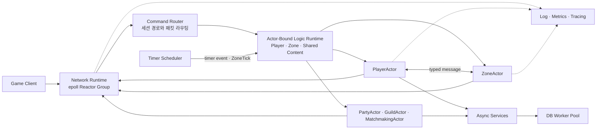
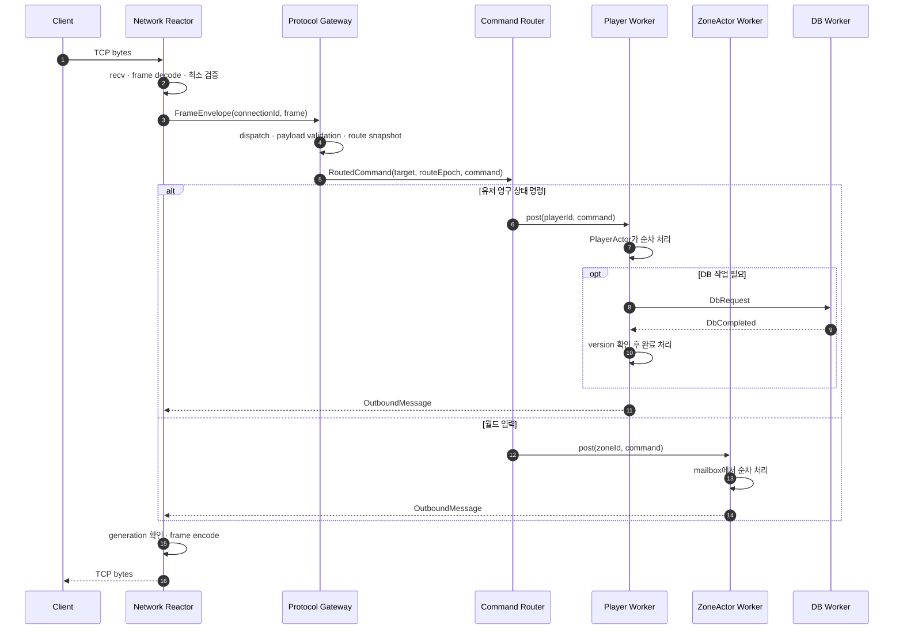
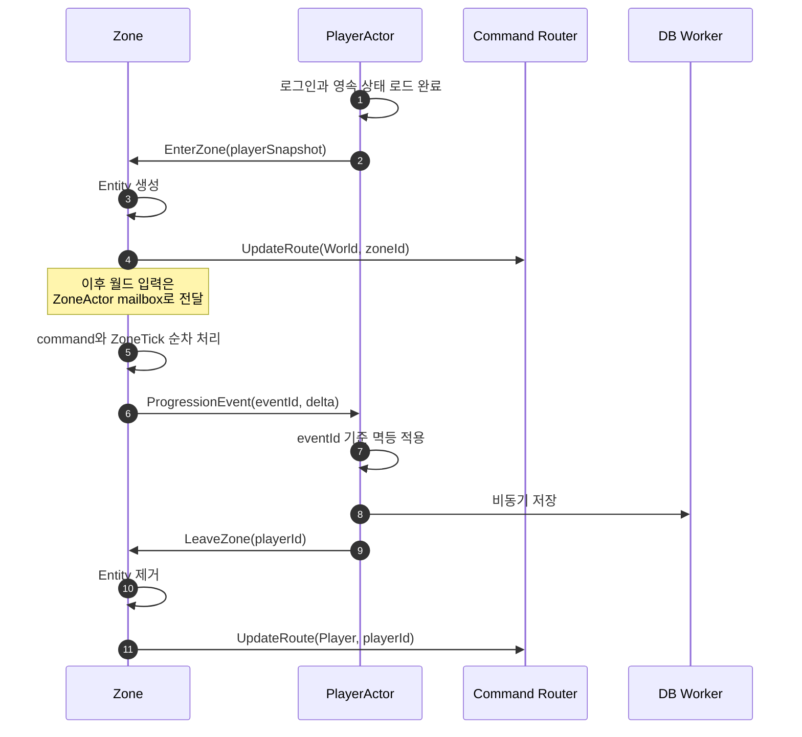

# SnF 서버 아키텍처 초안

> 상태: Draft  
> 대상: C++20, Linux, `epoll` 기반 실시간 게임 서버  
> 목표: 모든 게임 로직 Actor가 고정 Worker를 공유하는 실행 모델과 상태 소유권 정의
> 구현 순서는 [개발 로드맵](./development-roadmap.md)을 단일 기준으로 사용한다.

## 1. 문서 목적

이 문서는 SnF를 단순 패킷 서버에서 현대적인 실시간 게임 서버 구조로 발전시키기 위한
목표 아키텍처를 정의한다.

SnF의 최종 학습 목표는 다음과 같다.

- 네트워크 I/O와 게임 로직을 분리한다.
- 게임 상태마다 단 하나의 논리적 소유자를 둔다.
- Player, Zone과 공유 콘텐츠를 같은 Actor 실행 모델로 처리한다.
- 여러 Actor를 소수의 고정 OS Worker Thread에서 실행한다.
- 느린 DB, 파일 로그, 외부 I/O가 게임 Worker를 막지 않게 한다.
- 모든 경계에 순서 보장, 수명 검증, backpressure와 관측 가능성을 둔다.
- 처음에는 단일 프로세스로 구현하되 나중에 프로세스를 분리할 수 있게 한다.

이 문서에서 말하는 최종 형태는 대규모 분산 시스템을 처음부터 구축한다는 뜻이 아니다.
우선 하나의 프로세스 안에서 모듈과 메시지 경계를 검증한 뒤, 필요할 때 같은 경계를
프로세스 간 통신으로 교체하는 것을 의미한다.

## 2. 핵심 결정

### 2.1 플랫폼 모델

SnF는 Linux 서버이므로 네트워크 계층은 `epoll` 기반 Reactor Group으로 시작한다. 현재
protocol gateway는 `FrameIngress`를, Player binding은 `PlayerEffectSink`를 통해 network
runtime과 만난다. 일반화된 scheduler는 domain effect sink를 직접 알지 않는다. network
backend의 queue나 wake-up primitive도 domain과 scheduler에 노출하지 않는다. io_uring은
콘텐츠 단계의 선행 조건이 아닌 선택적 두 번째 backend다.

```text
NetworkRuntime
├── Linux: EpollNetworkRuntime
└── Linux: IoUringNetworkRuntime (선택적 확장)
```

### 2.2 상태 소유권

게임 상태를 보호하는 기본 수단은 큰 mutex가 아니라 단일 소유권과 순차 실행이다.

- PlayerActor만 유저 영구 상태를 수정한다.
- ZoneActor만 해당 필드의 실시간 상태를 수정한다.
- PartyActor, GuildActor 같은 공유 콘텐츠 Actor가 자신의 상태를 수정한다.
- 다른 Runtime의 mutable 객체를 직접 참조하지 않고 typed message를 보낸다.

### 2.3 Actor와 Thread

Actor는 OS Thread가 아니다. Actor는 상태, mailbox와 명령 처리 규칙을 가진 논리적 실행 단위다.
소수의 Worker Thread가 많은 Actor를 shard 방식으로 나누어 실행한다.

```cpp
enum class ActorKind
{
    ProvisionalPlayer,
    Player,
    Zone,
    Party,
    Guild,
};

struct ActorKey
{
    ActorKind kind;
    EntityId id;
};

worker_index = hash(actor_key) % logic_worker_count;
```

서로 다른 종류의 Actor가 같은 숫자 ID를 가질 수 있으므로 shard key의 동등성과 hash에는
Actor 종류를 모두 포함한다. 인증 전 `ProvisionalActorId`와 영속 `PlayerId`도 서로 다른
ID namespace다. 구현이 strong ID variant를 사용해 같은 구분을 제공해도 된다.

이 문서에서 Actor의 논리 identity는 `ActorKey`를 뜻한다. 별도의 `ActorIdentity`
동의어를 두지 않으며, 활성화 세대인 `ActorIncarnation`은 key에 포함하지 않는다.
async task와 continuation은 `{ActorKey, ActorIncarnation, TaskId}`로 식별한다.

Actor는 활성화된 동안 같은 Worker에 고정되며 모든 command, timer event와 coroutine continuation은
그 Worker에서만 실행된다. Actor 하나가 Thread 하나를 독점하지 않고 여러 Actor가 하나의 Worker를
공유한다. Worker 수 변경과 재배치는 restart 또는 명시적인 passivation/activation 경계에서만 한다.

ZoneActor는 여러 Entity를 함께 소유하는 aggregate Actor다. 내부 hot path는 연속 저장 구조나
단순한 ECS 형태를 사용할 수 있지만, 그 상태를 접근하고 수정하는 주체는 owning Worker 하나뿐이다.

### 2.4 실행 모델

게임 상태를 변경하는 로직은 Actor-Bound Logic Pool에서 실행한다. 느린 I/O와 상태를 소유하지 않는
CPU 작업만 별도 executor로 분리한다.

| Executor | 용도 | 대표 객체 |
| --- | --- | --- |
| Reactor | 네트워크 readiness 처리 | Session |
| Actor-Bound Logic Pool | 순차 상태 변경과 timer event 처리 | Player, Zone, Party, Guild |
| Blocking I/O Pool | 느린 외부 I/O | DB query, file operation |
| Stateless Job Pool | 선택적인 CPU 작업 | 경로 탐색, 압축 |

Stateless Job Pool은 게임 상태를 직접 수정하지 않는다. immutable snapshot을 입력으로 받고
결과를 원래 상태 소유자에게 메시지로 반환한다.

Logic Pool의 fairness는 완료된 Actor turn 사이의 cooperative fairness다. handler나 effect
적용이 blocking하면 그 Worker에 배치된 Player, Zone 등이 함께 지연될 수 있다. 단계 3.8은
현재 outbound backpressure 의미를 유지하되, effect 적용 정책을 scheduler에서 분리해 향후
non-blocking reservation 또는 Pool 분리를 재검토할 수 있게 한다. ZoneActor를 올리는 단계 6에서
tick 지연과 shard 편향을 측정해 최종 정책을 결정한다.

### 2.5 Scheduler와 typed Actor binding

일반화 대상은 domain Actor 계층이 아니라 실행 규칙이다.

| 계층 | 책임 |
| --- | --- |
| Actor scheduler | shard ingress, Actor별 FIFO mailbox, ready queue, turn budget, capacity, Worker lifecycle |
| Actor binding | Actor 활성화, typed command dispatch, handler result와 effect 적용, domain lifecycle 해석 |
| Command router | target과 command가 결합된 typed route를 선택해 적합한 binding으로 전달 |

scheduler의 public header와 translation unit은 `PlayerActor`, `PlayerCommand`, `PlayerResult`,
`PlayerEffectSink` 또는 향후 `ZoneActor`를 직접 참조하지 않는다. 구체 Actor를 다루는 binding은
type-erased 실행 계약 등으로 scheduler와 만날 수 있지만, domain Actor들에게 공통 상속
계층을 강제하지 않는다.

`PlayerCommandRoute`, 향후 `ZoneCommandRoute`처럼 target과 command는 같은 variant alternative에
유지한다. public `post(ActorKey, AnyMessage)`처럼 target-message의 잘못된 조합을 표현할 수
있는 경계는 만들지 않는다.

## 3. 전체 구조



## 4. 런타임 구성

### 4.1 Main 및 Control

Main Thread는 다음만 담당한다.

- 설정 로드
- Runtime 생성과 시작 순서 관리
- signal 수신과 종료 요청
- graceful shutdown 조정
- 최종 통계 출력

일반 패킷이나 게임 콘텐츠를 Main Thread에서 처리하지 않는다.

### 4.2 Network Runtime

각 Reactor Worker는 자신의 `epoll` 인스턴스와 Session 집합을 독점한다.

```text
NetworkRuntime
├── ReactorWorker 0
│   ├── epoll fd
│   ├── Session A
│   └── Session B
└── ReactorWorker 1
    ├── epoll fd
    ├── Session C
    └── Session D
```

Network Runtime의 책임은 다음과 같다.

- 연결 수락과 종료
- non-blocking recv/send
- Frame 조립 및 wire format 검증
- `FrameEnvelope`를 공통 `ProtocolGateway`에 제출
- outbound queue와 slow client backpressure
- Gateway 결과에 따른 프로토콜 오류·포화 처리

Network Runtime은 인벤토리, 이동, 충돌 같은 게임 상태를 수정하지 않는다.

Actor handler는 `PlayerResult`에 domain effect를 반환하고, `PlayerEffectSink`가 handler 완료 뒤 이를
적용한다. 현재 `ProtocolPlayerEffectSink`가 `SendResponse`를 `ProtocolResponseMapper`로 `SendFrame`
으로 바꿔 `OutboundSink`에 게시한다. `EventFdOutboundSink`가 bounded queue와 `eventfd` wake-up을
캡슐화하며, 실제 Session 조회, encode와 send는 Reactor가 수행한다. runtime drained/failed는 outbound action과 분리된
`RuntimeCompletionCoordinator`가 추적한다. outbound queue 포화로 Worker가 대기할 때는 publishing
Runtime의 stop token이 그 대기만 중단하며, 다른 Runtime이 공유하는 sink와 queue는 유지한다.
단계 3.8에서 Player binding과 향후 Zone·Shared Content binding은 하나의 Worker Pool을 공유하며
completion identity는 `RuntimeId::Logic`으로 통합했다. drain과 failure는 ActorKind별 완료가 아니라
Logic Runtime 전체의 terminal state를 의미한다.

FD는 재사용될 수 있으므로 다른 Runtime에는 raw FD 대신 다음과 같은 논리 ID를 전달한다.

```cpp
struct ConnectionId
{
    int descriptor;
    std::uint64_t generation;
};
```

응답 시 generation이 현재 Session과 다르면 오래된 응답으로 판단하여 폐기한다.

### 4.3 Command Router

현재 `ProtocolGateway`는 연결 generation에서 만든 `ProvisionalActorId`와 typed command 또는
`ConnectionClosed` lifecycle 사실을 route로 결합하고, `CommandRouter`가 `PlayerActorIngress`에
전달한다. 임시 ID는
인증 전 routing key일 뿐이며 `PlayerId`, DB key, 저장 key 또는 재접속 key가 아니다.
단계 3.8 후에도 route의 typed 조합은 유지하며, Player binding이
`ProvisionalActorId`를 `{ProvisionalPlayer, id}` ActorKey로 변환해 Logic Runtime에 제출한다.

`ConnectionClosed`는 모든 Actor의 공통 domain event가 아니다. Player binding이 인증 전 Actor에
대한 ordered lifecycle control로 해석한다. 기존 command 뒤에서 소비되고, Actor가 없는 close는
slot을 생성하지 않으며, close를 소비한 owning Worker만 slot을 evict하는 의미를 유지한다.

인증과 World 도입 후에는 `RouteCoordinator`가 `SessionRoute`와 `route_epoch`의
authoritative owner가 된다. Gateway는 route snapshot과 epoch을 command에 부여하고 destination은
자신의 activation epoch과 비교한다. epoch은 stale destination 검출 수단이며 route 전환의
원자성은 별도 transition protocol이 보장한다.

```cpp
struct SessionRoute
{
    UserId user_id;
    RouteKind kind;   // Player, World, SharedContent
    EntityId target;  // playerId, zoneId, partyId 등
    std::uint64_t epoch;
};
```

예시는 다음과 같다.

| 명령 | 목적지 |
| --- | --- |
| 장비 변경, 보상 수령 | PlayerActor |
| 필드 이동, 필드 상호작용 | ZoneActor |
| 파티 초대 | PartyActor |
| 길드 가입 | GuildActor |
| 매칭 참가 | MatchmakingActor |

라우팅 메타데이터는 게임 상태 전체의 복사본이 아니다. 실제 상태의 최종 권한은 목적지
Actor에 있다.

### 4.4 Player Actor

PlayerActor는 다음 상태를 소유한다.

- 인벤토리, 장비, 재화
- 퀘스트, 업적, 영구 진행도
- 로그인 및 연결 상태
- `InWorld(zoneId)` 같은 상위 위치 상태
- dirty flag, entity version, 저장 진행 상태

Logic Runtime은 인증 후 `{Player, player_id}`를 actor key로 사용해 PlayerActor의 owning Worker를
고정한다. 인증 전에는 `{ProvisionalPlayer, provisional_actor_id}`를 사용해 두 ID
namespace가 겹치지 않게 한다.

```cpp
worker_index = hash(ActorKey{ActorKind::ProvisionalPlayer, provisional_actor_id}) %
               logic_worker_count;
worker_index = hash(ActorKey{ActorKind::Player, player_id}) % logic_worker_count;
```

동일 PlayerActor의 명령은 항상 같은 Worker에서 순차 실행한다. 인증 전 현재 구현은 연결
generation을 `ProvisionalActorId`로 사용해 기본 2개 Worker에 shard하고, Worker별 Actor
mailbox에서 typed command를 순차 실행한다. 영속 `PlayerId`는 인증 vertical slice에서 도입한다.

```cpp
command_router.post(PlayerCommandRoute{PlayerId{player_id}, PlayerCommand{...}});
```

Player binding이 typed route에서 `ActorKey`를 도출하므로 caller가 Player command와 Zone key 같은
잘못된 조합을 구성할 수 없다.

현재 Actor mailbox와 ready queue는 중복 ready token을 방지하고 turn당 16개 command budget을
적용한다. Actor 간 메시징과 복잡한 lifecycle이 필요해지면 `ActorRef::tell()`과 passivation을
추가한다.

`PlayerActor::state()`의 const 참조는 owning Worker 내부 테스트와 진단에만 사용한다. `const`는
thread-safe snapshot을 의미하지 않으므로 다른 thread의 상태 조회는 query command 또는 immutable
snapshot으로 수행한다.

### 4.5 World Actor

World도 Player와 동일한 Actor 실행 규칙을 사용한다. `ZoneActor`는 Zone 또는 MapInstance 단위로
실시간 상태와 mailbox를 소유한다.

- 필드 위치와 이동
- 필드 충돌
- AOI 및 주변 객체 갱신
- NPC와 AI
- 스폰과 despawn
- 필드 이벤트 판정

Logic Runtime은 `{Zone, zone_id}`를 actor key로 사용해 ZoneActor의 owning Worker를 고정한다.

```cpp
worker_index = hash(ActorKey{ActorKind::Zone, zone_id}) % logic_worker_count;
```

`{Player, 1}`과 `{Zone, 1}`은 hash modulo 결과가 같아 같은 Worker에 배치될 수는 있지만,
동등한 key가 아니므로 항상 서로 다른 ActorSlot과 mailbox를 갖는다.

이동 입력, 관리 명령과 주기 갱신은 모두 같은 mailbox로 들어간다. Timer Scheduler는 시간이 되면
`ZoneTick{scheduled_at, sequence}` 메시지만 게시하며 Zone 상태를 직접 실행하거나 수정하지 않는다.
ZoneActor가 tick message를 처리하는 권장 순서는 다음과 같다.

```text
입력 command drain
→ 이동 입력 반영
→ 공간 인덱스 갱신
→ 충돌 처리
→ NPC와 AI
→ 스폰 처리
→ AOI 계산
→ 도메인 이벤트와 outbound 생성
```

tick message도 일반 command와 같은 turn budget과 단일 실행 규칙을 따른다. 늦어진 tick을 무제한
catch-up하지 않고 오래된 tick을 합치거나 건너뛰는 정책을 둔다. 비활성 Zone은 주기 tick 대신 필요한
timer나 domain event만 받도록 passivation할 수 있다.

### 4.6 Shared Content Actor

여러 유저가 공유하는 이벤트 기반 상태를 별도 Actor가 소유한다.

- PartyActor: 파티 구성, 파티장, 참가 상태
- GuildActor: 길드원, 역할, 길드 재화
- MatchmakingActor: 대기열과 매칭 결과
- ChatChannelActor: 채널 참가 상태

개인 인벤토리, 퀘스트, 상점 구매처럼 한 유저가 소유하는 기능은 Shared Content Runtime에
넣지 않고 PlayerActor의 handler 또는 module로 둔다. `ContentRuntime`이 소유자가 불분명한
기능을 모으는 공간이 되지 않게 한다.

### 4.7 Persistence Runtime

게임 Worker에서 동기 DB 호출을 하지 않는다.

```text
PlayerActor
→ DbRequest
→ bounded DB Worker Pool
→ blocking DB operation
→ DbCompleted
→ 원래 PlayerActor Worker
```

DB Worker는 PlayerActor 상태를 직접 수정하지 않는다. 완료 메시지에는 최소한 다음 정보를
포함한다.

- request ID
- entity ID
- 요청 시점의 entity version
- 성공 또는 실패 결과
- 재시도 가능 여부

PlayerActor는 완료 메시지를 자신의 mailbox 또는 Worker queue에서 처리하며 오래된 결과가
최신 상태를 덮지 못하게 한다.

권장 저장 전략은 다음과 같다.

- 로그인 시 PlayerActor 상태 로드
- 실행 중 메모리 상태를 authoritative state로 사용
- dirty 상태의 주기적인 비동기 flush
- 로그아웃 시 snapshot 저장
- command id를 이용한 중요 상태 변경의 멱등 처리
- 재화 같은 중요 변경에 명시적인 실패 및 재시도 정책 적용

### 4.8 Observability

로그 기록은 전용 bounded queue와 Logger Thread에서 처리한다. 일반 로그가 가득 찼을 때
게임 Worker를 무기한 막지 않도록 sampling 또는 drop 정책을 정의한다. 감사나 결제 성격의
로그는 별도의 신뢰성 정책을 가져야 한다.

최소 측정 항목은 다음과 같다.

- Reactor event loop 지연
- 연결 수와 Session별 송신 queue 크기
- Runtime별 queue depth
- command enqueue부터 실행까지의 p50/p95/p99 대기 시간
- ZoneActor tick 실행 시간
- tick budget 초과 횟수
- 활성 ZoneActor와 PlayerActor 수
- DB queue depth와 query latency
- dropped, rejected, coalesced message 수

## 5. 패킷 처리 흐름



이동 패킷은 Network Thread에서 즉시 시뮬레이션하지 않는다. 입력 command를 해당 ZoneActor의
mailbox에 넣고 owning Worker가 순차 처리한다. 주기 갱신이 필요한 경우에도 Timer Scheduler가 같은
mailbox에 tick message를 게시한다.

## 6. PlayerActor와 ZoneActor 사이 상태 전환



필드 위치와 실시간 Entity 상태는 ZoneActor가 소유한다. PlayerActor는 인벤토리, 재화와 영구
진행도를 소유한다. ZoneActor가 영구 진행도를 직접 수정하지 않고 typed domain event를 PlayerActor에
보내며, PlayerActor는 중복 event가 와도 한 번만 적용한다.

구현 시 route 변경은 `RouteCoordinator`가 직렬화한다.

```text
이전 destination 입력 중지와 drain 경계 확정
→ 새 destination activation 완료
→ SessionRoute target과 epoch 갱신
→ 새 epoch command 공개
```

destination은 command의 epoch을 자신의 activation epoch과 비교해 전환 전에 queue에 들어간 stale
입력을 거부한다. 동일 epoch 안의 중복과 역순은 별도 sequence/idempotency 규칙으로 처리한다.

## 7. 메시지 규약

Runtime 경계를 넘는 메시지는 immutable value 또는 명확한 단독 소유 값을 사용한다.
다른 Runtime이 소유한 객체의 raw pointer나 mutable reference를 전달하지 않는다.

공통 envelope는 다음 정보를 가질 수 있다.

```cpp
struct MessageEnvelope
{
    MessageId message_id;
    CorrelationId correlation_id;
    EntityId target_id;
    std::optional<ConnectionId> connection_id;
    std::optional<std::uint64_t> route_epoch;
    std::optional<std::uint64_t> sequence;
    TimePoint deadline;
    MessagePayload payload;
};
```

모든 메시지에 모든 필드를 강제할 필요는 없지만 다음 의미는 일관되게 유지한다.

- `message_id`: 중복 처리 방지
- `correlation_id`: 요청, DB 작업, 응답 연결
- `target_id`: shard와 상태 소유자 선택
- `connection_id`: 응답 Session 수명 검증
- `route_epoch`: 이전 destination으로 향한 command 검출
- `sequence`: 동일 route 스트림의 중복·역순 검증
- `deadline`: 이미 가치가 없어진 작업 폐기

Runtime 사이에서 동기 호출이나 `future.get()`으로 상대 Worker를 기다리지 않는다.

## 8. Queue와 Backpressure

모든 비동기 queue는 bounded queue여야 한다. 큐가 가득 찼을 때의 정책을 호출 지점별로
정의한다.

| 포화 지점 | 권장 정책 |
| --- | --- |
| Session inbound | 읽기 일시 중지, rate limit, 심한 경우 연결 종료 |
| Player command queue | Busy 응답 또는 비핵심 명령 거부 |
| ZoneActor mailbox | 최신 입력 병합, 오래된 입력 폐기, 악성 세션 종료 |
| Reactor outbound queue | 상태 갱신 병합 또는 slow client 종료 |
| DB queue | 제한된 재시도 또는 요청 실패 처리 |
| 일반 로그 queue | sampling 또는 drop |

입력 종류별로 정책이 다를 수 있다. 이동 입력은 최신 값으로 합칠 수 있지만 아이템 구매나
보상 적용은 임의로 버리면 안 된다.

명령별 전달 의미와 포화 정책은 다음을 기본값으로 삼는다.

| 종류 | 전달 의미 | 포화 시 정책 |
| --- | --- | --- |
| 이동 입력 | 최신 상태 우선 | 최신 입력으로 coalesce/replace |
| 필드 상호작용 | route 내 sequence 적용 | stale 폐기 또는 Busy |
| 구매·보상 | effect를 한 번만 적용 | 명시적 거부, idempotency key와 transaction |
| 악성 요청 | 서비스 보호 우선 | rate limit 또는 연결 종료 |

구매·보상은 exactly-once delivery를 가정하지 않는다. at-least-once 재전달 가능성을
idempotency와 transaction으로 흡수해 effectively-once application을 만든다.

## 9. Tick 설계

ZoneActor의 주기 갱신은 별도 tick 실행 스레드가 상태를 수정하는 방식이 아니라 Timer Scheduler가
`ZoneTick` 메시지를 mailbox에 게시하는 방식이다. 초기 예시는 20Hz지만 실제 값은 게임 규칙과
부하 테스트로 결정한다.

고정 tick의 기본 규칙은 다음과 같다.

- 시간 계산에는 `std::chrono::steady_clock`을 사용한다.
- 테스트에서는 주입 가능한 Clock을 사용한다.
- tick도 owning Worker에서 일반 actor turn으로 실행한다.
- 한 tick이 늦어져도 무제한 catch-up loop를 돌지 않는다.
- tick당 command 처리량 또는 시간을 제한한다.
- 긴 갱신은 여러 turn으로 나눠 같은 shard의 다른 Actor가 진행할 기회를 보장한다.
- tick 실행 시간이 budget을 넘으면 metric과 structured log를 남긴다.
- 네트워크 snapshot 주기는 simulation tick과 별도로 설정할 수 있다.

결정론적인 테스트를 위해 동일한 초기 상태와 입력 sequence가 같은 결과를 내도록 하는 것을
권장한다.

## 10. Thread 토폴로지

초기 구현은 다음과 같이 시작한다.

| 영역 | 초기 Worker 수 | 확장 기준 |
| --- | ---: | --- |
| Network Reactor | 1 | event loop 지연과 네트워크 처리량 |
| Actor-Bound Logic Pool | 2 | mailbox 대기 시간, tick budget과 shard 편향 |
| DB | 2 | DB connection 한도와 queue 지연 |
| Logger | 1 | 로그 queue 지연 |

Logic Worker는 최소 2개로 시작해 다음을 검증한다.

- 동일 PlayerActor와 ZoneActor는 각각 한 Worker에서만 실행된다.
- 서로 다른 shard의 Actor는 실제로 병렬 실행된다.
- 특정 shard의 부하가 다른 shard의 순서를 깨뜨리지 않는다.
- worker_count 변경과 entity 재배치 정책이 명확하다.

CPU를 지속적으로 사용하는 Logic Worker 수는 물리 코어 수와 tick deadline을 기준으로 결정한다.
DB Worker처럼 대부분 대기하는 Thread는 같은 방식으로 단순 합산하지 않는다.

## 11. 종료 순서

graceful shutdown은 다음 순서를 권장한다.

```text
새 연결 수락 중지
→ Session의 새 게임 command 수락 중지
→ Logic Actor Runtime에 종료 경계 전달
→ 모든 Actor mailbox와 continuation drain
→ RuntimeCompletionCoordinator가 모든 필수 Runtime drain 확인
→ 필요한 dirty state 저장 요청
→ DB queue drain 또는 timeout
→ outbound queue drain 또는 timeout
→ Reactor 종료
→ Logger flush
```

runtime 완료 상태는 outbound queue와 분리한다. coordinator의 상태가 authoritative하며 wake-up은
상태 재조회를 촉진하는 hint다. 종료 중에도 다른 Runtime이 이미 파괴된 Session이나 Actor에
메시지를 보내지 않도록 Runtime 간 수명 순서를 명시해야 한다.

## 12. 목표 소스 구조

```text
include/snf/
├── core/
│   ├── id.hpp
│   ├── message.hpp
│   ├── clock.hpp
│   └── result.hpp
├── net/
│   ├── network_runtime.hpp
│   ├── epoll_reactor.hpp
│   ├── reactor_group.hpp
│   ├── session.hpp
│   └── connection_id.hpp
├── gateway/
│   ├── command_router.hpp
│   └── session_route.hpp
├── runtime/
│   ├── bounded_queue.hpp
│   ├── actor_runtime.hpp
│   └── timer_scheduler.hpp
├── game/
│   ├── player/
│   ├── world/
│   └── social/
├── persistence/
│   ├── db_executor.hpp
│   ├── player_repository.hpp
│   └── persistence_message.hpp
├── protocol/
└── observability/
    ├── async_logger.hpp
    └── metrics.hpp
```

이 구조는 목표 형태이며 파일을 먼저 모두 만들 필요는 없다. 실제 기능을 구현할 때 필요한
경계를 순서대로 추가한다.

## 13. 현재 구조에서의 발전 단계

실행 순서는 [개발 로드맵](./development-roadmap.md)과 동일하다.

### 단계 1~3: Network 분리, Sharded ActorRuntime, PlayerActor/Mailbox (완료)

```text
epoll Reactor
→ FrameIngress
→ ProtocolGateway(MessageDispatcher)
→ RoutedCommand
→ CommandRouter
→ ActorRuntime shard ingress
→ PlayerActor mailbox와 ready queue
→ typed PlayerResult
→ PlayerEffectSink
→ ProtocolResponseMapper
→ OutboundSink
→ Reactor send
```

동일 Actor FIFO·단일 실행, shard 병렬성, fairness budget, backpressure, drain/cancel/실패와
stale `ConnectionId`를 검증했다.

### 단계 3.5~3.7: Coroutine 계약 준비와 경계 강화 (완료)

- `ConnectionId`를 net 계층으로 이동하고 연결 기반 키를 `ProvisionalActorId`로 명확히 했다.
- ActorRuntime에서 raw outbound queue와 `eventfd`, protocol `Frame` 의존을 제거했다.
- `PlayerResult → PlayerEffectSink → ProtocolResponseMapper → OutboundSink` pipeline을 만들고
  handler 예외 전에는 effect가 방출되지 않도록 했다.
- `ConnectionClosed`를 기존 ingress FIFO로 전달한다. reactor는 `Full` lifecycle post를 별도 pending
  deque에서 budgeted retry하며, owning worker가 close를 소비한 turn 끝에서 actor를 evict한다. active
  session과 pending close는 bounded lifecycle slot 예산을 공유하고, 소진 시 새 연결을 Actor 생성 전에
  거부한다.
- `OutboundAction`과 runtime completion 제어 경로를 분리했다.
- `RuntimeCompletionCoordinator`가 required runtime mask의 drain/failure를 authoritative state로
  추적한다.
- Coroutine continuation, frame 수명과 shutdown 규약은
  [Coroutine Actor 계약](./coroutine-actor-contract.md)에 고정했다.

### 단계 3.8: Actor-Bound Logic Runtime 일반화 (완료)

- `ProvisionalPlayer`, `Player`, `Zone` 등의 ID namespace를 보존하는 `ActorKey`를 도입하고
  Worker 선택을 `ActorKeyHash(key) % worker_count`로 통일했다.
- mailbox, ready queue, fairness, bounded capacity와 Worker lifecycle을 domain Actor 실행과
  effect 적용에서 분리했다.
- scheduler 계층에서 Player 전용 타입 의존을 제거하되 target-command 결합을 보장하는
  typed route와 binding 경계를 유지한다.
- synthetic 두 번째 Actor 종류로 하나의 Pool, ActorSlot 분리, cross-kind fairness·capacity와
  drain/cancel/failure를 검증했다. 실제 ZoneActor와 Timer Scheduler는 단계 6으로 남겨둔다.
- runtime completion identity를 `RuntimeId::Logic`으로 정리하고 기존 PING/PONG,
  `ConnectionClosed`, backpressure와 shutdown 의미를 유지한다.

### 단계 4: Coroutine Actor

- 일반화된 binding의 첫 적용으로 `ActorTask<PlayerResult>`, bounded continuation
  reservation과 Worker-affine resume을 구현한다.
- continuation을 `{ActorKey, ActorIncarnation, TaskId}`로 원래 Worker에 복귀시킨다.
- suspend된 Actor의 command는 mailbox에서 기다리고 다른 Actor는 진행한다.
- cancel, late completion과 drain 경합을 Debug, sanitizer와 deterministic test로 검증한다.

### 단계 5: 인증·영속성 Vertical Slice

- 영속 `PlayerId`, 비동기 load, 멱등한 구매와 transaction 저장을 구현한다.
- disconnect/passivation/reconnect 복원까지 하나의 흐름으로 검증한다.

### 단계 6: 최소 ZoneActor

- 일반화된 scheduler 위에 ZoneActor와 Zone binding을 구현해 PlayerActor와 같은 mailbox,
  fairness와 Worker affinity 규칙을 사용한다.
- Timer Scheduler가 `ZoneTick`을 mailbox에 게시하고 owning Worker가 이동·충돌·AOI를 순차 처리한다.
- RouteCoordinator, route epoch, PlayerActor↔ZoneActor 메시지와 전체 actor drain을 검증한다.

### 단계 7: Shared Content와 Projection

- Party 또는 Matchmaking 하나를 구현한다.
- 랭킹과 시즌 정산은 domain event 기반 projection과 재실행 가능한 job으로 분리한다.

### 선택적 인프라 트랙: io_uring과 프로세스 분리

- 안정된 inbound/outbound/lifecycle 계약을 두 번째 network backend로 검증할 때 io_uring을
  추가한다.
- 단일 프로세스 경계를 충분히 검증한 뒤에만 Gateway나 WorldNode 분리를 실험한다.
- 그 전에는 외부 message broker를 hot packet path에 두지 않는다.

## 14. 검증 기준

최종 학습 구조는 다음 조건을 자동화된 테스트와 부하 테스트로 검증해야 한다.

- 동일 PlayerActor의 handler가 동시에 실행되지 않는다.
- 동일 PlayerActor와 ZoneActor를 여러 Worker가 동시에 수정하지 않는다.
- 숫자 ID가 같은 다른 `ActorKind`와 인증 전·후 Player key는 각각 별도의 Actor로 실행된다.
- 서로 다른 shard의 Actor는 병렬 실행된다.
- 네트워크 Reactor가 게임 로직, DB 또는 파일 I/O 때문에 멈추지 않는다.
- 같은 Session의 명령 순서가 필요한 범위에서 보장된다.
- 재접속 후 오래된 generation의 응답이 새 Session으로 전달되지 않는다.
- Zone tick이 owning Worker에서 실행되고 다른 shard Actor의 진행을 불필요하게 막지 않는다.
- tick overrun을 감지하고 수치로 확인할 수 있다.
- queue가 포화되었을 때 정의된 backpressure가 동작한다.
- DB 완료 순서가 바뀌어도 최신 상태가 과거 결과로 덮이지 않는다.
- 같은 domain event가 중복 전달되어도 영구 상태에 한 번만 적용된다.
- shutdown 시 새 작업 차단, queue drain, 저장, 송신 drain이 순서대로 실행된다.
- 부하 테스트에서 queue depth, command wait, tick time과 end-to-end p99를 확인할 수 있다.

## 15. 의도적으로 미루는 항목

다음 항목은 핵심 구조를 검증하기 전에는 도입하지 않는다.

- Actor 하나당 Thread
- 모든 객체를 Actor로 만드는 설계
- 하나의 ZoneActor 내부 병렬 업데이트
- 측정 없는 lock-free 자료구조 전환
- 모든 비동기 흐름의 coroutine 전환
- 초기 단계의 microservice 또는 외부 message broker
- 영구적인 global singleton 상태
- 여러 Runtime이 같은 게임 상태를 mutex로 공동 수정하는 구조

## 16. 미결정 사항

다음 항목은 게임 규칙과 측정 결과에 따라 별도로 결정한다.

- ZoneActor tick rate
- 한 Worker가 소유할 PlayerActor와 ZoneActor 상한
- hot Zone의 공간 분할 방식
- Actor 종류·command별 mailbox coalescing 정책과 turn budget
- DB 종류, connection pool 크기와 저장 보장 수준
- snapshot, event journal 또는 outbox 도입 범위
- 네트워크 패킷 sequence와 재전송 정책
- 프로세스 분리 시 내부 프로토콜과 Actor Directory 방식

---

SnF의 목표 아키텍처를 한 문장으로 정리하면 다음과 같다.

> `epoll` Reactor Group, Player와 Zone을 함께 실행하는 actor-bound Logic Worker Pool,
> bounded 비동기 persistence와 명확한 상태 소유권을 가진 분리 가능한 모듈러 게임 서버.
