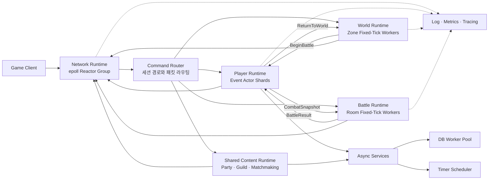
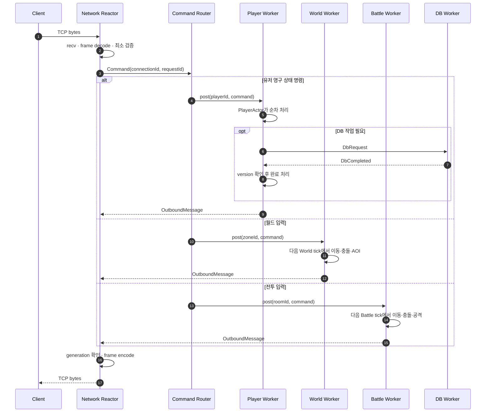
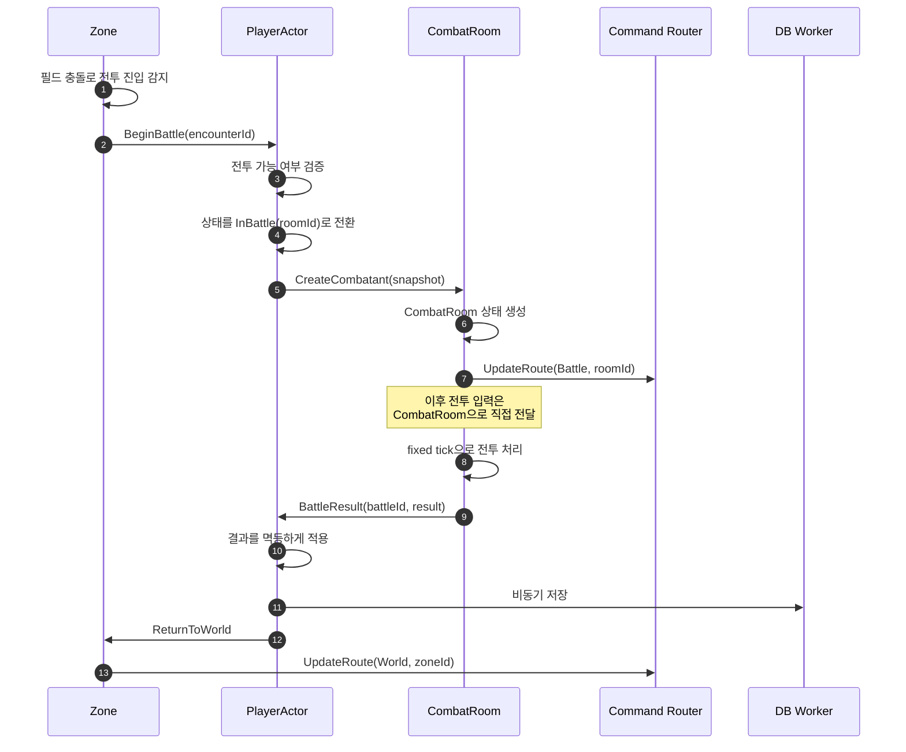

# SnF 서버 아키텍처 초안

> 상태: Draft  
> 대상: C++20, Linux, `epoll` 기반 실시간 게임 서버  
> 목표: 월드와 인스턴스 전투가 공존하는 게임 서버의 실행 모델과 상태 소유권 정의

## 1. 문서 목적

이 문서는 SnF를 단순 패킷 서버에서 현대적인 실시간 게임 서버 구조로 발전시키기 위한
목표 아키텍처를 정의한다.

SnF의 최종 학습 목표는 다음과 같다.

- 네트워크 I/O와 게임 로직을 분리한다.
- 게임 상태마다 단 하나의 논리적 소유자를 둔다.
- 이벤트 기반 콘텐츠와 고정 tick 시뮬레이션을 서로 다른 실행 모델로 처리한다.
- 여러 Actor와 시뮬레이션 객체를 소수의 OS Worker Thread에서 실행한다.
- 느린 DB, 파일 로그, 외부 I/O가 게임 Worker를 막지 않게 한다.
- 모든 경계에 순서 보장, 수명 검증, backpressure와 관측 가능성을 둔다.
- 처음에는 단일 프로세스로 구현하되 나중에 프로세스를 분리할 수 있게 한다.

이 문서에서 말하는 최종 형태는 대규모 분산 시스템을 처음부터 구축한다는 뜻이 아니다.
우선 하나의 프로세스 안에서 모듈과 메시지 경계를 검증한 뒤, 필요할 때 같은 경계를
프로세스 간 통신으로 교체하는 것을 의미한다.

## 2. 핵심 결정

### 2.1 플랫폼 모델

SnF는 Linux 서버이므로 네트워크 계층은 IOCP Worker Pool이 아니라 `epoll` 기반
Reactor Group으로 구현한다. 상위 게임 계층에서는 이를 `NetworkRuntime`으로 추상화하여
향후 IOCP 같은 다른 백엔드를 추가할 수 있게 한다.

```text
NetworkRuntime
├── Linux: EpollNetworkRuntime
└── Windows: IocpNetworkRuntime (선택적 확장)
```

### 2.2 상태 소유권

게임 상태를 보호하는 기본 수단은 큰 mutex가 아니라 단일 소유권과 순차 실행이다.

- PlayerActor만 유저 영구 상태를 수정한다.
- Zone만 해당 필드의 실시간 상태를 수정한다.
- CombatRoom만 해당 전투의 실시간 상태를 수정한다.
- PartyActor, GuildActor 같은 공유 콘텐츠 Actor가 자신의 상태를 수정한다.
- 다른 Runtime의 mutable 객체를 직접 참조하지 않고 typed message를 보낸다.

### 2.3 Actor와 Thread

Actor는 OS Thread가 아니다. Actor는 상태, mailbox 또는 명령 처리 규칙을 가진 논리적
실행 단위다. 소수의 Worker Thread가 많은 Actor를 shard 방식으로 나누어 실행한다.

Zone과 CombatRoom은 유저 하나당 Actor를 만드는 방식보다 여러 Entity를 함께 소유하는
시뮬레이션 aggregate로 취급한다. 내부 hot path는 연속 저장 구조나 단순한 ECS 형태를
사용할 수 있다.

### 2.4 실행 모델

하나의 범용 Thread Pool에 모든 작업을 넣지 않는다. 작업 특성에 맞는 executor를 둔다.

| Executor | 용도 | 대표 객체 |
| --- | --- | --- |
| Reactor | 네트워크 readiness 처리 | Session |
| Event Actor Executor | 이벤트 기반 순차 상태 변경 | Player, Party, Guild |
| Fixed-Tick Executor | 주기적인 실시간 시뮬레이션 | Zone, CombatRoom |
| Blocking I/O Pool | 느린 외부 I/O | DB query, file operation |
| Stateless Job Pool | 선택적인 CPU 작업 | 경로 탐색, 압축 |

Stateless Job Pool은 게임 상태를 직접 수정하지 않는다. immutable snapshot을 입력으로 받고
결과를 원래 상태 소유자에게 메시지로 반환한다.

## 3. 전체 구조



## 4. 런타임 구성

### 4.1 Main 및 Control

Main Thread는 다음만 담당한다.

- 설정 로드
- Runtime 생성과 시작 순서 관리
- signal 수신과 종료 요청
- graceful shutdown 조정
- 최종 통계 출력

일반 패킷이나 게임 콘텐츠를 Main Thread에서 처리하지 않는다.

### 4.2 Network Runtime

각 Reactor Worker는 자신의 `epoll` 인스턴스와 Session 집합을 독점한다.

```text
NetworkRuntime
├── ReactorWorker 0
│   ├── epoll fd
│   ├── Session A
│   └── Session B
└── ReactorWorker 1
    ├── epoll fd
    ├── Session C
    └── Session D
```

Network Runtime의 책임은 다음과 같다.

- 연결 수락과 종료
- non-blocking recv/send
- Frame 조립 및 wire format 검증
- 세션 인증 상태와 rate limit 확인
- 패킷에서 typed command 생성
- Command Router 호출
- outbound queue와 slow client backpressure
- 프로토콜 오류 처리

Network Runtime은 인벤토리, 이동, 충돌, 전투 같은 게임 상태를 수정하지 않는다.

게임 Worker가 응답을 만들면 Session을 소유한 Reactor의 bounded outbound queue에 넣고
`eventfd`로 Reactor를 깨운다. 실제 Session 조회, encode와 send는 Reactor가 수행한다.

FD는 재사용될 수 있으므로 다른 Runtime에는 raw FD 대신 다음과 같은 논리 ID를 전달한다.

```cpp
struct ConnectionId
{
    std::uint64_t value;
    std::uint32_t generation;
};
```

응답 시 generation이 현재 Session과 다르면 오래된 응답으로 판단하여 폐기한다.

### 4.3 Command Router

Command Router는 패킷 종류와 현재 Session Route를 사용해 상태 소유자를 선택한다.

```cpp
struct SessionRoute
{
    UserId user_id;
    RouteKind kind;   // Player, World, Battle, SharedContent
    EntityId target;  // playerId, zoneId, roomId, partyId 등
};
```

예시는 다음과 같다.

| 명령 | 목적지 |
| --- | --- |
| 장비 변경, 보상 수령 | PlayerActor |
| 필드 이동, 필드 상호작용 | Zone |
| 전투 이동, 공격 | CombatRoom |
| 파티 초대 | PartyActor |
| 길드 가입 | GuildActor |
| 매칭 참가 | MatchmakingActor |

라우팅 메타데이터는 게임 상태 전체의 복사본이 아니다. 실제 상태의 최종 권한은 목적지
Actor 또는 시뮬레이션 aggregate에 있다.

### 4.4 Player Runtime

PlayerActor는 다음 상태를 소유한다.

- 인벤토리, 장비, 재화
- 퀘스트, 업적, 영구 진행도
- 로그인 및 연결 상태
- `InWorld(zoneId)`, `InBattle(roomId)` 같은 상위 위치 상태
- dirty flag, entity version, 저장 진행 상태

Player Runtime은 `player_id`를 기준으로 shard한다.

```cpp
worker_index = hash(player_id) % player_worker_count;
```

동일 PlayerActor의 명령은 항상 같은 Worker에서 순차 실행한다. 초기 구현은 Worker별
bounded command queue를 사용한다.

```cpp
player_runtime.post(player_id, PlayerCommand{...});
```

Actor 간 메시징과 Actor lifecycle이 복잡해진 후에 Actor별 mailbox와 `ActorRef::tell()`을
도입할 수 있다. Actor mailbox를 도입하면 ready queue 중복 등록을 방지하고 한 번에 처리할
메시지 수나 실행 시간에 budget을 둔다.

### 4.5 World Runtime

World Runtime은 Zone 또는 MapInstance 단위로 실시간 상태를 소유한다.

- 필드 위치와 이동
- 필드 충돌
- AOI 및 주변 객체 갱신
- NPC와 AI
- 스폰과 despawn
- 전투 진입 판정

World Worker는 `zone_id`를 기준으로 Zone을 소유한다.

```cpp
worker_index = hash(zone_id) % world_worker_count;
```

한 tick의 권장 처리 순서는 다음과 같다.

```text
입력 command drain
→ 이동 입력 반영
→ 공간 인덱스 갱신
→ 충돌 처리
→ NPC와 AI
→ 스폰 처리
→ AOI 계산
→ 도메인 이벤트와 outbound 생성
```

이벤트만 필요한 비활성 콘텐츠는 전체 Zone tick에 넣지 않고 timer나 domain event로
처리할 수 있다.

### 4.6 Battle Runtime

Battle Runtime은 `room_id`를 기준으로 여러 CombatRoom을 Worker에 분산한다.

```cpp
worker_index = hash(room_id) % battle_worker_count;
```

CombatRoom은 다음을 소유한다.

- 전투 중 위치와 이동
- 전투 중 HP와 상태 이상
- 충돌과 공격 판정
- 전투 타이머
- 승패 및 종료 조건

전투 결과를 클라이언트에 자주 보내지 않더라도 서버 내부에서 연속적인 충돌과 이동을
계산한다면 fixed tick을 유지한다. 네트워크 송신 주기와 시뮬레이션 tick 주기는 독립적이다.

우선 병렬화 단위를 CombatRoom 사이로 잡는다. 하나의 CombatRoom 내부를 여러 스레드가
동시에 수정하지 않는다.

### 4.7 Shared Content Runtime

여러 유저가 공유하는 이벤트 기반 상태를 별도 Actor가 소유한다.

- PartyActor: 파티 구성, 파티장, 참가 상태
- GuildActor: 길드원, 역할, 길드 재화
- MatchmakingActor: 대기열과 매칭 결과
- ChatChannelActor: 채널 참가 상태

개인 인벤토리, 퀘스트, 상점 구매처럼 한 유저가 소유하는 기능은 Shared Content Runtime에
넣지 않고 PlayerActor의 handler 또는 module로 둔다. `ContentRuntime`이 소유자가 불분명한
기능을 모으는 공간이 되지 않게 한다.

### 4.8 Persistence Runtime

게임 Worker에서 동기 DB 호출을 하지 않는다.

```text
PlayerActor
→ DbRequest
→ bounded DB Worker Pool
→ blocking DB operation
→ DbCompleted
→ 원래 PlayerActor Worker
```

DB Worker는 PlayerActor 상태를 직접 수정하지 않는다. 완료 메시지에는 최소한 다음 정보를
포함한다.

- request ID
- entity ID
- 요청 시점의 entity version
- 성공 또는 실패 결과
- 재시도 가능 여부

PlayerActor는 완료 메시지를 자신의 mailbox 또는 Worker queue에서 처리하며 오래된 결과가
최신 상태를 덮지 못하게 한다.

권장 저장 전략은 다음과 같다.

- 로그인 시 PlayerActor 상태 로드
- 실행 중 메모리 상태를 authoritative state로 사용
- dirty 상태의 주기적인 비동기 flush
- 로그아웃 시 snapshot 저장
- `battle_id`를 이용한 전투 결과 멱등 처리
- 재화 같은 중요 변경에 명시적인 실패 및 재시도 정책 적용

### 4.9 Observability

로그 기록은 전용 bounded queue와 Logger Thread에서 처리한다. 일반 로그가 가득 찼을 때
게임 Worker를 무기한 막지 않도록 sampling 또는 drop 정책을 정의한다. 감사나 결제 성격의
로그는 별도의 신뢰성 정책을 가져야 한다.

최소 측정 항목은 다음과 같다.

- Reactor event loop 지연
- 연결 수와 Session별 송신 queue 크기
- Runtime별 queue depth
- command enqueue부터 실행까지의 p50/p95/p99 대기 시간
- World 및 Battle tick 실행 시간
- tick budget 초과 횟수
- 활성 Zone, CombatRoom, PlayerActor 수
- DB queue depth와 query latency
- dropped, rejected, coalesced message 수

## 5. 패킷 처리 흐름



이동이나 공격 패킷은 Network Thread에서 즉시 시뮬레이션하지 않는다. 입력 command를
해당 Zone 또는 CombatRoom에 넣고 다음 권위 있는 tick에서 처리한다.

## 6. 월드와 전투 사이 상태 전환



전투 중 임시 HP와 위치는 CombatRoom이 소유한다. PlayerActor는 전투 참여 상태와 영구
데이터를 소유하고 전투가 끝난 뒤 BattleResult를 적용한다. 두 객체가 같은 전투 상태를
동시에 수정하지 않는다.

## 7. 메시지 규약

Runtime 경계를 넘는 메시지는 immutable value 또는 명확한 단독 소유 값을 사용한다.
다른 Runtime이 소유한 객체의 raw pointer나 mutable reference를 전달하지 않는다.

공통 envelope는 다음 정보를 가질 수 있다.

```cpp
struct MessageEnvelope
{
    MessageId message_id;
    CorrelationId correlation_id;
    EntityId target_id;
    std::optional<ConnectionId> connection_id;
    std::optional<std::uint64_t> sequence;
    TimePoint deadline;
    MessagePayload payload;
};
```

모든 메시지에 모든 필드를 강제할 필요는 없지만 다음 의미는 일관되게 유지한다.

- `message_id`: 중복 처리 방지
- `correlation_id`: 요청, DB 작업, 응답 연결
- `target_id`: shard와 상태 소유자 선택
- `connection_id`: 응답 Session 수명 검증
- `sequence`: 필요한 스트림의 순서 검증
- `deadline`: 이미 가치가 없어진 작업 폐기

Runtime 사이에서 동기 호출이나 `future.get()`으로 상대 Worker를 기다리지 않는다.

## 8. Queue와 Backpressure

모든 비동기 queue는 bounded queue여야 한다. 큐가 가득 찼을 때의 정책을 호출 지점별로
정의한다.

| 포화 지점 | 권장 정책 |
| --- | --- |
| Session inbound | 읽기 일시 중지, rate limit, 심한 경우 연결 종료 |
| Player command queue | Busy 응답 또는 비핵심 명령 거부 |
| World/Battle input queue | 최신 입력 병합, 오래된 입력 폐기, 악성 세션 종료 |
| Reactor outbound queue | 상태 갱신 병합 또는 slow client 종료 |
| DB queue | 제한된 재시도 또는 요청 실패 처리 |
| 일반 로그 queue | sampling 또는 drop |

입력 종류별로 정책이 다를 수 있다. 이동 입력은 최신 값으로 합칠 수 있지만 아이템 구매나
전투 결과는 임의로 버리면 안 된다.

## 9. Tick 설계

World와 Battle은 서로 독립된 fixed tick 주기를 가질 수 있다. 초기 예시는 World 20Hz,
Battle 30Hz지만 실제 값은 게임 규칙과 부하 테스트로 결정한다.

고정 tick의 기본 규칙은 다음과 같다.

- 시간 계산에는 `std::chrono::steady_clock`을 사용한다.
- 테스트에서는 주입 가능한 Clock을 사용한다.
- 한 tick이 늦어져도 무제한 catch-up loop를 돌지 않는다.
- tick당 command 처리량 또는 시간을 제한한다.
- tick 실행 시간이 budget을 넘으면 metric과 structured log를 남긴다.
- 네트워크 snapshot 주기는 simulation tick과 별도로 설정할 수 있다.

결정론적인 테스트를 위해 동일한 초기 상태와 입력 sequence가 같은 결과를 내도록 하는 것을
권장한다.

## 10. Thread 토폴로지

초기 구현은 다음과 같이 시작한다.

| 영역 | 초기 Worker 수 | 확장 기준 |
| --- | ---: | --- |
| Network Reactor | 1 | event loop 지연과 네트워크 처리량 |
| Player Actor | 1 | mailbox 대기 시간 |
| World | 1 | tick budget과 Zone 수 |
| Battle | 1 | tick budget과 활성 Room 수 |
| Shared Content | 1 | Actor별 queue 지연 |
| DB | 2 | DB connection 한도와 queue 지연 |
| Logger | 1 | 로그 queue 지연 |

최종 학습 단계에서는 World 또는 Battle Worker를 최소 2개로 늘려 다음을 검증한다.

- 동일 Zone 또는 Room은 한 Worker에서만 실행된다.
- 서로 다른 shard는 실제로 병렬 실행된다.
- 특정 shard의 부하가 다른 shard의 순서를 깨뜨리지 않는다.
- worker_count 변경과 entity 재배치 정책이 명확하다.

CPU를 지속적으로 사용하는 Worker 수는 물리 코어 수와 tick deadline을 기준으로 결정한다.
DB Worker처럼 대부분 대기하는 Thread는 같은 방식으로 단순 합산하지 않는다.

## 11. 종료 순서

graceful shutdown은 다음 순서를 권장한다.

```text
새 연결 수락 중지
→ Session의 새 게임 command 수락 중지
→ World/Battle에 종료 경계 전달
→ 게임 Runtime queue drain
→ 필요한 dirty state 저장 요청
→ DB queue drain 또는 timeout
→ outbound queue drain 또는 timeout
→ Reactor 종료
→ Logger flush
```

종료 중에도 다른 Runtime이 이미 파괴된 Session이나 Actor에 메시지를 보내지 않도록 Runtime
간 수명 순서를 명시해야 한다.

## 12. 목표 소스 구조

```text
include/snf/
├── core/
│   ├── id.hpp
│   ├── message.hpp
│   ├── clock.hpp
│   └── result.hpp
├── net/
│   ├── network_runtime.hpp
│   ├── epoll_reactor.hpp
│   ├── reactor_group.hpp
│   ├── session.hpp
│   └── connection_id.hpp
├── gateway/
│   ├── command_router.hpp
│   └── session_route.hpp
├── runtime/
│   ├── bounded_queue.hpp
│   ├── event_executor.hpp
│   ├── fixed_tick_executor.hpp
│   └── timer_scheduler.hpp
├── game/
│   ├── player/
│   ├── world/
│   ├── battle/
│   └── social/
├── persistence/
│   ├── db_executor.hpp
│   ├── player_repository.hpp
│   └── persistence_message.hpp
├── protocol/
└── observability/
    ├── async_logger.hpp
    └── metrics.hpp
```

이 구조는 목표 형태이며 파일을 먼저 모두 만들 필요는 없다. 실제 기능을 구현할 때 필요한
경계를 순서대로 추가한다.

## 13. 현재 구조에서의 발전 단계

### 단계 1: Network와 게임 로직 분리

현재 `TcpServer`의 동기식 `MessageDispatcher::dispatch()` 호출을 다음 구조로 바꾼다.

```text
epoll Reactor
→ Frame decode
→ CommandRouter
→ Runtime.post(entityId, command)
```

이 단계에서 논리 `ConnectionId`, inbound/outbound bounded queue와 `eventfd` wake-up을
도입한다.

### 단계 2: Player Runtime

- PlayerWorker 하나와 bounded queue를 구현한다.
- PlayerActor만 Player 상태를 수정하게 한다.
- 동일 Player 명령의 순서와 단일 실행을 테스트한다.
- DB는 아직 in-memory repository로 대체할 수 있다.

### 단계 3: World Runtime

- 주입 가능한 Clock을 사용하는 FixedTickExecutor를 구현한다.
- Zone 하나에서 입력, 이동, 충돌, AOI의 최소 vertical slice를 만든다.
- tick overrun과 command queue 지연을 측정한다.

### 단계 4: Battle Runtime

- CombatRoom 생성과 종료 lifecycle을 구현한다.
- World에서 Battle로 route와 상태 소유권을 전환한다.
- 전투 중 충돌 처리와 BattleResult의 멱등 적용을 검증한다.

### 단계 5: Persistence와 Shared Content

- bounded DB Worker Pool과 완료 메시지 반환을 구현한다.
- entity version으로 오래된 완료 결과를 거부한다.
- Party 또는 Matchmaking 중 하나를 공유 Actor의 대표 vertical slice로 구현한다.

### 단계 6: Multi-Worker Sharding

- Player, World 또는 Battle Runtime을 2개 이상 Worker로 확장한다.
- shard별 queue와 metric을 추가한다.
- hot Zone 또는 hot Room 탐지와 분산 정책을 검증한다.

### 단계 7: 프로세스 분리 실험

단일 프로세스 경계를 검증한 뒤에만 다음 순서로 분리한다.

```text
단일 GameServer 프로세스
→ Gateway와 GameNode 분리
→ WorldNode와 BattleNode 분리
→ 여러 Node를 위한 Directory와 내부 메시징 추가
```

프로세스를 분리하기 전에는 Kafka 같은 외부 메시지 브로커를 hot packet path에 두지 않는다.
단일 프로세스에서는 직접 bounded queue가 더 단순하고 지연도 낮다.

## 14. 검증 기준

최종 학습 구조는 다음 조건을 자동화된 테스트와 부하 테스트로 검증해야 한다.

- 동일 PlayerActor의 handler가 동시에 실행되지 않는다.
- 동일 Zone과 CombatRoom을 여러 Worker가 동시에 수정하지 않는다.
- 서로 다른 shard의 Actor 또는 Room은 병렬 실행된다.
- 네트워크 Reactor가 게임 로직, DB 또는 파일 I/O 때문에 멈추지 않는다.
- 같은 Session의 명령 순서가 필요한 범위에서 보장된다.
- 재접속 후 오래된 generation의 응답이 새 Session으로 전달되지 않는다.
- World와 Battle tick이 독립적으로 유지된다.
- tick overrun을 감지하고 수치로 확인할 수 있다.
- queue가 포화되었을 때 정의된 backpressure가 동작한다.
- DB 완료 순서가 바뀌어도 최신 상태가 과거 결과로 덮이지 않는다.
- 같은 BattleResult가 중복 전달되어도 한 번만 적용된다.
- shutdown 시 새 작업 차단, queue drain, 저장, 송신 drain이 순서대로 실행된다.
- 부하 테스트에서 queue depth, command wait, tick time과 end-to-end p99를 확인할 수 있다.

## 15. 의도적으로 미루는 항목

다음 항목은 핵심 구조를 검증하기 전에는 도입하지 않는다.

- Actor 하나당 Thread
- 모든 객체를 Actor로 만드는 설계
- 하나의 CombatRoom 내부 병렬 업데이트
- 측정 없는 lock-free 자료구조 전환
- 모든 비동기 흐름의 coroutine 전환
- 초기 단계의 microservice 또는 외부 message broker
- 영구적인 global singleton 상태
- 여러 Runtime이 같은 게임 상태를 mutex로 공동 수정하는 구조

## 16. 미결정 사항

다음 항목은 게임 규칙과 측정 결과에 따라 별도로 결정한다.

- World 및 Battle tick rate
- 한 Worker가 소유할 Zone과 CombatRoom 상한
- hot Zone의 공간 분할 방식
- Actor별 mailbox 도입 시점과 batch budget
- DB 종류, connection pool 크기와 저장 보장 수준
- snapshot, event journal 또는 outbox 도입 범위
- 네트워크 패킷 sequence와 재전송 정책
- 프로세스 분리 시 내부 프로토콜과 Actor Directory 방식

---

SnF의 목표 아키텍처를 한 문장으로 정리하면 다음과 같다.

> `epoll` Reactor Group, keyed Player Actor Shard, fixed-tick Zone/Battle Shard,
> bounded 비동기 persistence와 명확한 상태 소유권을 가진 분리 가능한 모듈러 게임 서버.
