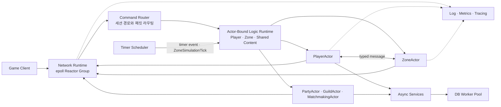
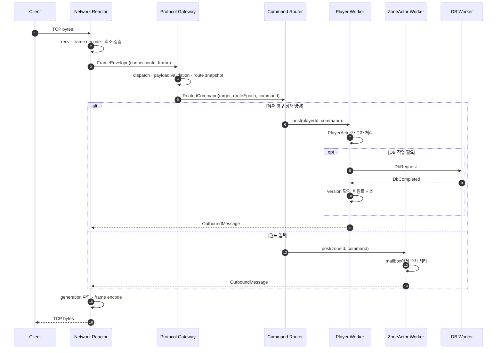
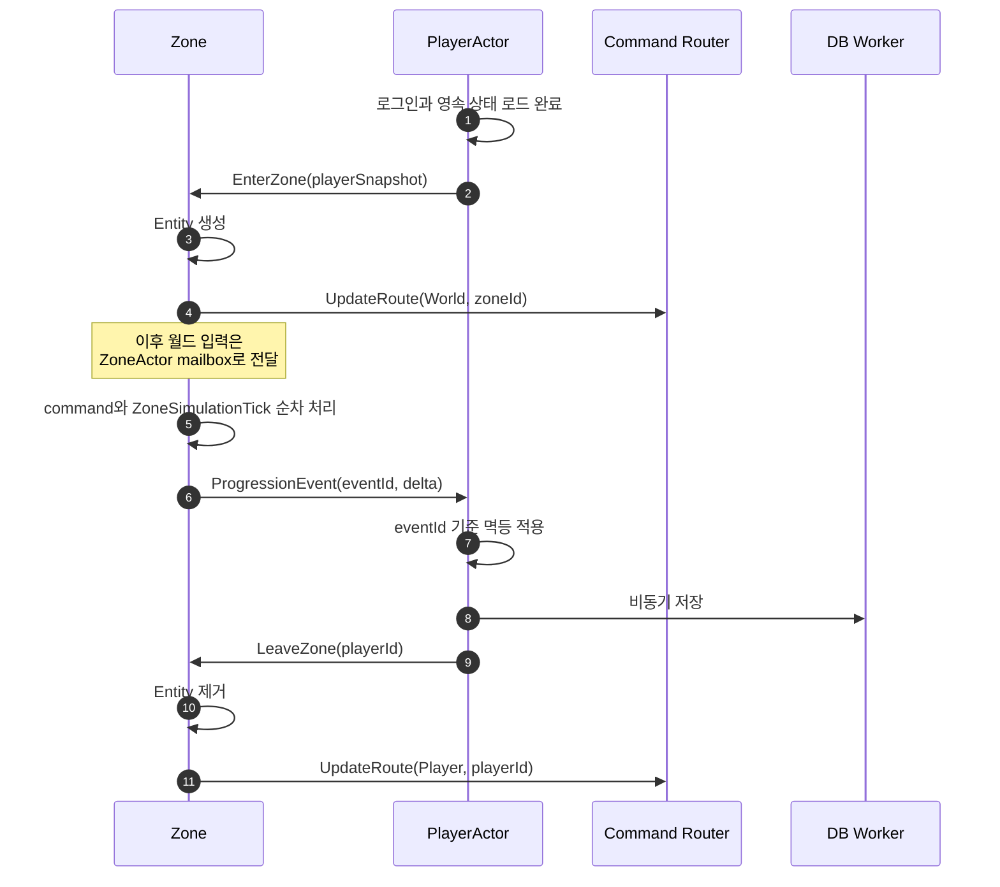

# SnF 서버 아키텍처 초안

> 상태: Draft  
> 대상: C++20, Linux, `epoll` 기반 실시간 게임 서버  
> 목표: 여러 종류의 게임 로직 Actor가 공통 Worker Pool을 공유하는 실행 모델과 상태 소유권 정의
>
> 이 문서는 **목표 구조와 불변식**을 기술한다. 현재 구현 상태와 구현 순서는
> [개발 로드맵](./development-roadmap.md), 실행 모델 전환의 근거는
> [UnifiedRuntime 전환 개요](../study/10-unified-runtime-overview.md), Actor coroutine 경합·수명 규약은
> [Coroutine Actor 계약](./coroutine-actor-contract.md), 전체 종료 판정은
> [Runtime Lifecycle 계약](./runtime-lifecycle-contract.md)이 소유한다. 현재 동작과 목표 동작이
> 섞이는 절은 표에 `현재 동작` 열을 두어 구분한다.

## 1. 문서 목적

이 문서는 SnF를 단순 패킷 서버에서 현대적인 실시간 게임 서버 구조로 발전시키기 위한
목표 아키텍처를 정의한다.

SnF의 최종 학습 목표는 다음과 같다.

- 네트워크 I/O와 게임 로직을 분리한다.
- 게임 상태마다 단 하나의 논리적 소유자를 둔다.
- Player, Zone과 공유 콘텐츠를 같은 Actor 실행 모델로 처리한다.
- 여러 Actor를 소수의 고정 OS Worker Thread에서 실행한다.
- 느린 DB, 파일 로그, 외부 I/O가 게임 Worker를 막지 않게 한다.
- 모든 경계에 순서 보장, 수명 검증, backpressure와 관측 가능성을 둔다.
- 처음에는 단일 프로세스로 구현하되 나중에 프로세스를 분리할 수 있게 한다.

이 문서에서 말하는 최종 형태는 대규모 분산 시스템을 처음부터 구축한다는 뜻이 아니다.
우선 하나의 프로세스 안에서 모듈과 메시지 경계를 검증한 뒤, 필요할 때 같은 경계를
프로세스 간 통신으로 교체하는 것을 의미한다.

## 2. 핵심 결정

### 2.1 플랫폼 모델

SnF는 Linux 서버이므로 네트워크 계층은 `epoll` 기반 Reactor Group으로 시작한다. 현재
protocol gateway는 `FrameIngress`를, Player binding은 `PlayerEffectSink`를 통해 network
runtime과 만난다. 일반화된 scheduler는 domain effect sink를 직접 알지 않는다. network
backend의 queue나 wake-up primitive도 domain과 scheduler에 노출하지 않는다. io_uring은
콘텐츠 단계의 선행 조건이 아닌 선택적 두 번째 backend다.

```text
NetworkRuntime
├── Linux: EpollNetworkRuntime
└── Linux: IoUringNetworkRuntime (선택적 확장)
```

### 2.2 상태 소유권

게임 상태를 보호하는 기본 수단은 큰 mutex가 아니라 단일 소유권과 순차 실행이다.

- PlayerActor만 유저 영구 상태를 수정한다.
- ZoneActor만 해당 필드의 실시간 상태를 수정한다.
- PartyActor, GuildActor 같은 공유 콘텐츠 Actor가 자신의 상태를 수정한다.
- 다른 Runtime의 mutable 객체를 직접 참조하지 않고 typed message를 보낸다.

### 2.3 Actor와 Thread

Actor는 OS Thread가 아니다. Actor는 상태, mailbox와 명령 처리 규칙을 가진 논리적 실행 단위다.
소수의 Worker Thread가 많은 Actor를 shard 방식으로 나누어 실행한다.

```cpp
enum class ActorKind
{
    ProvisionalPlayer,
    Player,
    Zone,
    Party,
    Guild,
};

struct ActorKey
{
    ActorKind kind;
    EntityId id;
};

worker_index = hash(actor_key) % logic_worker_count;
```

서로 다른 종류의 Actor가 같은 숫자 ID를 가질 수 있으므로 shard key의 동등성과 hash에는
Actor 종류를 모두 포함한다. 인증 전 `ProvisionalActorId`와 영속 `PlayerId`도 서로 다른
ID namespace다. 구현이 strong ID variant를 사용해 같은 구분을 제공해도 된다.

이 문서에서 Actor의 논리 identity는 `ActorKey`를 뜻한다. 별도의 `ActorIdentity`
동의어를 두지 않으며, 활성화 세대인 `ActorIncarnation`은 key에 포함하지 않는다.
async task와 continuation은 `{ActorKey, ActorIncarnation, TaskId}`로 식별한다.

Actor는 활성화된 동안 같은 Worker에 고정되며 모든 command, timer event와 coroutine continuation은
그 Worker에서만 실행된다. Actor 하나가 Thread 하나를 독점하지 않고 여러 Actor가 하나의 Worker를
공유한다. Worker 수 변경과 재배치는 restart 또는 명시적인 passivation/activation 경계에서만 한다.

ZoneActor는 여러 Entity를 함께 소유하는 aggregate Actor다. 내부 hot path는 연속 저장 구조나
단순한 ECS 형태를 사용할 수 있지만, 그 상태를 접근하고 수정하는 주체는 owning Worker 하나뿐이다.

### 2.4 실행 모델

게임 상태를 변경하는 로직은 Actor-Bound Logic Pool에서 실행한다. 느린 I/O와 상태를 소유하지 않는
CPU 작업만 별도 executor로 분리한다.

| Executor | 용도 | 대표 객체 | 선택적 통합 시 |
| --- | --- | --- | --- |
| Reactor | 네트워크 readiness 처리 | Session (`ConnectionScope`는 선택안) | UnifiedRuntime에 흡수 |
| Actor-Bound Logic Pool | 순차 상태 변경과 timer event 처리 | Player, Zone, Party, Guild | UnifiedRuntime에 흡수 |
| Blocking I/O Pool | 느린 외부 I/O | DB query, file operation | 별도 유지 |
| Stateless Job Pool | 선택적인 CPU 작업 | 경로 탐색, 압축 | 별도 유지 |

Stateless Job Pool은 게임 상태를 직접 수정하지 않는다. immutable snapshot을 입력으로 받고
결과를 원래 상태 소유자에게 메시지로 반환한다.

Logic Pool의 fairness는 Actor turn 사이의 cooperative fairness다. Phase 4.0부터 handler가 외부
operation을 await하면 해당 Actor만 suspend되고 같은 Worker의 다른 Actor는 계속 실행한다. continuation은
원래 owning Worker에 게시되고, suspend된 Actor의 다음 command보다 먼저 coroutine을 재개한다. 반면
handler가 suspend하지 않는 CPU 작업이나 effect 적용이 blocking하면 그 Worker에 배치된 Player, Zone
등이 함께 지연될 수 있다.

단계 4.1부터 outbound 포화는 Logic Worker를 세우지 않는다. Binding이 방출 전에 용량을 예약하고,
포화면 그 Actor만 suspend되어 같은 Worker의 다른 Actor가 계속 실행된다. grant는 reactor만 수행하고
용량을 되돌린 Worker는 wake-up만 신호하므로, grant 작업량은 reactor 회차당 상한 안에 머문다. 이
전환은 현재 구조에서 Worker 격리를 개선하고, 향후 실행 pool을 통합할 경우의 선행
조건도 만족한다. 통합 후에는 outbound를 비우는 주체와 대기하는
주체가 같은 pool에 있으므로 blocking 대기가 남아 있으면 pool 전체가 진행하지 못한다.

예약은 Actor 실행 규칙을 바꾸지 않는다. handler는 여전히 자신의 task에서 결정만 하고, 용량 획득과
effect 방출은 binding이 handler의 정상 반환 이후에 수행한다. 따라서 domain Actor는 outbound 용량이
유한하다는 사실을 알지 않는다.

ZoneActor를 올리는 Playable Session slice에서 tick 지연과 shard 편향을 측정해 worker 수,
affinity, fairness와 실행 pool 통합 필요를 판단한다.

### 2.5 Scheduler와 typed Actor binding

일반화 대상은 domain Actor 계층이 아니라 실행 규칙이다.

| 계층 | 책임 |
| --- | --- |
| Actor scheduler | shard ingress, Actor별 FIFO mailbox, ready queue, turn budget, capacity, Worker lifecycle |
| Actor binding | Actor 활성화, typed command dispatch, handler result와 effect 적용, domain lifecycle 해석 |
| Command router | target과 command가 결합된 typed route를 선택해 적합한 binding으로 전달 |

scheduler의 public header와 translation unit은 `PlayerActor`, `PlayerCommand`, `PlayerResult`,
`PlayerEffectSink` 또는 향후 `ZoneActor`를 직접 참조하지 않는다. 구체 Actor를 다루는 binding은
type-erased 실행 계약 등으로 scheduler와 만날 수 있지만, domain Actor들에게 공통 상속
계층을 강제하지 않는다.

`PlayerCommandRoute`, 향후 `ZoneCommandRoute`처럼 target과 command는 같은 variant alternative에
유지한다. public `post(ActorKey, AnyMessage)`처럼 target-message의 잘못된 조합을 표현할 수
있는 경계는 만들지 않는다.

### 2.6 선택적 UnifiedRuntime

현재의 Reactor + Actor Pool 분리 구조는 유효한 최종 구조다. Playable Session과 Zone 부하에서
cross-runtime hand-off, lifecycle 조정 또는 shard 편향이 실제 병목으로 증명되면 Connection,
I/O continuation, Actor turn과 runtime deadline을 하나의 Worker Pool에서 실행하는 방식을
재평가한다. 전환 근거와 트레이드오프는
[UnifiedRuntime 전환 개요](../study/10-unified-runtime-overview.md)가 보존한다.

이 절이 고정하는 것은 통합 후에도 유지되는 불변식이다.

**통합하는 것은 실행 pool이며 게임 상태가 아니다.** 하나의 Worker Pool을 쓰더라도 게임 상태는 소유
Actor만 수정하고, 같은 `ActorKey`의 command는 동시에 실행되지 않는다(§2.2, §2.3). 따라서 §15가
배제하는 "여러 Runtime이 같은 게임 상태를 mutex로 공동 수정하는 구조"는 통합 후에도 배제 대상으로
남는다. 두 항목은 서로 다른 축의 결정이다.

- 실행 pool 통합: 어떤 Worker가 어떤 종류의 작업을 실행하는가 → 측정 후 선택
- 상태 공유: 하나의 mutable 게임 상태를 여러 실행 주체가 수정하는가 → 배제

blocking 작업은 통합 대상이 아니다. DB query, 파일 I/O와 장시간 CPU 작업은 별도 bounded executor에
남긴다. 공통 pool의 Worker가 blocking 작업에 점유되면 전체 서버가 멈추기 때문이다.

통합 후 Actor 배치는 고정 shard(`hash(ActorKey) % worker_count`)에서 Actor별 직렬화 규칙으로 바뀔 수
있다. 이때도 §2.3의 단일 실행 불변식은 유지하며, worker 수·affinity·fairness는 Playable
Session의 Zone 측정으로 결정한다(§16).

## 3. 전체 구조



## 4. 런타임 구성

### 4.1 Main 및 Control

Main Thread는 다음만 담당한다.

- 설정 로드
- Runtime 생성과 시작 순서 관리
- signal 수신과 종료 요청
- graceful shutdown 조정
- 최종 통계 출력

일반 패킷이나 게임 콘텐츠를 Main Thread에서 처리하지 않는다.

### 4.2 Network Runtime

각 Reactor Worker는 자신의 `epoll` 인스턴스와 Session 집합을 독점한다.

```text
NetworkRuntime
├── ReactorWorker 0
│   ├── epoll fd
│   ├── Session A
│   └── Session B
└── ReactorWorker 1
    ├── epoll fd
    ├── Session C
    └── Session D
```

Network Runtime의 책임은 다음과 같다.

- 연결 수락과 종료
- non-blocking recv/send
- Frame 조립 및 wire format 검증
- `FrameEnvelope`를 공통 `ProtocolGateway`에 제출
- outbound queue와 slow client backpressure
- Gateway 결과에 따른 프로토콜 오류·포화 처리

Network Runtime은 인벤토리, 이동, 충돌 같은 게임 상태를 수정하지 않는다.

Actor handler는 `PlayerResult`에 domain effect를 반환하고, `PlayerEffectSink`가 handler 완료 뒤 이를
적용한다. 현재 `ProtocolPlayerEffectSink`가 `SendResponse`를 `ProtocolResponseMapper`로 `SendFrame`
으로 바꿔 `OutboundSink`에 게시한다. 그 인터페이스의 현재 구현인 `OutboundChannel`이 bounded queue,
예약 회계와 `eventfd` wake-up을 캡슐화하며, 실제 Session 조회, encode와 send는 Reactor가 수행한다.
runtime drained/failed는 outbound action과 분리된 `RuntimeCompletionCoordinator`가 추적한다.
outbound가 포화되면 binding이 emit 직전 예약에 실패하고 그 Actor만 suspend한다. Worker는 대기하지 않고
다른 Actor turn을 계속 처리하며, capacity가 풀리면 Reactor가 grant를 publish해 소유 Worker가 그 Actor를
resume한다. Worker의 in-flight 예산이 없어 예약을 시작조차 못 하면 응답을 조용히 버리지 않고 backend가
그 연결을 닫는다. 종료 시에는 채널 cancel이 남은 waiter를 무효 예약으로 해제하므로 도달할 수 없는 grant를
기다리는 Actor가 남지 않으며, binding은 stop token이 요청된 상태면 그 command를 Stopped로 끝낸다.
단계 3.8에서 Player binding과 향후 Zone·Shared Content binding은 하나의 Worker Pool을 공유하며
completion identity는 `RuntimeId::Logic`으로 통합했다. drain과 failure는 ActorKind별 완료가 아니라
Logic Runtime 전체의 terminal state를 의미한다.

FD는 재사용될 수 있으므로 다른 Runtime에는 raw FD 대신 다음과 같은 논리 ID를 전달한다.

```cpp
struct ConnectionId
{
    int descriptor;
    std::uint64_t generation;
};
```

응답 시 generation이 현재 Session과 다르면 오래된 응답으로 판단하여 폐기한다.

### 4.3 Command Router

현재 `ProtocolGateway`는 연결 generation에서 만든 `ProvisionalActorId`와 typed command 또는
`ConnectionClosed` lifecycle 사실을 route로 결합하고, `CommandRouter`가 `PlayerActorIngress`에
전달한다. 임시 ID는
인증 전 routing key일 뿐이며 `PlayerId`, DB key, 저장 key 또는 재접속 key가 아니다.
단계 3.8 후에도 route의 typed 조합은 유지하며, Player binding이
`ProvisionalActorId`를 `{ProvisionalPlayer, id}` ActorKey로 변환해 Logic Runtime에 제출한다.

`ConnectionClosed`는 모든 Actor의 공통 domain event가 아니다. Player binding이 인증 전 Actor에
대한 ordered lifecycle control로 해석한다. 기존 command 뒤에서 소비되고, Actor가 없는 close는
slot을 생성하지 않으며, close를 소비한 owning Worker만 slot을 evict하는 의미를 유지한다.

인증과 World 도입 후에는 `RouteCoordinator`가 `SessionRoute`와 `route_epoch`의
authoritative owner가 된다. Gateway는 route snapshot과 epoch을 command에 부여하고 destination은
자신의 activation epoch과 비교한다. epoch은 stale destination 검출 수단이며 route 전환의
원자성은 별도 transition protocol이 보장한다.

```cpp
struct SessionRoute
{
    UserId user_id;
    RouteKind kind;   // Player, World, SharedContent
    EntityId target;  // playerId, zoneId, partyId 등
    std::uint64_t epoch;
};
```

예시는 다음과 같다.

| 명령 | 목적지 |
| --- | --- |
| 장비 변경, 보상 수령 | PlayerActor |
| 필드 이동, 필드 상호작용 | ZoneActor |
| 파티 초대 | PartyActor |
| 길드 가입 | GuildActor |
| 매칭 참가 | MatchmakingActor |

라우팅 메타데이터는 게임 상태 전체의 복사본이 아니다. 실제 상태의 최종 권한은 목적지
Actor에 있다.

### 4.4 Player Actor

PlayerActor는 다음 상태를 소유한다.

- 인벤토리, 장비, 재화
- 퀘스트, 업적, 영구 진행도
- 로그인 및 연결 상태
- `InWorld(zoneId)` 같은 상위 위치 상태
- dirty flag, entity version, 저장 진행 상태

Logic Runtime은 인증 후 `{Player, player_id}`를 actor key로 사용해 PlayerActor의 owning Worker를
고정한다. 인증 전에는 `{ProvisionalPlayer, provisional_actor_id}`를 사용해 두 ID
namespace가 겹치지 않게 한다.

```cpp
worker_index = hash(ActorKey{ActorKind::ProvisionalPlayer, provisional_actor_id}) %
               logic_worker_count;
worker_index = hash(ActorKey{ActorKind::Player, player_id}) % logic_worker_count;
```

동일 PlayerActor의 명령은 항상 같은 Worker에서 순차 실행한다. 인증 전 현재 구현은 연결
generation을 `ProvisionalActorId`로 사용해 기본 2개 Worker에 shard하고, Worker별 Actor
mailbox에서 typed command를 순차 실행한다. 영속 `PlayerId`는 인증 vertical slice에서 도입한다.

```cpp
command_router.post(PlayerCommandRoute{PlayerId{player_id}, PlayerCommand{...}});
```

Player binding이 typed route에서 `ActorKey`를 도출하므로 caller가 Player command와 Zone key 같은
잘못된 조합을 구성할 수 없다.

현재 Actor mailbox와 ready queue는 중복 ready token을 방지하고 turn당 16개 command budget을
적용한다. Actor 간 메시징과 복잡한 lifecycle이 필요해지면 `ActorRef::tell()`과 passivation을
추가한다.

`PlayerActor::state()`의 const 참조는 owning Worker 내부 테스트와 진단에만 사용한다. `const`는
thread-safe snapshot을 의미하지 않으므로 다른 thread의 상태 조회는 query command 또는 immutable
snapshot으로 수행한다.

### 4.5 World Actor

World도 Player와 동일한 Actor 실행 규칙을 사용한다. `ZoneActor`는 Zone 또는 MapInstance 단위로
실시간 상태와 mailbox를 소유한다.

- 필드 위치와 이동
- 필드 충돌
- AOI 및 주변 객체 갱신
- NPC와 AI
- 스폰과 despawn
- 필드 이벤트 판정

Logic Runtime은 `{Zone, zone_id}`를 actor key로 사용해 ZoneActor의 owning Worker를 고정한다.

```cpp
worker_index = hash(ActorKey{ActorKind::Zone, zone_id}) % logic_worker_count;
```

`{Player, 1}`과 `{Zone, 1}`은 hash modulo 결과가 같아 같은 Worker에 배치될 수는 있지만,
동등한 key가 아니므로 항상 서로 다른 ActorSlot과 mailbox를 갖는다.

이동 입력, 관리 명령과 주기 갱신은 모두 같은 mailbox로 들어간다. Timer Scheduler는 시간이 되면
`ZoneSimulationTick{timer, tick}` 메시지만 게시하며 Zone 상태를 직접 실행하거나 수정하지 않는다.
ZoneActor가 tick message를 처리하는 권장 순서는 다음과 같다.

```text
입력 command drain
→ 이동 입력 반영
→ 공간 인덱스 갱신
→ 충돌 처리
→ NPC와 AI
→ 스폰 처리
→ AOI 계산
→ 도메인 이벤트와 outbound 생성
```

tick message도 일반 command와 같은 turn budget과 단일 실행 규칙을 따른다. 늦어진 tick을 무제한
catch-up하지 않고 오래된 tick을 합치거나 건너뛰는 정책을 둔다. 비활성 Zone은 주기 tick 대신 필요한
timer나 domain event만 받도록 passivation할 수 있다.

현재 구현은 마지막 Leave 뒤 같은 mailbox의 `CancelZoneSimulationTimer`가 적용되어 player 0, active
timer 없음이 된 경우 `PassivateIfIdle`을 요청한다. scheduler는 mailbox tail이 비었을 때만 제거하므로
동시에 승인된 새 Arm/Enter를 passivation이 폐기하지 않는다.

### 4.6 Shared Content Actor

여러 유저가 공유하는 이벤트 기반 상태를 별도 Actor가 소유한다.

- PartyActor: 파티 구성, 파티장, 참가 상태
- GuildActor: 길드원, 역할, 길드 재화
- MatchmakingActor: 대기열과 매칭 결과
- ChatChannelActor: 채널 참가 상태

현재 shared-content vertical slice는 PartyActor다. `PartyCoordinator`가 reactor 경계에서
connection·Player→Party route와 membership epoch을 소유하고, PartyActor는 member map을
소유한다. coordinator의 route는 network routing 상태이지 domain member map의 대체물이 아니다.
join/leave는 PartyId로 shard된 하나의 FIFO mailbox에서 적용되고 response member list는
PlayerId 오름차순으로 결정적이다.

Party 용량은 두 계층에서 같은 설정값으로 bounded다. coordinator가 용량 초과 route를
공개하지는 않지만, 거부를 protocol error로 바꾸지 않도록 capacity probe command를 Party
mailbox에 게시한다. 이 command는 앞서 수락된 join 뒤에서 `PartyFull`을 결정한다.
connection close는 Party leave를 Player passivation 앞에 게시하며, 마지막 leave는
`PassivateIfIdle`으로 빈 Party slot을 회수한다. leave route는 Actor 결과까지
`leaving`으로 남아 다른 Party join과 동시에 공개되지 않으며, post 거부시 active로
rollback한다.

개인 인벤토리, 퀘스트, 상점 구매처럼 한 유저가 소유하는 기능은 Shared Content Runtime에
넣지 않고 PlayerActor의 handler 또는 module로 둔다. `ContentRuntime`이 소유자가 불분명한
기능을 모으는 공간이 되지 않게 한다.

### 4.7 Persistence Runtime

게임 Worker에서 동기 DB 호출을 하지 않는다.

```text
PlayerActor
→ DbRequest
→ bounded DB Worker Pool
→ blocking DB operation
→ DbCompleted
→ 원래 PlayerActor Worker
```

DB Worker는 PlayerActor 상태를 직접 수정하지 않는다. 완료 메시지에는 최소한 다음 정보를
포함한다.

- request ID
- entity ID
- 요청 시점의 entity version
- 성공 또는 실패 결과
- 재시도 가능 여부

PlayerActor는 완료 메시지를 자신의 mailbox 또는 Worker queue에서 처리하며 오래된 결과가
최신 상태를 덮지 못하게 한다.

권장 저장 전략은 다음과 같다.

- 로그인 시 PlayerActor 상태 로드
- 실행 중 메모리 상태를 authoritative state로 사용
- dirty 상태의 주기적인 비동기 flush
- 로그아웃 시 snapshot 저장
- command id를 이용한 중요 상태 변경의 멱등 처리
- 재화 같은 중요 변경에 명시적인 실패 및 재시도 정책 적용

Phase 6의 구매 참조 구현은 `PlayerRecord`의 재화·inventory counter와 Player별
idempotency record를 하나의 in-memory mutex 임계 구역에서 변경한다. 이 임계 구역이
현재 transaction 경계며, DB Worker의 여러 thread가 동시에 요청해도 debit, grant와
idempotency 증거가 분리되지 않는다. 이는 운영 DB 선택이 아니라 transaction 의미의
결정적 adapter다. 향후 SQL/KV adapter는 같은 세 변경을 하나의 DB transaction으로
commit하고, 중복 key를 유일성 제약 또는 동등한 동시성 기구로 직렬화해야 한다.

같은 key·product의 replay는 원래 outcome을 유지한다. 단 completion이 PlayerActor에 적용될
때 후속 transaction의 상태를 되돌리지 않도록, 응답의 절대 balance와 inventory count는
현재 authoritative record에서 읽는다. Player별 idempotency table이 설정 상한에 닿으면
기존 증거를 지우지 않고 새 transaction을 명시적으로 거부한다.

wire 구매는 인증된 Player route에서만 허용한다. Player binding이 repository
completion을 async operation으로 기다리는 동안 그 Player의 mailbox는 순서를 유지하고,
같은 Worker의 다른 Actor는 진행한다. completion은 Player identity, key와 product가
대기 중이던 command와 일치하는지 확인한 후 owning Worker에서만 PlayerActor 상태에
적용한다. `Unavailable`은 authoritative snapshot이 아니므로 Actor의 balance와 inventory를
변경하지 않는다.

현재 in-memory adapter의 idempotency와 record는 프로세스 재시작 후 사라진다. 따라서
응답 유실·disconnect·reconnect retry는 검증됐지만 crash recovery는 검증되지 않았다.
운영 adapter는 같은 transaction 경계와 durable idempotency 증거를 유지해야 한다.

### 4.8 Observability

로그 기록은 전용 bounded queue와 Logger Thread에서 처리한다. 일반 로그가 가득 찼을 때
게임 Worker를 무기한 막지 않도록 sampling 또는 drop 정책을 정의한다. 감사나 결제 성격의
로그는 별도의 신뢰성 정책을 가져야 한다.

최소 측정 항목은 다음과 같다. 지연 항목은 평균이 아니라 `p50/p95/p99/max`로 노출한다. 평균은 tail을
가리고, max는 경합과 일시 정지를 찾는 데 필요하다.

- Reactor event loop 지연 (`p50/p95/p99/max`)
- command enqueue부터 실행까지의 대기 시간 (`p50/p95/p99/max`)
- end-to-end 응답 지연 (`p50/p95/p99/max`)
- 연결 수와 연결별 pending send 분포
- Runtime별 queue depth와 high-water mark
- Runtime 사이 hand-off 시간, 즉 게시부터 상대 Runtime의 소비까지 (`p50/p95/p99/max`)
- ZoneActor tick 실행 시간과 tick budget 초과 횟수
- 활성 ZoneActor와 PlayerActor 수
- DB queue depth와 query latency
- dropped, rejected, coalesced message 수

단계 3.9에서 reactor turn 지연, Actor command queue wait, 연결별 pending send, outbound queue depth와
Logic Worker에서 reactor로의 outbound hand-off 시간을 `p50/p95/p99/max`로 노출하고 운영 중 주기 보고
경로를 만들었다. percentile은 bucket 상한 추정이므로 표현 범위 안에서는 실제 값보다 작아지지 않고,
그 범위를 넘는 표본은 상한에서 포화하므로 max만 정확하다. 5.3f에서 Zone command/tick 실행 시간과
tick budget overrun을 같은 표면에 추가했다. end-to-end 응답 지연은 load client가 수집하며 실제 DB
query latency는 DB adapter를 고르는 transaction 단계에서 추가한다.

보고 경로 자체가 부하가 되지 않아야 한다. 주기 보고 callback은 reactor thread에서 실행되므로 block하면
안 되고, 파일이나 수집기 전송이 필요하면 위의 로그 정책과 같은 별도 bounded queue에 게시한다. 보고 비용은
turn 측정 이후에 발생하므로 reactor turn 분포에는 나타나지 않는다.

## 5. 패킷 처리 흐름



이동 패킷은 Network Thread에서 즉시 시뮬레이션하지 않는다. 입력 command를 해당 ZoneActor의
mailbox에 넣고 owning Worker가 순차 처리한다. 주기 갱신이 필요한 경우에도 Timer Scheduler가 같은
mailbox에 tick message를 게시한다.

## 6. PlayerActor와 ZoneActor 사이 상태 전환



필드 위치와 실시간 Entity 상태는 ZoneActor가 소유한다. PlayerActor는 인벤토리, 재화와 영구
진행도를 소유한다. ZoneActor가 영구 진행도를 직접 수정하지 않고 typed domain event를 PlayerActor에
보내며, PlayerActor는 중복 event가 와도 한 번만 적용한다.

재접속 복원을 위한 마지막 위치는 실시간 Entity 상태의 두 번째 owner가 아니다. reactor session은
해당 route mailbox가 **승인한** enter/move value의 마지막 값을 journal하고 disconnect close에 immutable
snapshot으로 실어 Player 저장 경로로 전달한다. ZoneActor의 collision/simulation 결과가 입력 위치와
달라지는 콘텐츠를 추가할 때는 Zone result가 같은 journal을 갱신하는 typed event로 계약을 확장해야
하며, reactor가 ZoneActor 내부 상태를 직접 읽어서는 안 된다.

disconnect snapshot은 3상태다. 아직 repository load가 끝나지 않은 `unknown`은 PlayerActor가 방금
복원한 위치를 덮지 않고, `known + none`은 명시적 leave로 Zone 밖임을 뜻하며, `known + location`은
마지막 승인 위치를 뜻한다. `optional` 하나로 앞의 두 상태를 합치면 인증 중 disconnect가 저장 위치를
지우므로 둘을 구분해야 한다.

구현 시 route 변경은 `RouteCoordinator`가 직렬화한다.

```text
이전 destination 입력 중지와 drain 경계 확정
→ 새 destination activation 완료
→ SessionRoute target과 epoch 갱신
→ 새 epoch command 공개
```

destination은 command의 epoch을 자신의 activation epoch과 비교해 전환 전에 queue에 들어간 stale
입력을 거부한다. 동일 epoch 안의 중복과 역순은 별도 sequence/idempotency 규칙으로 처리한다.

## 7. 메시지 규약

Runtime 경계를 넘는 메시지는 immutable value 또는 명확한 단독 소유 값을 사용한다.
다른 Runtime이 소유한 객체의 raw pointer나 mutable reference를 전달하지 않는다.

공통 envelope는 다음 정보를 가질 수 있다.

```cpp
struct MessageEnvelope
{
    MessageId message_id;
    CorrelationId correlation_id;
    EntityId target_id;
    std::optional<ConnectionId> connection_id;
    std::optional<std::uint64_t> route_epoch;
    std::optional<std::uint64_t> sequence;
    TimePoint deadline;
    MessagePayload payload;
};
```

모든 메시지에 모든 필드를 강제할 필요는 없지만 다음 의미는 일관되게 유지한다.

- `message_id`: 중복 처리 방지
- `correlation_id`: 요청, DB 작업, 응답 연결
- `target_id`: shard와 상태 소유자 선택
- `connection_id`: 응답 Session 수명 검증
- `route_epoch`: 이전 destination으로 향한 command 검출
- `sequence`: 동일 route 스트림의 중복·역순 검증
- `deadline`: 이미 가치가 없어진 작업 폐기

Runtime 사이에서 동기 호출이나 `future.get()`으로 상대 Worker를 기다리지 않는다.

## 8. Queue와 Backpressure

모든 비동기 queue는 bounded queue여야 한다. 큐가 가득 찼을 때의 정책을 호출 지점별로
정의한다.

| 포화 지점 | 현재 동작 | 목표 동작 | 예정 단계 |
| --- | --- | --- | --- |
| Session inbound | `FramePostResult::Full`이면 그 연결을 `ConnectionCloseCause::Overflow`로 종료한다. frame을 조용히 버리지는 않는다 | 느린 command 부하가 연결 간 격리 문제를 재현하면 in-flight credit 소진 전에 socket 읽기를 중지하고 command terminal에서 credit을 반환한다 | Playable Session 측정 후 |
| Actor command ingress | Worker별 bounded capacity. `Full`은 위 inbound 정책으로 귀결된다 | credit을 채택하면 admission 앞단에서 연결별 점유를 제한한다 | Playable Session 측정 후 |
| Outbound queue | Binding이 방출 전에 용량을 예약하고, 실패하면 그 Actor만 suspend된 뒤 reactor의 grant를 기다린다. 연결별 상한이 있고, 예약 대기조차 승인되지 않거나 결과가 연결별 상한보다 크면 그 연결을 `Overflow`로 종료한다. 종료 요청은 연결 단위로 합치며, 기록 상한/할당 실패에는 Worker 예외나 silent drop 대신 현재 session 전체를 닫는 reactor fail-safe를 쓴다 | 현재 동작을 유지한다 | 4.1 완료 |
| Connection lifecycle post | reactor 소유 pending deque가 회차당 제한된 건수를 재시도하고, active session과 pending close가 lifecycle slot 예산을 공유한다 | 현재 의미를 유지한다. `ConnectionScope`를 선택할 때만 단일 종결 경로로 이전한다 | 선택적 Runtime 최적화 |
| ZoneActor mailbox | Worker별 bounded FIFO. `Full`은 해당 연결 종료로 귀결되며 이동도 현재 FIFO에 누적된다 | 최신 이동 입력 병합, 오래된 입력 폐기, 악성 세션 종료 | 5.3 후속 |
| PartyActor mailbox | Worker별 bounded FIFO. runtime queue `Full`은 해당 연결을 종료하지만 domain member 용량 초과는 typed `PartyFull`로 응답한다 | 현재 동작을 유지한다 | 7.1 완료 |
| DB queue | 전용 Worker의 bounded FIFO. load 거부는 연결 종료, save 거부는 runtime failure, 구매 거부는 `Unavailable` 응답이다 | durable DB adapter의 제한된 재시도와 요청 실패 의미를 transaction 경계와 함께 고정한다 | 6.3 |
| 일반 로그 queue | 미구현. 현재는 `std::cerr`로 직접 출력한다 | 전용 bounded queue와 sampling 또는 drop | 미정 |

입력 종류별로 정책이 다를 수 있다. 이동 입력은 최신 값으로 합칠 수 있지만 아이템 구매나
보상 적용은 임의로 버리면 안 된다.

명령별 전달 의미와 포화 정책은 다음을 기본값으로 삼는다.

| 종류 | 전달 의미 | 포화 시 정책 |
| --- | --- | --- |
| 이동 입력 | 최신 상태 우선 | 최신 입력으로 coalesce/replace |
| 필드 상호작용 | route 내 sequence 적용 | stale 폐기 또는 Busy |
| 구매·보상 | effect를 한 번만 적용 | 명시적 거부, idempotency key와 transaction |
| 악성 요청 | 서비스 보호 우선 | rate limit 또는 연결 종료 |

구매·보상은 exactly-once delivery를 가정하지 않는다. at-least-once 재전달 가능성을
idempotency와 transaction으로 흡수해 effectively-once application을 만든다.

## 9. Tick 설계

ZoneActor의 주기 갱신은 별도 tick 실행 스레드가 상태를 수정하는 방식이 아니라 Timer Scheduler가
`ZoneSimulationTick` 메시지를 mailbox에 게시하는 방식이다. 초기 예시는 20Hz지만 실제 값은 게임 규칙과
부하 테스트로 결정한다.

고정 tick의 기본 규칙은 다음과 같다.

- 시간 계산에는 `std::chrono::steady_clock`을 사용한다.
- 테스트에서는 주입 가능한 Clock을 사용한다.
- tick도 owning Worker에서 일반 actor turn으로 실행한다.
- 한 tick이 늦어져도 무제한 catch-up loop를 돌지 않는다.
- tick당 command 처리량 또는 시간을 제한한다.
- 긴 갱신은 여러 turn으로 나눠 같은 shard의 다른 Actor가 진행할 기회를 보장한다.
- tick 실행 시간이 budget을 넘으면 metric과 structured log를 남긴다.
- 네트워크 snapshot 주기는 simulation tick과 별도로 설정할 수 있다.

결정론적인 테스트를 위해 동일한 초기 상태와 입력 sequence가 같은 결과를 내도록 하는 것을
권장한다.

## 10. Thread 토폴로지

토폴로지는 단계에 따라 세 상태를 갖는다.

| 상태 | 토폴로지 | 시점 |
| --- | --- | --- |
| 현재 | Network Reactor 1(main thread) + Player·Zone·Party Actor-Bound Logic Pool 2 + bounded Player Repository Worker 1 + Zone Timer Scheduler 1 | 7.1 |
| 콘텐츠 목표 | Network Reactor + Actor-Bound Logic Pool + 실제 DB adapter를 실행하는 bounded DB Pool + Zone Timer Scheduler + Logger | Playable Session 이후 |
| 선택적 최적화 | UnifiedRuntime N + 별도 Blocking DB Pool + Logger | 병목 증명 후 |

선택적 전환의 판단 근거는 [UnifiedRuntime 전환 개요](../study/10-unified-runtime-overview.md)에 있다. 영역별 초기 Worker 수와
확장 기준은 다음과 같다.

| 영역 | 초기 Worker 수 | 확장 기준 |
| --- | ---: | --- |
| Network Reactor | 1 | event loop 지연과 네트워크 처리량 |
| Actor-Bound Logic Pool | 2 | mailbox 대기 시간, tick budget과 shard 편향 |
| Zone Timer Scheduler | 1 | active timer 수, skipped interval, mailbox full |
| DB | 2 | DB connection 한도와 queue 지연 |
| Logger | 1 | 로그 queue 지연 |

Logic Worker는 최소 2개로 시작해 다음을 검증한다.

- 동일 PlayerActor와 ZoneActor는 각각 한 Worker에서만 실행된다.
- 서로 다른 shard의 Actor는 실제로 병렬 실행된다.
- 특정 shard의 부하가 다른 shard의 순서를 깨뜨리지 않는다.
- worker_count 변경과 entity 재배치 정책이 명확하다.

CPU를 지속적으로 사용하는 Logic Worker 수는 물리 코어 수와 tick deadline을 기준으로 결정한다.
DB Worker처럼 대부분 대기하는 Thread는 같은 방식으로 단순 합산하지 않는다.

## 11. 종료 순서

graceful shutdown 순서, drain predicate와 실패·취소 경로는
[Runtime Lifecycle 계약](./runtime-lifecycle-contract.md)이 소유한다. 이 문서는 순서를 중복
기록하지 않는다.

이 절에서 유지하는 원칙은 두 가지다. runtime 완료 상태는 outbound queue와 분리하며 coordinator의
상태가 authoritative하다. 그리고 종료 중에도 다른 Runtime이 이미 파괴된 Session이나 Actor에 메시지를
보내지 않도록 Runtime 간 수명 순서를 명시해야 한다.

## 12. 목표 소스 구조

```text
include/snf/
├── core/
│   ├── id.hpp
│   ├── message.hpp
│   ├── clock.hpp
│   └── result.hpp
├── net/
│   ├── network_runtime.hpp
│   ├── epoll_reactor.hpp
│   ├── reactor_group.hpp
│   ├── session.hpp
│   └── connection_id.hpp
├── gateway/
│   ├── command_router.hpp
│   └── session_route.hpp
├── runtime/
│   ├── bounded_queue.hpp
│   ├── actor_runtime.hpp
│   └── timer_scheduler.hpp
├── game/
│   ├── player/
│   ├── world/
│   └── social/
├── persistence/
│   ├── db_executor.hpp
│   ├── player_repository.hpp
│   └── persistence_message.hpp
├── protocol/
└── observability/
    ├── async_logger.hpp
    └── metrics.hpp
```

이 구조는 목표 형태이며 파일을 먼저 모두 만들 필요는 없다. 실제 기능을 구현할 때 필요한
경계를 순서대로 추가한다.

## 13. 구현 단계

단계별 범위, 순서와 완료 기준은 [개발 로드맵](./development-roadmap.md)이 단일 기준이다. 선택적 실행
모델 전환의 근거와 관문은 [UnifiedRuntime 전환 개요](../study/10-unified-runtime-overview.md)를 참조한다. 이
문서는 완료 이력을 중복 기록하지 않는다.

프로세스 분리(Gateway, WorldNode)와 외부 message broker는 단일 프로세스 경계를 충분히 검증한 뒤에만
실험한다. 그 전에는 hot packet path에 broker를 두지 않는다(§15). 두 번째 network backend인 io_uring도
inbound/outbound/lifecycle 계약이 안정된 뒤의 선택적 트랙이다.

## 14. 검증 기준

최종 학습 구조는 다음 조건을 자동화된 테스트와 부하 테스트로 검증해야 한다.

- 동일 PlayerActor의 handler가 동시에 실행되지 않는다.
- 동일 PlayerActor와 ZoneActor를 여러 Worker가 동시에 수정하지 않는다.
- 숫자 ID가 같은 다른 `ActorKind`와 인증 전·후 Player key는 각각 별도의 Actor로 실행된다.
- 서로 다른 shard의 Actor는 병렬 실행된다.
- 네트워크 Reactor가 게임 로직, DB 또는 파일 I/O 때문에 멈추지 않는다.
- 같은 Session의 명령 순서가 필요한 범위에서 보장된다.
- 재접속 후 오래된 generation의 응답이 새 Session으로 전달되지 않는다.
- Zone tick이 owning Worker에서 실행되고 다른 shard Actor의 진행을 불필요하게 막지 않는다.
- tick overrun을 감지하고 수치로 확인할 수 있다.
- queue가 포화되었을 때 정의된 backpressure가 동작한다.
- DB 완료 순서가 바뀌어도 최신 상태가 과거 결과로 덮이지 않는다.
- 같은 domain event가 중복 전달되어도 영구 상태에 한 번만 적용된다.
- shutdown 시 새 작업 차단, queue drain, 저장, 송신 drain이 순서대로 실행된다.
- 부하 테스트에서 queue depth, command wait, tick time과 end-to-end p99를 확인할 수 있다.
- inbound frame을 조용히 드롭하지 않는다. credit 소진 전 읽기를 중지하고, admission 실패와 악성
  과부하는 명시적 정책으로 종료한다.
- logic worker는 outbound 포화로 무한 대기하지 않는다.
- 느린 클라이언트의 메모리 사용량과 다른 연결에 미치는 p99 영향이 설정된 상한 안에 머문다.
- 종료 원인을 누가 먼저 관측하든, ingress close 이전에 종결에 진입한 연결의 `ConnectionClosed`는 정확히
  한 번, terminal 전이 전에 승인된 해당 연결의 command 뒤에 게시된다. shutdown 중 종결은 게시하지 않는다.
- actor key 이관 중 도착한 stale command를 거부한다.
- 위치를 변경하는 모든 경로에서 spatial index와 AOI가 일관된다.

## 15. 의도적으로 미루는 항목

다음 항목은 핵심 구조를 검증하기 전에는 도입하지 않는다.

- Actor 하나당 Thread
- 모든 객체를 Actor로 만드는 설계
- 하나의 ZoneActor 내부 병렬 업데이트
- 측정 없는 lock-free 자료구조 전환
- 모든 비동기 흐름의 coroutine 전환
- 초기 단계의 microservice 또는 외부 message broker
- 영구적인 global singleton 상태
- 여러 Runtime이 같은 게임 상태를 mutex로 공동 수정하는 구조

## 16. 미결정 사항

다음 항목은 게임 규칙과 측정 결과에 따라 별도로 결정한다. 결정 시점과 근거 지표가 없는 항목은 영구
미결정이 되므로 함께 적는다.

| 항목 | 결정 시점 | 근거 지표 |
| --- | --- | --- |
| UnifiedRuntime 통합 여부, worker 수와 Actor affinity | Playable Session 이후 | tick 지연, shard 편향, hand-off, end-to-end p99 |
| I/O continuation과 Actor turn 사이 fairness budget | 선택적 Runtime 최적화 검토 시 | reactor loop 지연, tick overrun |
| blocking 작업 외에 별도 pool로 분리할 작업 | 5.2 이후 | Worker 점유 시간 분포 |
| ZoneActor tick rate | 콘텐츠 부하 측정 후 | tick 실행 시간, overrun, skipped interval |
| 한 Worker가 소유할 PlayerActor와 ZoneActor 상한 | 콘텐츠 부하 측정 후 | Worker별 queue wait p99, actor 수, 메모리 사용량 |
| Actor 종류·command별 mailbox coalescing 정책과 turn budget | 5.3 | 입력 유실률, tick 지연 |
| 네트워크 패킷 sequence와 재전송 정책 | 5.3 | 이동 입력 유실률 |
| hot Zone의 공간 분할 방식 | 5.3 이후 | Zone별 entity 수, AOI 계산 비용 |
| DB 종류, connection pool 크기와 저장 보장 수준 | 5.2 | DB queue depth, query latency |
| snapshot, event journal 또는 outbox 도입 범위 | 5.2 이후 | 저장 실패율과 복구 요구 수준 |
| 프로세스 분리 시 내부 프로토콜과 Actor Directory 방식 | 미정 | 단일 프로세스 한계 지표 |

UnifiedRuntime 통합은 실제 콘텐츠 부하가 현재 분리 구조의 병목을 증명한 뒤에만 선택한다.
병목이 reactor에만 있다면 pool 통합 전에 Reactor Group과 연결 sharding을 비교한다.

---

SnF의 목표 아키텍처를 한 문장으로 정리하면 다음과 같다.

> `epoll` Reactor Group, Player와 Zone을 함께 실행하는 actor-bound Logic Worker Pool,
> bounded 비동기 persistence와 명확한 상태 소유권을 가진 분리 가능한 모듈러 게임 서버.
